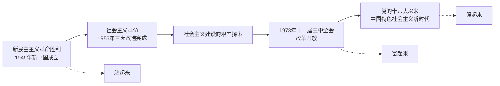

# 中国共产党领导人民站起来、富起来、强起来

## 核心要义

- **站起来**：新民主主义革命胜利、中华人民共和国成立和社会主义制度确立，中国人民实现了站起来的伟大飞跃。
- **富起来**：改革开放极大解放和发展了社会生产力，中华民族迎来了从站起来到富起来的伟大飞跃。
- **强起来**：中国特色社会主义进入新时代，中华民族迎来了从富起来到强起来的伟大飞跃。

## 知识梳理

| 阶段 | 标志 | 意义 |
| --- | --- | --- |
| 站起来 | 1949年新中国成立；1956年社会主义制度确立 | 实现民族独立、人民解放；完成中华民族有史以来最深刻最伟大的社会变革 |
| 富起来 | 1978年党的十一届三中全会开启改革开放 | 极大解放和发展社会生产力，人民生活显著改善 |
| 强起来 | 党的十八大以来进入新时代 | 日益走近世界舞台中央，不断为人类作出更大贡献 |

## 重点精讲

1. **新中国成立的意义**：实现了中国从几千年封建专制政治向人民民主的伟大飞跃，为实现中华民族伟大复兴创造了根本社会条件。
2. **社会主义制度确立的意义**：1956年生产资料私有制的社会主义改造基本完成，社会主义基本制度确立，为当代中国一切发展进步奠定了**根本政治前提和制度基础**。
3. **改革开放的意义**：是党的一次伟大觉醒，是决定当代中国前途命运的**关键一招**，中国大踏步赶上时代。
4. **新时代的内涵**：我国发展新的历史方位；社会主要矛盾转化为人民日益增长的美好生活需要和不平衡不充分的发展之间的矛盾。
5. **根本结论**：历史和人民选择中国共产党领导中华民族伟大复兴的事业是完全正确的；办好中国的事情，关键在党。

## 典型例题

**例1（选择题）** 为当代中国一切发展进步奠定根本政治前提和制度基础的是（　）
A. 新民主主义革命的胜利　B. 中华人民共和国的成立和社会主义制度的确立　C. 改革开放的实行　D. 中国特色社会主义进入新时代
**解析**：教材规范表述为"中华人民共和国的成立和社会主义制度的确立，为当代中国一切发展进步奠定了根本政治前提和制度基础"。选 **B**。

**例2（材料题）** 材料：从"两弹一星"到载人航天，从解决温饱到全面小康，从"赶上时代"到"引领时代"，百年大党带领人民书写了壮丽史诗。
问：结合材料，说明中国共产党为什么"能"。
**解析**：①党始终坚持马克思主义指导，并同中国具体实际相结合；②党的性质宗旨决定其代表最广大人民的根本利益，没有自己特殊的利益；③党团结带领人民实现了站起来、富起来到强起来的伟大飞跃，用实践证明了自身先进性；④办好中国的事情，关键在党，必须坚持和加强党的全面领导。

## 易错点

- "站起来"的标志是**新中国成立**（并由社会主义制度确立加以巩固），不是1921年建党。
- 1956年三大改造完成确立的是**社会主义基本制度**，勿与1949年新中国成立混淆。
- 改革开放是"关键一招"，但**根本政治前提和制度基础**是新中国成立和社会主义制度确立。
- 新时代社会主要矛盾的转化没有改变我国仍处于**社会主义初级阶段**的基本国情。

## 背记要点

1. 三次伟大飞跃：站起来（1949/1956）→ 富起来（1978改革开放）→ 强起来（新时代）
2. 新中国成立 + 社会主义制度确立 = 根本政治前提和制度基础
3. 改革开放 = 党的伟大觉醒、决定当代中国前途命运的关键一招
4. 结论：没有共产党就没有新中国；办好中国的事情，关键在党

## 自测题

1. "站起来、富起来、强起来"三个阶段各自的标志性事件是什么？
2. 社会主义制度在我国确立的标志和意义是什么？
3. 如何理解"改革开放是决定当代中国前途命运的关键一招"？
4. 新时代我国社会主要矛盾是什么？

## 相关知识点

三种政治力量的较量见 [[中华人民共和国成立前各种政治力量]]；党永葆先进性的原因见 [[始终走在时代前列]]；坚持党的领导的必要性见 [[坚持党的领导]]。
