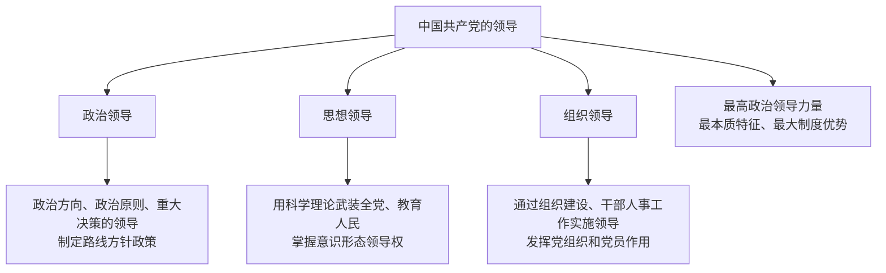

# 坚持党的领导

## 核心要义

- **党的领导地位**：中国共产党是最高政治领导力量；党的领导是中国特色社会主义最本质的特征，是中国特色社会主义制度的最大优势。
- **党的领导是全面的**：党政军民学，东西南北中，党是领导一切的（政治、经济、文化、社会、生态文明建设等各领域）。
- **党的领导方式**：政治领导、思想领导、组织领导。

## 知识梳理

| 领导方式 | 内涵 | 关键词 |
| --- | --- | --- |
| 政治领导 | 政治方向、政治原则、重大决策的领导 | 路线、方针、政策 |
| 思想领导 | 以科学理论武装全党、教育人民 | 理论宣传、意识形态 |
| 组织领导 | 通过干部工作、组织体系贯彻党的主张 | 选人用人、党组织建设 |

## 重点精讲

1. **为什么坚持党的全面领导**：①历史逻辑——党的领导地位是历史和人民的选择；②理论逻辑——党的性质宗旨决定；③现实逻辑——党的领导是中国特色社会主义最本质的特征和最大制度优势，是战胜风险挑战、实现民族复兴的根本保证。
2. **"两个维护"**：坚决维护习近平总书记党中央的核心、全党的核心地位，坚决维护党中央权威和集中统一领导——这是党的最高政治原则和根本政治规矩。
3. **区分三种领导方式**是选择题高频点：出台文件定方向→政治领导；理论学习宣传→思想领导；选拔干部、建强支部→组织领导。
4. 党的领导是全面的、系统的、整体的，要落实到治国理政的各领域各方面各环节。

## 典型例题

**例1（选择题）** 某地党委通过学习贯彻党的创新理论统一思想认识，同时选优配强乡村振兴带头人队伍。上述做法分别体现党的（　）
A. 政治领导、组织领导　B. 思想领导、组织领导　C. 思想领导、政治领导　D. 组织领导、思想领导
**解析**：理论武装、统一思想属于思想领导；选拔配备干部属于组织领导。选 **B**。

**例2（材料题）** 材料：面对突发重大自然灾害，党中央统一指挥，各级党组织迅速行动，广大党员冲锋在前，凝聚起抢险救灾的强大合力。
问：结合材料，说明为什么必须坚持中国共产党的全面领导。
**解析**：①中国共产党是最高政治领导力量，党的领导是中国特色社会主义最本质的特征、最大制度优势；②党中央统一指挥体现党总揽全局、协调各方，是应对重大风险挑战的根本保证；③各级党组织的战斗堡垒作用和党员的先锋模范作用，把党的政治优势、组织优势转化为救灾实效；④只有坚持党的全面领导，才能保证国家统一、社会稳定，实现人民根本利益。

## 易错点

- 党的领导是中国特色社会主义**最本质的特征**，人民代表大会制度才是"根本政治制度"，二者不可混。
- 党是**领导核心**，实施政治、思想、组织领导，但党不直接行使国家立法权、行政权（党领导立法、保证执法）。
- 政治领导≠党包办一切；党总揽全局、协调各方，不代替政府等机关的具体职能。
- "最大优势"指**中国特色社会主义制度**的最大优势是党的领导。

## 背记要点

1. 最高政治领导力量；最本质特征；最大制度优势
2. 党的领导方式：政治领导、思想领导、组织领导
3. 党政军民学，东西南北中，党是领导一切的
4. 两个维护：维护核心地位、维护党中央权威和集中统一领导

## 自测题

1. 如何理解"党的领导是中国特色社会主义最本质的特征"？
2. 党的三种领导方式各自的内涵是什么？请各举一例。
3. 为什么必须坚持和加强党的全面领导？
4. "两个维护"的内容是什么？

## 相关知识点

党长期执政的依据与方式见 [[巩固党的长期执政地位]]；党领导下的国家政权组织见 [[人民代表大会制度：我国的根本政治制度]]；党对法治建设的领导见 [[全面推进依法治国的总目标与原则]]。
