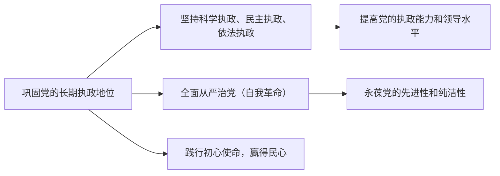

# 巩固党的长期执政地位

## 核心要义

- **党的执政方式**：科学执政、民主执政、依法执政，其中**依法执政是党执政的基本方式**。
- **全面从严治党**：巩固党的长期执政地位，必须坚持党要管党、全面从严治党。
- **立党为公、执政为民**：党的执政地位的巩固归根到底靠赢得民心。

## 知识梳理

| 执政方式 | 内涵 | 相互关系 |
| --- | --- | --- |
| 科学执政 | 遵循共产党执政规律、社会主义建设规律、人类社会发展规律，以科学的思想、制度、方法领导中国特色社会主义事业 | 科学执政是基本前提 |
| 民主执政 | 坚持为人民执政、靠人民执政，发展全过程人民民主，以党内民主带动人民民主 | 民主执政是本质要求 |
| 依法执政 | 坚持依法治国、依宪治国，领导立法、保证执法、支持司法、带头守法 | 依法执政是基本方式，是科学执政、民主执政的保证 |

## 重点精讲

1. **依法执政为什么是基本方式**：宪法法律是党的主张和人民意志相统一的体现，依法执政既规范党的执政行为，又通过法定程序使党的主张上升为国家意志，是科学执政、民主执政的保证。
2. **依法执政的关键**：党领导立法、保证执法、支持司法、带头守法；党必须在宪法和法律范围内活动。
3. **全面从严治党**：核心是加强党的领导，基础在全面，关键在严，要害在治；把政治建设摆在首位，坚持思想建党和制度治党同向发力，持之以恒正风肃纪反腐。
4. **民心是最大的政治**：党的执政地位不是一劳永逸的，过去拥有不等于现在拥有，现在拥有不等于永远拥有。

## 典型例题

**例1（选择题）** 中共中央就修改法律提出建议，经全国人大审议通过后施行。这体现党（　）
①依法执政　②通过法定程序使党的主张上升为国家意志　③直接行使国家立法权　④科学执政的实现不需要民主程序
A. ①②　B. ①③　C. ②④　D. ③④
**解析**：党提出立法建议、由人大依法定程序通过，体现依法执政和党的主张经法定程序上升为国家意志，①②正确；立法权属于人大，③错误；④说法错误。选 **A**。

**例2（材料题）** 材料：党的十八大以来，党中央以雷霆之势反腐惩恶，制定修订党内法规，开展多轮集中学习教育，党在革命性锻造中更加坚强。
问：结合材料，说明全面从严治党对巩固党的长期执政地位的意义。
**解析**：①勇于自我革命是党最鲜明的品格，全面从严治党是新时代党的自我革命的伟大实践；②反腐惩恶、正风肃纪能够保持党的先进性和纯洁性，密切党群关系，厚植执政的群众基础；③制度治党、思想建党提高党的执政能力和领导水平；④只有坚持党要管党、全面从严治党，才能确保党长期执政、跳出历史周期率。

## 易错点

- 三种执政方式中，**依法执政是基本方式**；不能说"科学执政是基本方式"。
- 党**领导**立法而非**行使**立法权；党依法执政不等于党直接管理国家事务。
- 依宪执政、依宪治国中的"宪"指**中华人民共和国宪法**，与西方"宪政"有本质区别。
- 党的执政地位"不是一劳永逸的"——注意这一教材原句常作判断题。

## 背记要点

1. 执政方式：科学执政、民主执政、依法执政（基本方式）
2. 依法执政关键：领导立法、保证执法、支持司法、带头守法
3. 全面从严治党：政治建设摆首位，思想建党与制度治党同向发力
4. 巩固执政地位的根本：践行初心使命，赢得人民拥护

## 自测题

1. 党的三种执政方式的内涵及其关系是什么？
2. 为什么说依法执政是党执政的基本方式？
3. 如何理解"打铁必须自身硬"？
4. 巩固党的长期执政地位需要从哪些方面努力？

## 相关知识点

党的领导方式见 [[坚持党的领导]]；自我革命的品格见 [[始终走在时代前列]]；党依法执政与依法治国的统一见 [[全面推进依法治国的总目标与原则]]。
