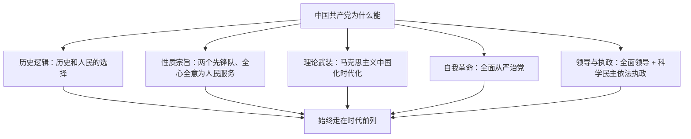

# 综合探究一 始终走在时代前列的中国共产党

## 探究主题

围绕"中国共产党为什么能"，整合第一至第三课知识，从历史选择、性质宗旨、先进性建设、全面领导四条线索，理解党始终走在时代前列的根本原因。

## 知识整合

| 线索 | 核心知识 | 对应课 |
| --- | --- | --- |
| 历史和人民的选择 | 半殖民地半封建国情、三种建国方案、三次伟大飞跃 | 第一课 |
| 党的先进性 | 性质宗旨、人民立场、群众路线、与时俱进、自我革命 | 第二课 |
| 党的领导与执政 | 全面领导、三种领导方式、三种执政方式、全面从严治党 | 第三课 |

## 重点精讲

1. **答题总框架（党为什么能/为什么要坚持党的领导）**：①领导地位是历史和人民的选择；②性质（两个先锋队）宗旨（全心全意为人民服务）决定；③以科学理论为指导并与时俱进；④最本质特征、最大制度优势；⑤勇于自我革命、全面从严治党。
2. **"怎么办"类设问**：坚持科学执政、民主执政、依法执政；坚持全面领导（政治、思想、组织领导）；坚持以人民为中心；推进自我革命。
3. 注意将"是什么—为什么—怎么办"与材料信息一一对应，切忌堆砌术语。

## 典型例题

**例1（选择题）** "中国共产党之所以能，中国特色社会主义之所以好，归根到底是马克思主义行，是中国化时代化的马克思主义行。"这强调了（　）
A. 科学理论指导对党的事业的根本意义　B. 党的执政地位一劳永逸　C. 马克思主义可以解决一切具体问题　D. 党的领导只体现在思想领导上
**解析**：引文强调科学理论及其中国化时代化对党和事业成功的根本作用。B、C、D 均表述错误。选 **A**。

**例2（探究题）** 以"百年大党何以风华正茂"为主题撰写发言提纲。
**解析要点**：①不忘初心：为中国人民谋幸福、为中华民族谋复兴；②人民至上：性质宗旨、群众路线，人民是最大底气；③理论创新：坚持"两个结合"，与时俱进；④自我革命：全面从严治党，跳出历史周期率；⑤全面领导：把党的领导落实到各领域各方面各环节。

## 易错点

- 综合探究答题时不可只答一课内容，须跨课整合（历史选择+先进性+领导执政）。
- "党的领导""党的执政"角度不同：领导方式（政治/思想/组织）与执政方式（科学/民主/依法）勿混用。

## 背记要点

1. 党为什么能：历史选择 + 性质宗旨 + 科学理论 + 自我革命 + 全面领导
2. 三种领导方式 ↔ 三种执政方式，两组概念对应准确
3. 勇于自我革命是跳出历史周期率的第二个答案

## 自测题

1. 从三课知识整合角度，列出"为什么必须坚持党的全面领导"的答题要点。
2. 党的领导方式与执政方式分别是什么？如何区分？
3. 结合实例说明党如何做到"始终走在时代前列"。

## 相关知识点

基础知识见 [[中华人民共和国成立前各种政治力量]]、[[始终坚持以人民为中心]]、[[始终走在时代前列]]、[[坚持党的领导]]、[[巩固党的长期执政地位]]。
