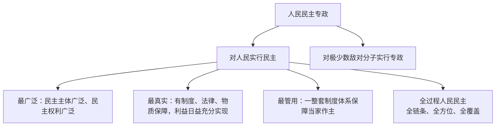

# 人民民主专政的本质：人民当家作主

## 核心要义

- **国体**：我国是工人阶级领导的、以工农联盟为基础的人民民主专政的社会主义国家。
- **人民民主专政的本质**：人民当家作主。
- **全过程人民民主**：最广泛、最真实、最管用的社会主义民主。

## 知识梳理

| 项目 | 内容 |
| --- | --- |
| 国家性质（国体） | 工人阶级领导的、以工农联盟为基础的人民民主专政的社会主义国家 |
| 领导阶级 | 工人阶级；阶级基础：工农联盟 |
| 本质 | 人民当家作主 |
| 民主的特点 | 全过程人民民主：全链条、全方位、全覆盖；最广泛、最真实、最管用 |
| 民主与专政的关系 | 对人民实行民主与对极少数敌人实行专政的统一 |

## 重点精讲

1. **民主的阶级性**：民主是具体的、历史的，世界上没有抽象的超阶级的民主；社会主义民主是绝大多数人享有的民主，与资本主义民主有本质区别。
2. **全过程人民民主**：实现了过程民主和成果民主、程序民主和实质民主、直接民主和间接民主、人民民主和国家意志相统一。
3. **民主与专政的统一**：民主是专政的基础，专政是民主的保障；二者相辅相成，共同保证人民当家作主。
4. **"三个最"**须与材料对应：主体和权利广泛→最广泛；制度、法律、物质保障→最真实；制度体系有效管用→最管用。

## 典型例题

**例1（选择题）** 我国人民民主专政的本质是（　）
A. 工人阶级领导　B. 人民当家作主　C. 民主与专政的统一　D. 全过程人民民主
**解析**：教材规范表述："人民民主专政的本质是人民当家作主"。选 **B**。

**例2（材料题）** 材料：某市立法前通过基层立法联系点征集群众意见3000余条，多条被采纳写入法规；法规实施后群众满意度显著提升。
问：结合材料，说明我国全过程人民民主的特点。
**解析**：①全过程人民民主是全链条、全方位、全覆盖的民主，群众全程参与立法体现民主贯穿决策的各环节；②最广泛——参与主体广泛；③最真实——群众意见被采纳，民主有制度和法律保障、利益得到实现；④最管用——基层立法联系点等制度安排使人民意愿有效转化为国家意志，实现过程民主与成果民主相统一。

## 易错点

- 本质是**人民当家作主**，不能答成"民主与专政的统一"（后者是特点/内容）。
- "公民"与"人民"不同：人民是政治概念，不包括敌对分子；公民是法律概念，范围更大。
- 专政的对象是**极少数敌对分子**，不是所有违法的人。
- 我国民主是"最广泛、最真实、最管用"，三者内涵不同，答题勿混。

## 背记要点

1. 国体：工人阶级领导、工农联盟为基础的人民民主专政的社会主义国家
2. 本质：人民当家作主
3. 全过程人民民主：全链条、全方位、全覆盖；最广泛、最真实、最管用
4. 民主是专政的基础，专政是民主的保障

## 自测题

1. 我国的国家性质是什么？其本质是什么？
2. 如何理解我国民主的"三个最"？
3. 民主与专政的关系是怎样的？
4. "人民"与"公民"有何区别？

## 相关知识点

为什么必须坚持这一国体见 [[坚持人民民主专政]]；人民当家作主的根本制度保障见 [[人民代表大会制度：我国的根本政治制度]]；基层民主实践见 [[基层群众自治制度]]。
