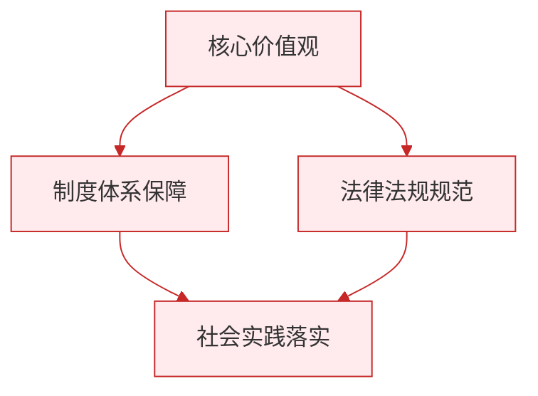

# 坚持人民民主专政

## 核心要义

- **坚持人民民主专政的必要性**：人民民主专政是四项基本原则之一，是立国之本，已载入宪法。
- **新时代坚持人民民主专政的要求**：发展全过程人民民主，履行好国家职能，坚持总体国家安全观。

## 知识梳理

| 角度 | 内容 |
| --- | --- |
| 地位 | 四项基本原则之一，立国之本，国家生存发展的政治基石 |
| 为什么坚持 | 是社会主义现代化建设的政治保证；民主面保障人民当家作主，专政面维护国家长治久安 |
| 民主职能 | 发展全过程人民民主，保障人民权益，扩大人民有序政治参与 |
| 专政职能 | 依法打击极少数敌对分子的破坏活动，维护国家安全和社会稳定 |
| 国家职能 | 对内：政治统治与社会管理；对外：防御外来侵犯、维护国家利益、促进国际合作 |
| 总体国家安全观 | 以人民安全为宗旨，以政治安全为根本，以经济安全为基础 |

## 重点精讲

1. **坚持人民民主专政不过时**：国内外敌对势力的渗透破坏依然存在，必须坚持专政职能；同时人民民主是社会主义的生命，两方面不可偏废。
2. **总体国家安全观**："宗旨—根本—基础"的表述要记准：人民安全是宗旨、政治安全是根本、经济安全是基础，以军事、科技、文化、社会安全为保障，以促进国际安全为依托。
3. **国家安全是头等大事**：坚持国家安全一切为了人民、一切依靠人民，筑牢国家安全人民防线；每个公民都负有维护国家安全的义务。
4. 答题时区分设问角度：问"为什么坚持人民民主专政"侧重国体地位与两大职能；问"如何坚持"侧重发展民主+依法专政+总体国家安全观。

## 典型例题

**例1（选择题）** 总体国家安全观强调，国家安全工作应当（　）
①以人民安全为宗旨　②以经济安全为根本　③以政治安全为根本　④以军事安全为基础
A. ①③　B. ①②　C. ②④　D. ③④
**解析**：规范表述为以人民安全为宗旨、以政治安全为根本、以经济安全为基础。②④错位。选 **A**。

**例2（材料题）** 材料：国家安全机关依法破获多起境外势力窃密案件；同时，各地开展全民国家安全教育日活动，增强公民安全意识。
问：结合材料，运用"坚持人民民主专政"的知识加以分析。
**解析**：①人民民主专政对极少数敌对分子实行专政，依法打击窃密等危害国家安全的行为，是履行专政职能、维护国家安全的体现；②开展安全教育体现坚持总体国家安全观，筑牢国家安全人民防线；③民主与专政相统一，打击敌对势力正是为了保障最广大人民的民主权利和根本利益；④维护国家安全是每个公民的义务。

## 易错点

- 人民民主专政的专政面**没有取消**，认为"新时代只讲民主不讲专政"是错误的。
- 总体国家安全观的"宗旨、根本、基础"对象易混：人民—宗旨、政治—根本、经济—基础。
- 专政的对象是**敌对分子**及严重危害国家安全的犯罪行为，不是一般违法者。
- 维护国家安全是**公民的法定义务**，不是"可选择的道德要求"。

## 背记要点

1. 人民民主专政 = 四项基本原则之一、立国之本
2. 两大职能：民主职能（保障人民当家作主）+ 专政职能（维护国家安全稳定）
3. 总体国家安全观：人民安全宗旨、政治安全根本、经济安全基础
4. 坚持的路径：发展全过程人民民主 + 依法履行专政职能 + 贯彻总体国家安全观

## 自测题

1. 为什么必须坚持人民民主专政？
2. 总体国家安全观的主要内容是什么？
3. 新时代坚持人民民主专政有哪些要求？
4. 公民在维护国家安全中应承担什么责任？

## 相关知识点

国体的本质见 [[人民民主专政的本质：人民当家作主]]；人民行使国家权力的机关见 [[人民代表大会：我国的国家权力机关]]；党的领导与国家政权的关系见 [[坚持党的领导]]。

### 政治理论与逻辑框架

