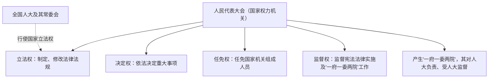

# 人民代表大会：我国的国家权力机关

## 核心要义

- **人民代表大会的性质**：国家权力机关；全国人大是最高国家权力机关。
- **人大的四项职权**：立法权、决定权、任免权、监督权。
- **人大代表**：国家权力机关的组成人员，由民主选举产生，对人民负责、受人民监督。

## 知识梳理

| 项目 | 内容 | 判断关键词 |
| --- | --- | --- |
| 立法权 | 制定、修改、废止法律（全国人大及其常委会行使国家立法权） | 制定/修改××法 |
| 决定权 | 依照法定程序决定国家和地方重大事项 | 批准计划、预算，通过决议 |
| 任免权 | 选举、任命、罢免国家机关组成人员 | 选举、任命、罢免 |
| 监督权 | 监督宪法和法律的实施，监督其他国家机关工作 | 听取审议报告、执法检查、质询 |
| 人大代表权利 | 审议权、表决权、提案权、质询权 | —— |
| 人大代表义务 | 与群众保持密切联系，听取和反映群众意见要求，对人民负责、受人民监督 | —— |

## 重点精讲

1. **四项职权的辨析**是选择题必考点：批准政府工作报告→监督权；批准预算→决定权；通过法律→立法权；选举国家主席→任免权。注意"决定权"针对重大事项本身，"监督权"针对其他机关的工作。
2. **全国人大的地位**：最高国家权力机关，在国家机构中居于最高地位；其常设机关是全国人大常委会。
3. **人大与其他国家机关的关系**："一府一委两院"（政府、监察委、法院、检察院）由人大产生，对它负责，受它监督。
4. **人大代表的产生**：县乡两级直接选举，县级以上间接选举；任期五年。

## 典型例题

**例1（选择题)** 某省人大常委会听取并审议省政府关于生态环境保护工作情况的报告，并开展相关执法检查。这体现人大行使（　）
A. 立法权　B. 决定权　C. 任免权　D. 监督权
**解析**：听取审议专项工作报告、执法检查是人大监督"一府一委两院"工作和法律实施的形式。选 **D**。

**例2（材料题）** 材料：十四届全国人大会议表决通过《中华人民共和国××法》，批准国务院机构改革方案，并选举产生新一届国家机构领导人员。
问：指出材料中全国人大分别行使了哪些职权，并说明全国人大的地位。
**解析**：通过法律——立法权；批准机构改革方案——决定权；选举国家机构领导人员——任免权。地位：全国人大是最高国家权力机关，其他中央国家机关由它产生、对它负责、受它监督。

## 易错点

- 立法权不专属全国人大：**全国人大及其常委会行使国家立法权**，有立法权的地方人大可制定地方性法规。
- "决定权"与"监督权"易混：批准**预算/计划**是决定权，批准（听取审议）**工作报告**属监督权。
- 人大代表的"提案权"是**依法定程序提出议案**，质询权针对"一府一委两院"。
- 人大是**权力机关**，不是行政机关，不能直接处理具体行政事务。

## 背记要点

1. 性质：国家权力机关；全国人大 = 最高国家权力机关
2. 四项职权：立法权、决定权、任免权、监督权
3. "一府一委两院"由人大产生、对人大负责、受人大监督
4. 人大代表：审议、表决、提案、质询四项权利；密切联系群众的义务

## 自测题

1. 人民代表大会的四项职权分别是什么？各举一例。
2. 全国人大与其他中央国家机关是什么关系？
3. 人大代表享有哪些权利、承担哪些义务？
4. 如何区分人大的决定权与监督权？

## 相关知识点

以人大为基石的政体见 [[人民代表大会制度：我国的根本政治制度]]；国体决定政体见 [[人民民主专政的本质：人民当家作主]]；人大立法与依法治国见 [[科学立法]]。
