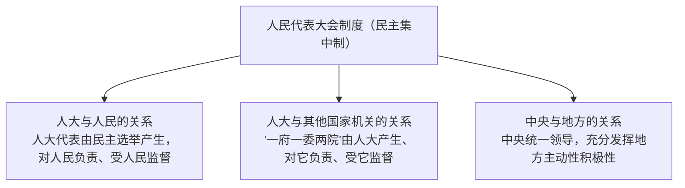

# 人民代表大会制度：我国的根本政治制度

## 核心要义

- **政体**：人民代表大会制度是我国的政体，是我国的根本政治制度。
- **组织和活动原则**：民主集中制。
- **优势**：人民代表大会制度是坚持党的领导、人民当家作主、依法治国有机统一的根本政治制度安排。

## 知识梳理

| 项目 | 内容 |
| --- | --- |
| 地位 | 根本政治制度，是我国的政体 |
| 基石 | 人民代表大会 |
| 组织活动原则 | 民主集中制（民主基础上的集中和集中指导下的民主相结合） |
| 决定因素 | 国体决定政体：人民民主专政的国家性质决定实行人民代表大会制度 |
| 制度优势 | 保障人民当家作主；动员人民投身社会主义建设；保证国家机关协调高效运转；维护国家统一和民族团结 |

## 重点精讲

1. **民主集中制的三个体现**（表格中三层关系）是主观题高频考点，答题时结合材料指明属于哪一层关系。
2. **为什么坚持人民代表大会制度**：①由国体决定，与人民民主专政的国家性质相适应；②是历史和人民的选择；③是坚持党的领导、人民当家作主、依法治国有机统一的根本制度安排；④具有四大显著优势。
3. **如何坚持和完善**：毫不动摇坚持党的领导；保证人民当家作主，发展全过程人民民主；加强人大自身建设，更好发挥职能作用；不能照搬西方"三权分立"模式。
4. **人大制度与西方议会制的本质区别**：经济基础不同、行使权力的主体不同、活动原则不同（民主集中制 vs 分权制衡）。

## 典型例题

**例1（选择题）** 我国宪法规定："中华人民共和国的国家机构实行民主集中制的原则。"下列体现"中央和地方国家机构职权划分"中民主集中制的是（　）
A. 人大代表由选民选举产生　B. 国务院对全国人大负责　C. 在中央统一领导下充分发挥地方的主动性、积极性　D. 人大代表提出议案
**解析**：A 体现人大与人民的关系，B 体现人大与其他国家机关的关系，C 体现中央与地方的关系。题干限定为央地关系。选 **C**。

**例2（材料题）** 材料：某省人大围绕重大民生项目组织代表视察调研，法规草案全文公开征求意见，省政府依据人大决议推进落实，并向人大报告进展。
问：结合材料，说明人民代表大会制度是如何保证人民当家作主的。
**解析**：①人大代表由民主选举产生、代表人民视察调研，人民通过人大行使国家权力；②法规公开征求意见体现发展全过程人民民主，民意进入国家决策；③政府由人大产生、对人大负责、受人大监督，人大决议得到执行，保证国家权力体现人民意志；④这一制度坚持民主集中制，把党的领导、人民当家作主、依法治国有机统一起来。

## 易错点

- **根本政治制度**只有一个（人民代表大会制度）；政党制度、民族区域自治、基层群众自治是**基本政治制度**。
- 人大制度的基石是**人民代表大会**，二者是制度与机关的关系，不能混同。
- 民主集中制不是"少数服从多数"一句话，须完整表述三层关系。
- 我国国家机构**不实行**"三权分立"，人大统一行使国家权力。

## 背记要点

1. 地位：政体、根本政治制度；基石：人民代表大会
2. 组织活动原则：民主集中制（三层关系）
3. 国体决定政体
4. 优势：三者有机统一的根本政治制度安排

## 自测题

1. 为什么说人民代表大会制度是适合我国国情的好制度？
2. 民主集中制在我国国家机构中的三个体现是什么？
3. 人民代表大会与人民代表大会制度有何区别与联系？
4. 新时代如何坚持和完善人民代表大会制度？

## 相关知识点

权力机关的职权见 [[人民代表大会：我国的国家权力机关]]；基本政治制度见 [[中国共产党领导的多党合作和政治协商制度]]、[[民族区域自治制度]]；三者有机统一见 [[综合探究三 坚持党的领导、人民当家作主、依法治国有机统一]]。
