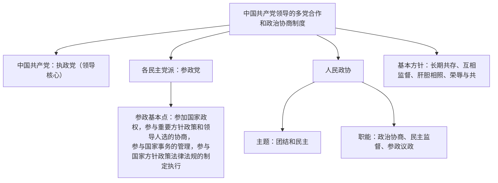

# 中国共产党领导的多党合作和政治协商制度

## 核心要义

- **地位**：我国的一项基本政治制度，是从中国土壤中生长出来的**新型政党制度**。
- **首要前提和根本保证**：中国共产党的领导。
- **基本方针**：长期共存、互相监督、肝胆相照、荣辱与共。
- **重要机构**：中国人民政治协商会议（爱国统一战线的组织，协商民主的重要渠道和专门协商机构）。

## 知识梳理

| 项目 | 内容 |
| --- | --- |
| 政党关系 | 共产党执政、多党派参政；通力合作的友党关系 |
| 首要前提 | 坚持中国共产党的领导 |
| 人民政协性质 | 爱国统一战线的组织，多党合作和政治协商的重要机构，不是国家机关 |
| 政协职能 | 政治协商、民主监督、参政议政 |
| 新型政党制度"新"在 | 利益代表新（代表最广大人民利益）、功能新（凝聚共识、合作共事）、效果新（避免一党缺乏监督或多党恶性竞争的弊端） |

## 重点精讲

1. **民主党派是参政党**，不是在野党、反对党；参政基本点"一个参加、三个参与"须记准。
2. **人民政协不是国家机关**，其民主监督不具有法律约束力，与人大的权力监督性质不同；政协委员经协商推荐产生，不由选举产生。
3. **新型政党制度为什么"新"**：马克思主义政党理论同中国实际相结合的产物，能真实、广泛、持久代表和实现最广大人民根本利益，避免了旧式政党制度的弊端。
4. **协商民主**：是我国社会主义民主政治的特有形式和独特优势，人民政协是专门协商机构。

## 典型例题

**例1（选择题）** 各民主党派中央就"十四五"规划实施情况开展专项民主监督并提出建议。这表明民主党派（　）
①是我国的参政党　②依法行使国家监督权　③参与国家事务的管理　④与中国共产党联合执政
A. ①③　B. ①②　C. ②④　D. ③④
**解析**：民主党派是参政党，开展民主监督、建言资政体现参政职能，①③正确；民主监督不是国家权力监督，②错误；我国不存在联合执政，④错误。选 **A**。

**例2（材料题）** 材料：全国政协围绕"促进就业"召开专题协商会，各民主党派、无党派人士深入调研，提出提案百余件，多项建议被政府部门采纳。
问：结合材料，说明我国新型政党制度的优势。
**解析**：①在共产党领导下，各党派围绕中心工作协商议政，凝聚共识与力量，体现新型政党制度能集中力量办大事；②政协履行政治协商、民主监督、参政议政职能，提案被采纳表明该制度能有效反映社会各方面意见，推动决策科学化民主化；③这一制度真实、广泛、持久地代表和实现最广大人民根本利益，避免了旧式政党制度的弊端，是协商民主的生动实践。

## 易错点

- 政协的**民主监督**不同于人大的监督：前者是协商式监督，无法律强制力。
- 民主党派与共产党是**通力合作的友党关系**，政治上接受共产党领导，组织上相互独立。
- 政协不能行使国家职能、不能立法、不能决定国家重大事项。
- "政治协商"是政协职能之一，也是多党合作的重要内容，注意语境。

## 背记要点

1. 地位：基本政治制度、新型政党制度；前提和根本保证：党的领导
2. 基本方针：长期共存、互相监督、肝胆相照、荣辱与共
3. 政协两大主题：团结和民主；三大职能：政治协商、民主监督、参政议政
4. 参政基本点："一个参加、三个参与"

## 自测题

1. 我国政党制度的地位和基本内容是什么？
2. 民主党派参政的基本点有哪些？
3. 人民政协的性质、主题和职能分别是什么？
4. 我国新型政党制度"新"在哪里？

## 相关知识点

根本政治制度见 [[人民代表大会制度：我国的根本政治制度]]；其他基本政治制度见 [[民族区域自治制度]]、[[基层群众自治制度]]；制度整合见 [[综合探究二 在党的领导下实现人民当家作主]]。
