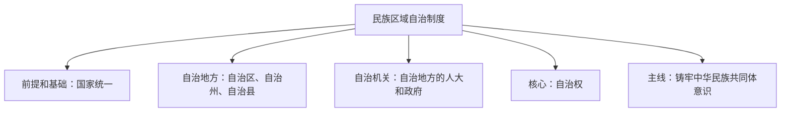

# 民族区域自治制度

## 核心要义

- **我国的民族格局**：多元一体；社会主义民族关系：平等团结互助和谐。
- **处理民族关系的方针**：坚持民族平等、民族团结、各民族共同繁荣。
- **民族区域自治制度**：在国家统一领导下，各少数民族聚居的地方实行区域自治——我国的一项基本政治制度。
- **前提和基础**：国家统一（领土完整、国家统一是实行民族区域自治的前提和基础）；**核心**：自治权。

## 知识梳理

| 项目 | 内容 |
| --- | --- |
| 方针 | 民族平等（首要原则/前提）、民族团结（重要保证）、各民族共同繁荣（物质保证） |
| 自治地方 | 自治区、自治州、自治县三级（不含民族乡） |
| 自治机关 | 自治地方的人民代表大会和人民政府 |
| 前提和基础 | 国家统一，自治地方是国家不可分割的部分 |
| 核心内容 | 自治权（立法自治权、经济自治权、文化管理自治权等） |
| 新时代主线 | 铸牢中华民族共同体意识 |

## 重点精讲

1. **为什么实行民族区域自治**：由统一多民族国家的历史传统、"大杂居、小聚居、交错居住"的民族分布特点、各民族在长期奋斗中形成的相互依存的民族关系决定，是适合我国国情的必然选择。
2. **自治机关的双重地位**：既是地方国家机关行使一般地方国家机关职权，又依法行使自治权。注意：自治地方的法院、检察院**不是**自治机关。
3. **我国宗教政策**（本框附带考点）：实行宗教信仰自由政策，依法管理宗教事务，坚持独立自主自办原则，积极引导宗教与社会主义社会相适应，坚持我国宗教中国化方向。
4. **铸牢中华民族共同体意识**：新时代党的民族工作的主线，促进各民族像石榴籽一样紧紧抱在一起。

## 典型例题

**例1（选择题）** 民族区域自治制度的核心内容是（　）
A. 国家统一　B. 民族平等　C. 自治权　D. 设立自治机关
**解析**：自治权是民族区域自治制度的核心内容；国家统一是前提和基础。选 **C**。

**例2（材料题）** 材料：某自治区人大依据当地实际制定自治条例，国家实施对口支援推动当地特色产业发展，各族群众收入大幅提高、交往交流交融不断深化。
问：结合材料，说明我国民族区域自治制度的优越性。
**解析**：①自治区人大制定自治条例体现自治机关依法行使自治权，保障少数民族人民当家作主；②对口支援体现坚持各民族共同繁荣的方针，有利于缩小发展差距；③收入提高、交往交融深化表明该制度有利于巩固平等团结互助和谐的社会主义民族关系，铸牢中华民族共同体意识；④把国家统一领导与区域自治有机结合，维护了国家统一和民族团结。

## 易错点

- 前提和基础是**国家统一**，核心是**自治权**，二者不能颠倒。
- 自治机关只包括自治地方的**人大和政府**，不含法院、检察院、政协。
- 民族自治地方分**自治区、自治州、自治县**三级，**民族乡不是**自治地方。
- 自治权≠高度自治、完全自治；民族区域自治以领土完整、国家统一为前提。

## 背记要点

1. 民族方针：平等、团结、共同繁荣；民族关系：平等团结互助和谐
2. 前提和基础：国家统一；核心：自治权；自治机关：自治地方人大和政府
3. 三级自治地方：自治区、自治州、自治县
4. 新时代主线：铸牢中华民族共同体意识

## 自测题

1. 我国处理民族关系的方针是什么？三者关系如何？
2. 民族区域自治制度的前提、核心、自治机关分别是什么？
3. 为什么说民族区域自治制度适合我国国情？
4. 我国的宗教政策包括哪些内容？

## 相关知识点

其他基本政治制度见 [[中国共产党领导的多党合作和政治协商制度]]、[[基层群众自治制度]]；根本政治制度见 [[人民代表大会制度：我国的根本政治制度]]。
