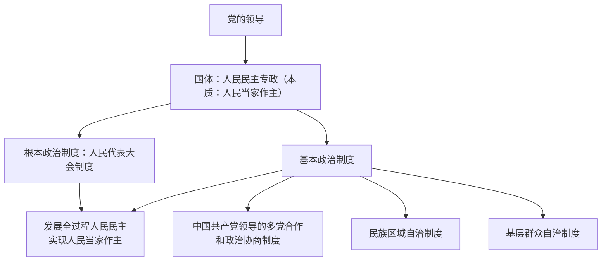

# 综合探究二 在党的领导下实现人民当家作主

## 探究主题

整合第四至第六课知识，理解我国以人民民主专政为国体、以一套制度体系保证人民当家作主的政治发展道路，把握党的领导与人民当家作主的内在统一。

## 知识整合

| 制度 | 地位 | 保障人民当家作主的方式 |
| --- | --- | --- |
| 人民代表大会制度 | 根本政治制度 | 人民通过人大统一行使国家权力 |
| 新型政党制度 | 基本政治制度 | 协商民主，广泛凝聚共识 |
| 民族区域自治制度 | 基本政治制度 | 保障少数民族当家作主 |
| 基层群众自治制度 | 基本政治制度 | 群众直接行使民主权利 |

## 重点精讲

1. **答题总框架（我国如何保障人民当家作主）**：坚持党的领导（根本保证）→ 坚持人民民主专政的国体 → 根本政治制度 + 三项基本政治制度 → 发展全过程人民民主。
2. **党的领导与人民当家作主的关系**：党的领导是人民当家作主的根本保证；人民当家作主是社会主义民主政治的本质特征；党通过制度体系支持和保证人民当家作主。
3. 中国的民主是全过程人民民主，评价一个国家政治制度是不是民主的、有效的，关键看是否符合本国国情、能否解决实际问题。

## 典型例题

**例1（选择题）** 我国保证人民当家作主的根本政治制度安排是（　）
A. 基层群众自治制度　B. 人民代表大会制度　C. 民族区域自治制度　D. 新型政党制度
**解析**：人民代表大会制度是坚持党的领导、人民当家作主、依法治国有机统一的根本政治制度安排。选 **B**。

**例2（探究题）** 以"中国式民主行得通、很管用"为主题，结合本单元知识列出论证提纲。
**解析要点**：①国体本质是人民当家作主，民主具有最广泛、最真实、最管用的特点；②人大制度保证人民统一行使国家权力；③新型政党制度凝聚共识、协商议政；④民族区域自治保障各民族平等团结；⑤基层群众自治让群众直接行使民主权利；⑥全过程人民民主贯通各层级各领域，实践证明符合国情、解决实际问题。

## 易错点

- "根本政治制度"与"基本政治制度"层级不同，作答须准确定位。
- 人民当家作主不是抽象口号，须落实到具体制度和民主环节上论证。

## 背记要点

1. 一条主线：党的领导—人民当家作主—制度保障
2. 一个国体 + 一个根本政治制度 + 三项基本政治制度
3. 全过程人民民主：最广泛、最真实、最管用

## 自测题

1. 画出我国保障人民当家作主的制度体系结构图。
2. 如何理解党的领导与人民当家作主的统一？
3. 结合实例说明全过程人民民主"管用"在何处？

## 相关知识点

基础内容见 [[人民民主专政的本质：人民当家作主]]、[[人民代表大会制度：我国的根本政治制度]]、[[中国共产党领导的多党合作和政治协商制度]]、[[民族区域自治制度]]、[[基层群众自治制度]]。
