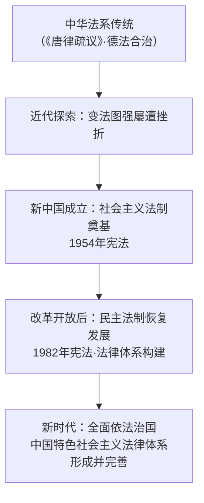

# 我国法治建设的历程

## 核心要义

- **法律的产生与本质**：法是人类社会发展到一定历史阶段的产物；在阶级社会中，法反映**统治阶级的意志**，是实现国家职能的工具。
- **马克思主义法治理论**：法是由国家制定或认可、依靠**国家强制力**保证实施的社会规范，最终由社会**物质生活条件**决定。
- **中华法系**：源远流长，以儒家思想为理论基础，代表性法典如《唐律疏议》；强调法律与伦理道德相结合。

## 知识梳理

| 阶段 | 主要成就 |
| --- | --- |
| 新中国成立初期 | 制定1954年宪法等，初步奠定社会主义法制基础 |
| 改革开放以来 | 1982年宪法及修正案；1999年"依法治国"入宪；2010年中国特色社会主义法律体系形成 |
| 新时代 | 全面依法治国纳入"四个全面"战略布局；《民法典》颁布（2020） |

## 重点精讲

1. **法的特征**：①国家制定或认可；②国家强制力保证实施（最显著特征）；③规定权利与义务；④对全体社会成员具有普遍约束力。
2. **法的职能**：政治职能（维护统治秩序）与社会职能（管理公共事务）。
3. **我国法治建设成就的根本原因**：坚持**中国共产党的领导**，坚持中国特色社会主义道路，把马克思主义法治理论与中国实际相结合。
4. **考法提示**：材料出现"《唐律疏议》""1954年宪法""法律体系形成"等，对应法治历程的阶段定位；分析成就原因时须答党的领导+国情结合。

## 典型例题

**例1（选择题）** 法区别于道德等其他社会规范的最显著特征是（　）
A. 反映统治阶级意志　B. 依靠国家强制力保证实施　C. 具有普遍约束力　D. 规定权利义务
**解析**：道德亦有约束力与价值导向，唯有"国家强制力"为法所独有且最显著。选 **B**。

**例2（材料题）** 材料：从1954年宪法到1982年宪法及其五次修正，从"法制"到"法治"，从"有法可依"到建成中国特色社会主义法律体系。
问：结合材料说明我国法治建设的历程体现了什么。
**解析**：①我国法治建设在党的领导下不断推进，与时俱进；②从法律制度体系建设（法制）走向治国方略层面（法治），治理理念不断深化；③立足中国国情，随着改革开放与社会主义现代化建设的实践发展而完善；④说明全面依法治国是一个长期的历史进程，法治建设成就来之不易。

## 易错点

- "法制"（法律制度）与"法治"（治国方略）内涵不同，1999年宪法修正案确立"依法治国，建设社会主义法治国家"。
- 法产生于**阶级社会**，原始社会无法律（靠习惯调整）。
- 中华法系的特点是**礼法结合**（出礼入刑），不是单纯严刑峻法。
- 中国特色社会主义法律体系形成的时间节点：**2010年**。

## 背记要点

1. 法的本质：统治阶级意志的体现；由物质生活条件决定。
2. 法的特征：国家制定或认可、国家强制力、权利义务、普遍约束力。
3. 历程：1954宪法奠基→1982宪法→1999依法治国入宪→2010法律体系形成→新时代全面依法治国。
4. 根本保证：党的领导。

## 自测题

1. 马克思主义如何理解法的产生与本质？
2. 法有哪些基本特征？最显著的是哪一项？
3. 列举我国法治建设三个阶段的标志性成就。
4. 为什么说党的领导是我国法治建设的根本保证？

## 相关知识点

依法治国的总目标见 [[全面推进依法治国的总目标与原则]]；法治建设的具体展开见 [[法治国家]]、[[法治政府]]、[[法治社会]]。
