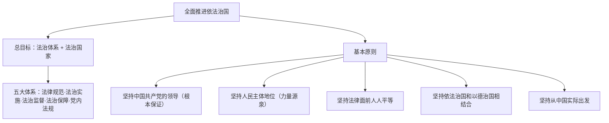

# 全面推进依法治国的总目标与原则

## 核心要义

- **总目标**：建设**中国特色社会主义法治体系**，建设**社会主义法治国家**。
- **总目标的内涵**：在中国共产党领导下，坚持中国特色社会主义制度，贯彻中国特色社会主义法治理论，形成完备的法律规范体系、高效的法治实施体系、严密的法治监督体系、有力的法治保障体系，形成完善的党内法规体系。

## 知识梳理

| 原则 | 要点 |
| --- | --- |
| 党的领导 | 党的领导和社会主义法治是一致的；把党的领导贯彻到依法治国全过程和各方面 |
| 人民主体地位 | 法治建设为了人民、依靠人民、造福人民、保护人民 |
| 法律面前人人平等 | 任何组织和个人都必须尊重宪法法律权威，不得有超越宪法法律的特权 |
| 依法治国与以德治国相结合 | 法律是成文的道德，道德是内心的法律；法安天下，德润人心 |
| 从中国实际出发 | 与推进国家治理体系和治理能力现代化相适应，汲取中华法律文化精华，借鉴而不照搬 |

## 重点精讲

1. **党的领导与依法治国的关系**：党的领导是社会主义法治**最根本的保证**；社会主义法治必须坚持党的领导，党的领导必须依靠社会主义法治——党领导立法、保证执法、支持司法、带头守法。
2. **法治与德治的结合**：法律有效实施有赖于道德支持，道德践行也离不开法律约束；既发挥法律的规范作用，又发挥道德的教化作用，实现法治与德治相辅相成、相得益彰。
3. **"从实际出发"的辨析**：借鉴国外法治有益经验，但**决不照搬**别国模式；中国特色社会主义道路、理论、制度是全面推进依法治国的根本遵循。
4. **考法提示**：材料出现"党领导立法""民主立法征求意见""德法并举"等，先定位对应原则，再展开该原则的内涵与意义。

## 典型例题

**例1（选择题）** "法安天下，德润人心"体现全面依法治国的原则是（　）
A. 坚持党的领导　B. 坚持人民主体地位　C. 坚持依法治国和以德治国相结合　D. 坚持从中国实际出发
**解析**：强调法律与道德协同发力。选 **C**。

**例2（材料题）** 材料：某法律草案公开征求意见期间收到群众建议数十万条，全国人大常委会多次修改后表决通过。
问：上述立法过程体现了全面依法治国的哪些原则？
**解析**：①坚持人民主体地位——开门立法、汇聚民智，法治建设依靠人民；②坚持党的领导——立法工作在党的领导下依法定程序推进；③坚持从中国实际出发——针对现实问题回应社会关切，使法律符合国情、反映人民意愿，提高立法质量。

## 易错点

- 总目标是"**法治体系**+法治国家"，勿漏"中国特色社会主义法治体系"。
- 五大体系中包含**党内法规体系**，易被遗漏。
- 依法治国与以德治国是**结合**关系，不是以德治国代替依法治国。
- "从中国实际出发"≠排斥借鉴，而是**借鉴不照搬**。

## 背记要点

1. 总目标：建设中国特色社会主义法治体系，建设社会主义法治国家。
2. 五大体系：法律规范、法治实施、法治监督、法治保障、党内法规。
3. 五项原则：党的领导、人民主体、人人平等、德法结合、从实际出发。
4. 金句：法律是成文的道德，道德是内心的法律。

## 自测题

1. 全面推进依法治国的总目标是什么？包含哪五大体系？
2. 为什么必须坚持党的领导？
3. 如何理解依法治国和以德治国相结合？
4. "从中国实际出发"对法治建设提出了什么要求？

## 相关知识点

法治建设的历史脉络见 [[我国法治建设的历程]]；总目标的落实路径见 [[法治国家]]、[[法治政府]]、[[法治社会]]与 [[科学立法]] 等基本要求。
