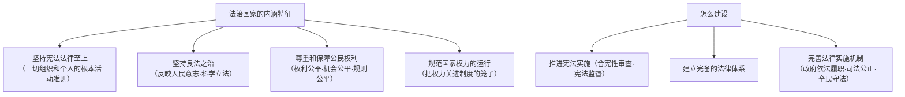

# 法治国家

## 核心要义

- **内涵**：法治国家意味着**法律至上、良法之治**，实现国家治理的制度化、规范化、程序化。
- **地位**：建设法治国家是全面依法治国的**目标**层面，与法治政府、法治社会一体建设。

## 知识梳理

| 特征 | 要点 |
| --- | --- |
| 宪法法律至上 | 法律地位、权威、效力至上；任何组织和个人不得有超越宪法法律的特权 |
| 良法之治 | 法律须反映最广大人民的意志和利益，符合社会发展规律；"良法是善治之前提" |
| 保障公民权利 | 依法保障人身权、财产权、基本政治权利等各项权利 |
| 规范权力运行 | 通过严密的法治监督体系，规范国家权力的行使 |

## 重点精讲

1. **为什么强调"良法"**：法治的关键不仅在"有法"，更在法之"良善"——内容上反映人民意志、保障公民权利，程序上经过科学民主的立法过程；恶法非法治。
2. **规范权力运行的逻辑**：国家权力来自人民，必须**依法设立、依法行使、依法监督**——"把权力关进制度的笼子里"，防止权力滥用与腐败。
3. **建设法治国家的意义**：①能够有效规范权力运行，保障公民合法权益；②推动实现国家治理现代化，实现长治久安。
4. **考法提示**：材料出现"合宪性审查""备案审查""宪法宣誓"对应**推进宪法实施**；出现"科学立法、民主立法"对应**良法之治**与完备法律体系。

## 典型例题

**例1（选择题）** 我国实行宪法宣誓制度、开展合宪性审查工作。这些举措旨在（　）
A. 扩大公民政治权利　B. 维护宪法权威，推进宪法实施　C. 提高立法数量　D. 强化政府权力
**解析**：两项制度都指向宪法的贯彻实施与权威维护。选 **B**。

**例2（材料题）** 材料：某省人大常委会对一批地方性文件开展备案审查，撤销了与上位法抵触的规定；同时通过立法听证会广泛听取公众意见。
问：结合材料说明法治国家的特征与建设要求。
**解析**：①坚持宪法法律至上——备案审查纠正与上位法抵触的文件，维护法制统一；②坚持良法之治——立法听证吸纳民意，使法律反映人民意志；③规范国家权力运行——通过法治监督体系约束地方立法权；④这体现了推进宪法实施、建立完备法律体系、完善法律实施机制的建设路径。

## 易错点

- 法治国家强调**宪法法律至上**，与"党的领导"不矛盾——党领导人民制定和实施宪法法律，党自身在宪法法律范围内活动。
- "良法之治"是法治与**人治、恶法之治**的分界，答题勿只写"有法可依"。
- 规范的对象是**国家权力**，保障的对象是**公民权利**，二者对应关系要写清。
- 法治国家、法治政府、法治社会**一体建设**，法治国家侧重整体目标。

## 背记要点

1. 四大内涵：宪法法律至上、良法之治、保障公民权利、规范权力运行。
2. 三条路径：推进宪法实施、建立完备法律体系、完善法律实施机制。
3. 意义：规范权力+保障权利+长治久安。
4. 金句：良法是善治之前提；把权力关进制度的笼子。

## 自测题

1. 法治国家的内涵特征有哪些？
2. 什么是良法？为什么法治必须是良法之治？
3. 如何建设法治国家？
4. 建设法治国家有何意义？

## 相关知识点

总目标与原则见 [[全面推进依法治国的总目标与原则]]；政府维度见 [[法治政府]]；社会维度见 [[法治社会]]。
