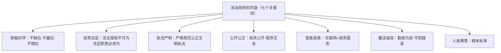

# 法治政府

## 核心要义

- **内涵**：法治政府是**职能科学、权责法定、执法严明、公开公正、智能高效、廉洁诚信、人民满意**的政府。
- **要求**：政府的权力由法律授予（法无授权不可为），行使权力必须依据法律（法定职责必须为）。

## 知识梳理

| 建设措施 | 内容 |
| --- | --- |
| 依宪施政、依法行政 | 把政府工作全面纳入法治轨道 |
| 完善行政决策程序 | 公众参与、专家论证、风险评估、合法性审查、集体讨论决定 |
| 严格执法 | 规范执法行为、改进执法方式、健全行政执法责任制 |
| 加强监督 | 自觉接受人大、司法、社会与舆论等监督，全面推进政务公开 |

## 重点精讲

1. **"两个不得"的口诀**：**法无授权不可为**（政府不得法外设权、滥用权力）；**法定职责必须为**（不得懒政怠政、推诿失责）——权与责的统一。
2. **为什么建设法治政府**：政府是执法的最重要主体；①能够督促政府依法履职，保障公民权利；②防止权力缺位、越位、错位；③提高政府公信力，推进国家治理现代化。
4. **重大行政决策法定程序**（五环节）：公众参与→专家论证→风险评估→合法性审查→集体讨论决定——程序正当是行政决策合法的保障。
3. **考法提示**：材料出现"权责清单""一网通办""行政执法公示""听证会"分别对应权责法定、智能高效、公开公正、公众参与；答题先点关键词再释义并结合材料。

## 典型例题

**例1（选择题）** 某市公布政府"权责清单"，明确"清单之外无权力"。这体现法治政府建设的要求是（　）
A. 职能科学　B. 权责法定　C. 智能高效　D. 廉洁诚信
**解析**：权力法定、于清单中公示，正是"法无授权不可为"。选 **B**。

**例2（材料题）** 材料：某市拟建垃圾焚烧项目，先后组织公众听证、委托专家评估环境风险、经司法局合法性审查后由市政府常务会议集体讨论决定，并全程网上公开。
问：结合材料说明该市是如何建设法治政府的。
**解析**：①严格履行重大行政决策法定程序——公众参与（听证）、专家论证与风险评估、合法性审查、集体讨论决定；②坚持公开公正——决策全程网上公开，保障公民知情权、参与权、监督权；③坚持依法行政、权责法定，把政府活动纳入法治轨道；④其目的是防止决策失误、维护群众利益，建设人民满意的法治政府。

## 易错点

- 法治政府的判断**根本标准是人民满意**，不是效率至上。
- "法无授权不可为"针对**政府（公权力）**；公民则是"法无禁止即可为"，主体勿混。
- 重大行政决策五程序的**顺序**与全称要记准（合法性审查在集体讨论之前）。
- 政府接受监督≠削弱政府权威，依法行政恰恰**提高公信力**。

## 背记要点

1. 内涵七词：职能科学、权责法定、执法严明、公开公正、智能高效、廉洁诚信、人民满意。
2. 权责口诀：法无授权不可为，法定职责必须为。
3. 决策五程序：公众参与、专家论证、风险评估、合法性审查、集体讨论决定。
4. 意义：保障权利、规范权力、提升公信力。

## 自测题

1. 法治政府的内涵包括哪七个方面？
2. 如何理解"法无授权不可为、法定职责必须为"？
3. 重大行政决策的法定程序有哪些环节？
4. 建设法治政府对公民和国家分别有何意义？

## 相关知识点

国家层面目标见 [[法治国家]]；社会层面基础见 [[法治社会]]；执法环节要求见 [[严格执法]]。
