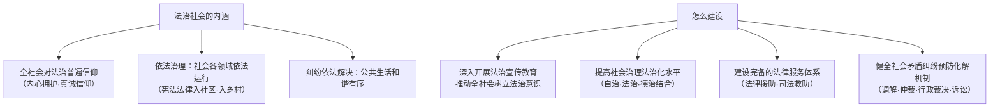

# 法治社会

## 核心要义

- **内涵**：法治社会是指**法律得到公认和普遍遵从、社会治理依法开展、公共生活和谐有序**的社会。
- **地位**：法治社会是构筑法治国家的**基础**；法治国家、法治政府、法治社会一体建设。

## 知识梳理

| 建设措施 | 要点 |
| --- | --- |
| 法治宣传教育 | 增强全民法治观念，使尊法学法守法用法成为共同追求 |
| 社会治理法治化 | 基层自治、法治、德治相结合的治理体系 |
| 法律服务体系 | 法律援助、司法救助覆盖城乡，保障群众获得及时有效的法律帮助 |
| 纠纷多元化解 | 完善调解、仲裁、行政裁决、行政复议、诉讼等有机衔接的机制 |

## 重点精讲

1. **法治信仰**：法律要发生作用，"全社会都信仰法律"是前提——法治不仅是制度，更是**观念与生活方式**；遇事找法、解决问题靠法。
2. **多元纠纷解决机制**：诉讼并非唯一途径——人民调解（自治性）、仲裁（准司法）、行政裁决与复议（行政性）、诉讼（司法性）互相衔接，既节约司法资源又便利群众。
3. **建设法治社会的意义**：①更好形成守法光荣、违法可耻的社会氛围，增进社会共识、维护社会秩序；②通过法治保障人民权益，实现公平正义。
4. **考法提示**：材料出现"普法宣传""法律援助""人民调解"分别对应宣传教育、法律服务、纠纷化解；出现"村规民约+法律顾问"对应自治法治德治结合。

## 典型例题

**例1（选择题）** 某社区设立"法律诊所"，律师定期坐班为居民免费提供咨询和法律援助。这一做法属于（　）
A. 深入开展法治宣传教育　B. 建设完备的法律服务体系　C. 强化行政执法　D. 推进司法体制改革
**解析**：法律援助与咨询服务属于法律服务体系建设。选 **B**。

**例2（材料题）** 材料：某市推行"枫桥经验"，健全人民调解组织网络，90%以上的邻里纠纷在基层通过调解化解，未激化成诉讼。
问：结合材料说明建设法治社会的措施与意义。
**解析**：措施：①健全社会矛盾纠纷预防化解机制，发挥人民调解第一道防线作用；②提高社会治理法治化水平，坚持自治、法治、德治相结合。意义：①及时化解矛盾、降低解纷成本，维护社会和谐稳定；②引导群众办事依法、遇事找法，增强法治观念；③夯实法治国家建设的社会基础。

## 易错点

- 法治社会是法治国家的**基础**，三者是一体建设、相互支撑的关系。
- 纠纷解决**不等于都要打官司**，多元化解机制是重要考点。
- 法律援助的对象主要是**经济困难或特殊案件当事人**，体现司法领域的民生保障。
- "自治、法治、德治相结合"是**基层社会治理**体系，勿写成国家治理的全部。

## 背记要点

1. 内涵三要素：法治普遍信仰、社会依法治理、纠纷依法解决。
2. 建设四措施：法治宣传教育、治理法治化（三治结合）、法律服务体系、纠纷多元化解。
3. 意义：凝聚共识、维护秩序、保障权益、实现公平正义。
4. 地位：法治社会是构筑法治国家的基础。

## 自测题

1. 法治社会的内涵是什么？
2. 建设法治社会有哪些措施？
3. 多元纠纷解决机制包括哪些方式？各有何特点？
4. 法治国家、法治政府、法治社会三者是什么关系？

## 相关知识点

国家层面见 [[法治国家]]；政府层面见 [[法治政府]]；公民守法的要求见 [[全民守法]]。
