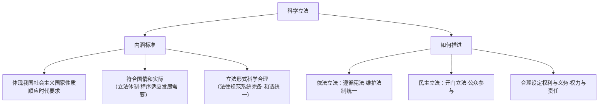

# 科学立法

## 核心要义

- **内涵**：科学立法就是尊重和体现社会发展的**客观规律**，不断提高法律的质量。
- **地位**：科学立法是全面推进依法治国的**前提**（基本要求之首：科学立法、严格执法、公正司法、全民守法）。

## 知识梳理

| 推进路径 | 要点 |
| --- | --- |
| 依法立法 | 在立法权限内立法，遵循法定程序，维护社会主义法制的统一和尊严 |
| 民主立法 | 拓宽公民参与立法的途径（座谈、听证、公开征求意见），凝聚社会共识 |
| 科学配置权责 | 使每一项立法都符合宪法精神、反映人民意志、得到人民拥护 |

## 重点精讲

1. **科学立法的三重标准**：政治性（体现国家性质与时代要求）、实践性（符合国情实际）、技术性（体系完备、内在和谐、形式合理）——三者统一于"提高立法质量"。
2. **民主立法的价值**：立法过程公开透明、广纳民意，既提高法律的**科学性**（信息充分），也增强其**正当性与可执行性**（人民认同）。
3. **依法立法的红线**：下位法不得抵触上位法；地方立法、部门规章不得越权——备案审查制度是保障法制统一的机制。
4. **考法提示**：材料出现"公开征求意见""立法听证""基层立法联系点"对应民主立法；出现"备案审查""不得同宪法抵触"对应依法立法。

## 典型例题

**例1（选择题）** 全国人大常委会法工委在多地设立"基层立法联系点"，让法律草案直通田间地头。这一做法（　）
A. 扩大了公民立法权　B. 体现民主立法，凝聚立法共识　C. 下放了国家立法权　D. 取代了人大审议程序
**解析**：公民享有参与权而非立法权，联系点是民意直通渠道。选 **B**。

**例2（材料题）** 材料：《民法典》编纂历时五年，先后10次公开征求意见，收到102万条建议；同时对既有民事单行法进行系统整合、消除矛盾。
问：结合材料说明《民法典》编纂如何体现科学立法。
**解析**：①民主立法——多次公开征求意见，广泛吸纳民智，使法典反映人民意愿；②立法形式科学——系统整合单行法，使法律规范系统完备、和谐统一；③符合国情与时代要求——回应信息时代人格权保护等新问题；④依法立法——依宪法与法定程序编纂，维护法制统一。故《民法典》成为科学立法的典范。

## 易错点

- 公民**参与**立法≠公民行使立法权，立法权属于全国人大及其常委会等法定主体。
- 科学立法的核心是**提高立法质量**，不是追求立法数量。
- 民主立法与科学立法相互支撑：民意是科学性的重要来源。
- "依法立法"强调**立法本身也要守法**（权限与程序），易被忽视。

## 背记要点

1. 内涵：尊重客观规律，提高法律质量。
2. 标准：体现国家性质、符合国情实际、形式科学合理。
3. 路径：依法立法、民主立法、合理设置权利义务与权力责任。
4. 地位：全面依法治国的前提。

## 自测题

1. 什么是科学立法？其衡量标准有哪些？
2. 如何推进科学立法？
3. 民主立法有哪些具体形式？
4. 以《民法典》为例说明科学立法的体现。

## 相关知识点

执法环节见 [[严格执法]]；司法环节见 [[公正司法]]；守法环节见 [[全民守法]]；立法质量与 [[法治国家]] 的"良法之治"相呼应。
