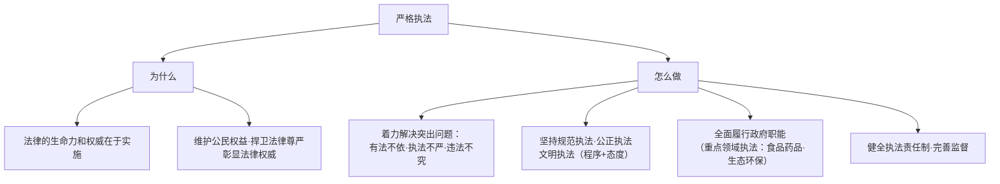

# 严格执法

## 核心要义

- **内涵**：严格执法就是执法机关在执法过程中**严格依照法律规定**行使权力、履行职责。
- **地位**：严格执法是全面推进依法治国的**关键**——法律的生命力在于实施。

## 知识梳理

| 要求 | 内涵 |
| --- | --- |
| 规范执法 | 严格依照法定权限与程序，杜绝随意执法、选择性执法 |
| 公正执法 | 平等对待执法对象，同案同罚、不偏不倚 |
| 文明执法 | 尊重当事人人格尊严，执法方式合理适度 |
| 严格监督 | 执法公示、全过程记录、重大执法决定法制审核 |

## 重点精讲

1. **"关键"的含义**：徒法不足以自行——再好的法律若不能严格实施，就会成为一纸空文；执法是把"纸上的法"变成"行动中的法"的核心环节。
2. **严格执法≠粗暴执法**：严格针对**依法**（不打折扣），文明针对**方式**（尊重权利）；"过罚相当""柔性执法（首违不罚）"与严格执法并不矛盾，都是依法的体现。
3. **执法监督机制**：行政执法公示制度、执法全过程记录制度、重大执法决定法制审核制度（"三项制度"）——以程序制约保证执法公正。
4. **考法提示**：材料出现"钓鱼执法、以罚代管"是反面典型（违背规范公正执法）；出现"执法记录仪、首违不罚清单"对应执法规范化与文明执法。

## 典型例题

**例1（选择题）** 某地推行轻微违法"首违不罚"清单，对首次轻微违规且及时改正者予以警示教育。这（　）
A. 违背了严格执法要求　B. 属于执法不严　C. 体现依法、文明、过罚相当的执法理念　D. 削弱了法律权威
**解析**："首违不罚"有法律依据（行政处罚法），体现处罚与教育相结合、过罚相当。选 **C**。

**例2（材料题）** 材料：某市市场监管部门开展食品安全专项整治，公开执法依据与结果，执法全程录音录像，重大处罚决定须经法制审核。
问：结合材料说明该部门是如何做到严格执法的。
**解析**：①全面履行政府职能，聚焦食品安全重点领域执法，解决有法不依、违法不究问题；②坚持规范执法——依法定权限程序，执法全过程记录；③坚持公正公开——公示执法依据与结果，接受社会监督；④健全执法制度——重大决定法制审核，防止权力滥用。这既捍卫了法律权威，又维护了人民群众生命健康权益。

## 易错点

- 严格执法的主体主要是**行政机关（政府）**，司法机关对应"公正司法"。
- "严格"指**依法不打折**，不是从重从严处罚。
- 三项制度（公示、全过程记录、法制审核）是执法规范化的抓手，勿与立法程序混淆。
- 执法既要维护法律权威，也要**保障行政相对人的合法权益**，两面都要答。

## 背记要点

1. 地位：严格执法是依法治国的关键；法律的生命力在于实施。
2. 突出问题：有法不依、执法不严、违法不究。
3. 要求：规范、公正、文明执法+全面履职+健全责任与监督。
4. 三项制度：执法公示、全过程记录、重大决定法制审核。

## 自测题

1. 为什么说严格执法是全面依法治国的关键？
2. 严格执法要着力解决哪些问题？
3. 规范执法、公正执法、文明执法各指什么？
4. "首违不罚"是否违背严格执法？说明理由。

## 相关知识点

立法前提见 [[科学立法]]；司法防线见 [[公正司法]]；执法主体的建设要求见 [[法治政府]]。
