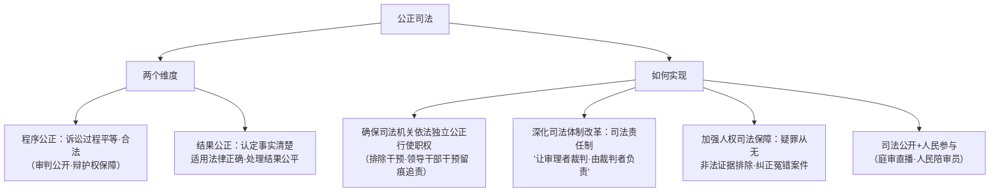

# 公正司法

## 核心要义

- **内涵**：公正司法就是要在司法活动的**过程和结果**中体现公平正义的精神。
- **地位**：公正司法是全面推进依法治国的**重要任务**，是维护社会公平正义的**最后一道防线**。

## 知识梳理

| 措施 | 要点 |
| --- | --- |
| 依法独立行使职权 | 司法机关依照法律规定独立行使审判权、检察权，不受行政机关、社会团体和个人的干涉 |
| 司法责任制 | 让审理者裁判、由裁判者负责，员额制改革 |
| 人权司法保障 | 疑罪从无、非法证据排除、国家赔偿、纠正冤假错案 |
| 阳光司法 | 审判流程、庭审活动、裁判文书、执行信息公开 |

## 重点精讲

1. **程序公正与结果公正的关系**：程序公正是结果公正的**保障**——只有过程依法、各方平等参与，结果才可信可接受；"正义不仅要实现，而且要以看得见的方式实现"。
2. **"最后一道防线"的含义**：立法、执法环节的问题最终可诉诸司法裁断；司法不公将使公平正义的底线失守——"一次不公正的审判，其恶果甚于十次犯罪"（培根）。
3. **冤错案件纠正的意义**：呼格案、聂树斌案等的再审改判，体现**疑罪从无**与人权司法保障理念的落实，以个案正义修复司法公信。
4. **考法提示**：材料出现"庭审直播、裁判文书上网"对应司法公开；"排除刑讯逼供所获证据"对应非法证据排除；"领导干部干预司法留痕"对应依法独立行使职权。

## 典型例题

**例1（选择题）** 我国建立领导干部干预司法活动、插手具体案件处理的记录、通报和责任追究制度。此举旨在（　）
A. 削弱党的领导　B. 保障司法机关依法独立公正行使职权　C. 扩大司法机关权力　D. 减少案件数量
**解析**：制度目的在于排除不当干预，保障独立公正司法（党的领导是政治领导，不等于干预个案）。选 **B**。

**例2（材料题）** 材料：某中院对一起故意杀人案因"事实不清、证据不足"依法宣告被告人无罪，并同步公开裁判文书，引发社会好评。
问：结合材料说明公正司法的要求及意义。
**解析**：要求：①坚持疑罪从无，加强人权司法保障——证据不足即宣告无罪，防止冤错案件；②坚持程序公正与司法公开——裁判文书上网，以看得见的方式实现正义。意义：①保障公民合法权益，彰显宪法尊重和保障人权原则；②守住社会公平正义的最后一道防线，提升司法公信力，弘扬法治精神。

## 易错点

- "依法独立行使职权"是**依照法律**独立，且须接受党的领导和人大监督，勿理解为"三权分立"。
- 公正司法主体是**司法机关**（法院、检察院），与行政机关的严格执法区分。
- 疑罪从无：证据不足**只能判无罪**，不能"疑罪从轻"。
- 程序公正不是形式主义，其本身就是司法公正的组成部分。

## 背记要点

1. 内涵：过程（程序公正）+结果（结果公正）体现公平正义。
2. 地位：维护社会公平正义的最后一道防线。
3. 措施：依法独立行使职权、司法责任制、人权司法保障、司法公开与人民参与。
4. 理念：疑罪从无、非法证据排除、让审理者裁判由裁判者负责。

## 自测题

1. 公正司法的内涵包括哪两个维度？关系如何？
2. 为什么说司法公正是最后一道防线？
3. 如何推进公正司法？
4. 疑罪从无原则有何意义？

## 相关知识点

执法环节见 [[严格执法]]；守法基础见 [[全民守法]]；司法公正与 [[法治国家]] 的权利保障相呼应。
