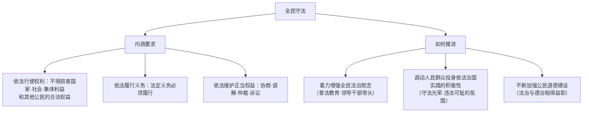

# 全民守法

## 核心要义

- **内涵**：全民守法是指所有社会成员**普遍尊重和信仰法律、依法行使权利和履行义务**的状态。
- **地位**：全民守法是全面推进依法治国的**基础**——法治的根基在人民。

## 知识梳理

| 维度 | 要点 |
| --- | --- |
| 权利维度 | 依法行使权利，权利行使有边界 |
| 义务维度 | 依法履行义务，权利义务相统一 |
| 救济维度 | 通过合法途径表达诉求、解决纠纷，不能"信访不信法""以闹解决" |

## 重点精讲

1. **权利与义务的统一**：公民对"法无禁止即可为"，但行使自由权利**不得超越法律边界**（如言论自由不得诽谤侮辱他人）；享有权利的同时必须履行法定义务（纳税、受教育等）。
2. **依法维权的导向**：遇到纠纷应通过**协商、调解、仲裁、行政复议、诉讼**等法定渠道解决——"办事依法、遇事找法、解决问题用法、化解矛盾靠法"。
3. **领导干部"关键少数"**：领导干部带头尊法学法守法用法，对全社会有示范效应；任何组织和个人都不得有超越宪法法律的特权。
4. **考法提示**：材料出现"理性维权 vs 网络造谣、医闹"是正反对照，答依法行使权利与依法维权；出现"宪法宣传周、法治副校长"对应增强全民法治观念。

## 典型例题

**例1（选择题）** 消费者王某网购遇假货，先与商家协商，后向平台与市场监管部门投诉，最终通过诉讼获得赔偿。这体现了（　）
A. 以闹维权　B. 依法行使权利、依法维护正当权益　C. 私力报复　D. 逃避义务
**解析**：王某逐级通过法定渠道维权，是全民守法的典型表现。选 **B**。

**例2（材料题）** 材料：某地开展"宪法进社区"活动，同时曝光多起网络谣言案件，造谣者被依法处罚。
问：结合材料说明如何推进全民守法。
**解析**：①着力增强全民法治观念——宪法宣传教育使尊法学法守法用法成为共同追求；②引导公民依法行使权利——言论自由有边界，网络空间不是法外之地，造谣侵权须担责；③营造守法光荣、违法可耻的社会氛围，以案释法发挥警示教育作用；④坚持法治与德治结合，加强公民道德建设，使守法成为内在自觉。

## 易错点

- 公民"法无禁止即可为"，政府"法无授权不可为"——两个口诀的**主体**勿颠倒。
- 全民守法不仅指"不违法"，更包括**依法行使权利、履行义务、依法维权**的积极状态。
- 维权必须走**合法途径**，"网络曝光施压""聚众闹事"不属于依法维权。
- 全民守法是依法治国的**基础**，科学立法是**前提**，严格执法是**关键**，公正司法是**重要任务/防线**——四个定位词勿混。

## 背记要点

1. 内涵：尊法信法、依法行使权利、依法履行义务、依法维护权益。
2. 路径：增强法治观念、调动群众积极性、加强道德建设。
3. 口诀：办事依法、遇事找法、解决问题用法、化解矛盾靠法。
4. 定位：全民守法是全面依法治国的基础。

## 自测题

1. 全民守法的内涵是什么？
2. 公民应如何依法行使权利与履行义务？
3. 依法维权有哪些法定途径？
4. 如何推进全民守法？

## 相关知识点

四大基本要求的其余环节见 [[科学立法]]、[[严格执法]]、[[公正司法]]；社会氛围建设见 [[法治社会]]。
