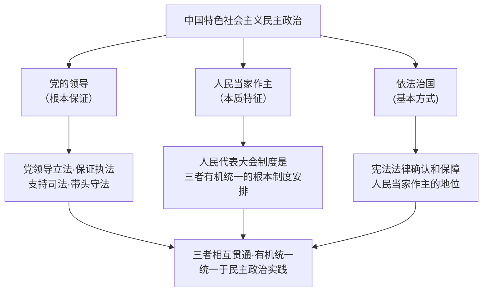

# 综合探究三 坚持党的领导、人民当家作主、依法治国有机统一

## 核心要义

- **三者关系总述**：党的领导是人民当家作主和依法治国的**根本保证**；人民当家作主是社会主义民主政治的**本质特征**；依法治国是党领导人民治理国家的**基本方式**——三者统一于我国社会主义民主政治的伟大实践。

## 知识梳理

| 关系 | 阐释 |
| --- | --- |
| 党的领导 ↔ 人民当家作主 | 党的宗旨是全心全意为人民服务；党领导人民有效治理国家，人民民主是党执政的基础 |
| 党的领导 ↔ 依法治国 | 党领导人民制定和实施宪法法律，党自身必须在宪法法律范围内活动 |
| 人民当家作主 ↔ 依法治国 | 法律是人民意志的体现，依法治国保障人民权利；人民是依法治国的主体和力量源泉 |

## 重点精讲

1. **为什么必须有机统一**：割裂三者会导致方向迷失（离开党的领导）、根基动摇（离开人民立场）或治理失序（离开法治轨道）；三者统一才能实现党的主张、人民意愿与国家法律的高度一致。
2. **人民代表大会制度的枢纽作用**：人大制度把三者贯通——党的主张通过法定程序上升为国家意志；人民通过人大行使国家权力；国家机关依法产生、依法履职。它是坚持三者有机统一的**根本政治制度安排**。
3. **党的领导如何体现在依法治国全过程**：领导立法（重大立法决策）、保证执法（推进法治政府）、支持司法（保障独立公正行使职权）、带头守法（党章党规严于国法、党员干部作表率）。
4. **考法提示**：综合探究类大题常要求"结合材料说明三者如何有机统一"——答题框架：先分别点明三者地位（保证/本质/方式），再结合材料逐一对应，最后落脚"统一于民主政治实践"。

## 典型例题

**例1（选择题）** 党的重大立法建议经全国人大法定程序成为国家法律。这一过程体现（　）
A. 党直接行使国家立法权　B. 党的主张与人民意志通过法定程序相统一　C. 人大权力高于党的领导　D. 立法无需程序
**解析**：党领导立法但不代替立法，党的主张经法定程序上升为国家意志。选 **B**。

**例2（材料题）** 材料：《民法典》编纂由党中央决策部署，全国人大常委会十次审议、多次公开征求意见，最终由全国人民代表大会表决通过。
问：结合材料说明党的领导、人民当家作主、依法治国是如何有机统一的。
**解析**：①党的领导——编纂工作由党中央决策部署，把握方向，体现根本保证；②人民当家作主——公开征求百万条意见，人大代表审议表决，人民意志充分表达，体现本质特征；③依法治国——严格依照立法法定程序审议通过，以法典形式确认和保障民事权利，体现基本方式；④三者通过人民代表大会制度贯通衔接，统一于社会主义民主法治实践。

## 易错点

- 三个定位词精确对应：党的领导=根本保证、人民当家作主=**本质特征**、依法治国=**基本方式**，勿错配。
- 党领导立法≠党直接立法；立法权由**人大**依法行使。
- "有机统一"的制度载体是**人民代表大会制度**（根本政治制度）。
- 依法治国首先是**依宪治国**，党也必须在宪法法律范围内活动。

## 背记要点

1. 三定位：根本保证、本质特征、基本方式。
2. 枢纽：人民代表大会制度是三者有机统一的根本制度安排。
3. 党与法治：领导立法、保证执法、支持司法、带头守法。
4. 答题框架：分述地位→结合材料对应→归结于统一实践。

## 自测题

1. 党的领导、人民当家作主、依法治国各处于什么地位？
2. 为什么三者必须有机统一、不可分割？
3. 人民代表大会制度如何贯通三者？
4. 以一部法律的制定为例，说明三者的有机统一。

## 相关知识点

依法治国的总目标见 [[全面推进依法治国的总目标与原则]]；四大基本要求见 [[科学立法]]、[[严格执法]]、[[公正司法]]、[[全民守法]]；法治建设历程见 [[我国法治建设的历程]]。
