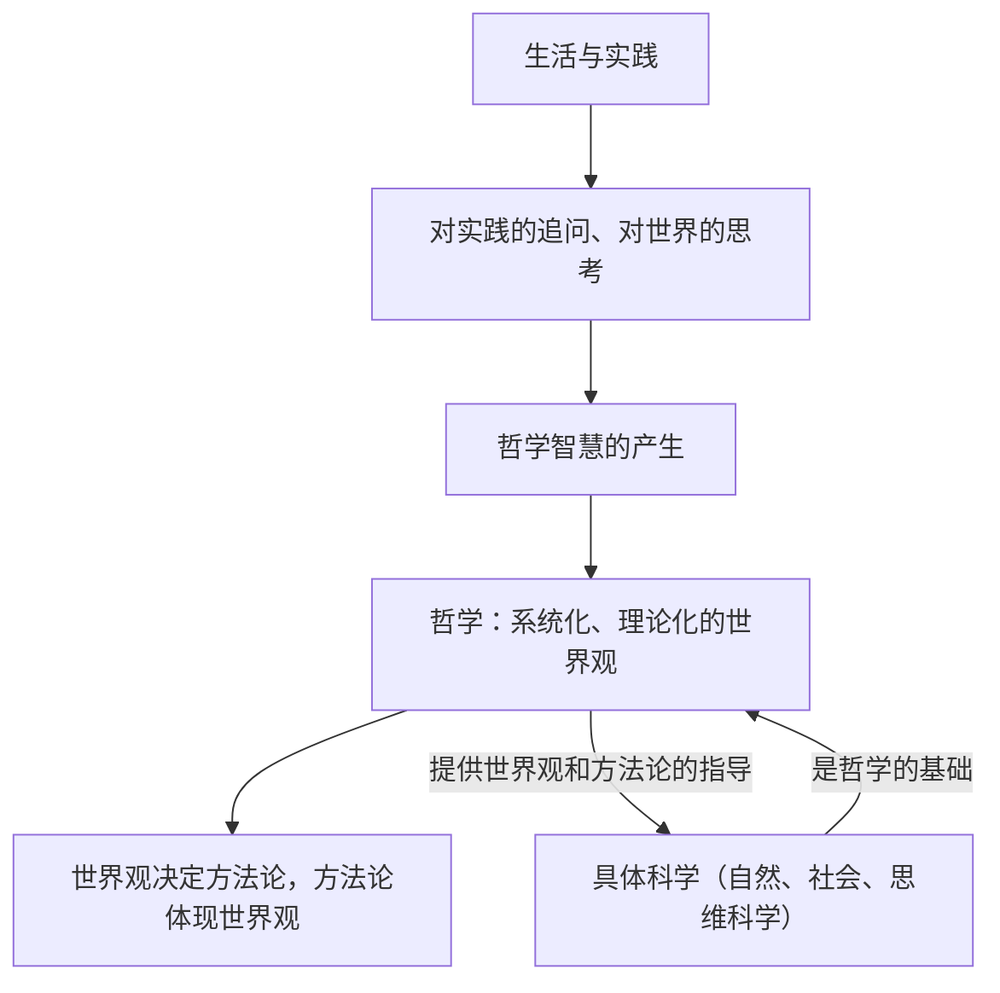

# 追求智慧的学问

## 核心概念

- **哲学的本义**：爱智慧、追求智慧，哲学是一门给人智慧、使人聪明的学问。
- **哲学的起源**：哲学的智慧产生于人类的实践活动，源于人们对实践的追问和对世界的思考。
- **世界观**：人们对整个世界的总的看法和根本观点。哲学是系统化、理论化的世界观。
- **方法论**：人们用世界观作指导去认识世界和改造世界，就成了方法论。哲学是世界观和方法论的统一。
- **哲学与具体科学**：具体科学是哲学的基础，哲学为具体科学提供世界观和方法论的指导。

## 知识梳理

| 比较项 | 世界观 | 哲学 |
| --- | --- | --- |
| 含义 | 对整个世界总的看法和根本观点 | 关于世界观的学问 |
| 特点 | 人人都有，往往自发、零散 | 系统化、理论化 |
| 联系 | 哲学是系统化、理论化的世界观 | 二者不能等同也不能割裂 |

## 原理与方法论

| 原理 | 方法论要求 |
| --- | --- |
| 哲学源于实践，源于对实践的追问和对世界的思考 | 自觉投身实践，在实践中反思和追问 |
| 世界观决定方法论，方法论体现世界观 | 树立科学的世界观，用正确方法认识和改造世界 |
| 具体科学是哲学的基础，哲学给具体科学以指导 | 重视具体科学发展，坚持科学世界观的指导 |

## 典型题例

**例1（选择题）** "哲学开始于仰望天穹"，这句话形象地说明（　）
A. 哲学的发展与生活无关　B. 哲学源于人们对实践的追问和对世界的思考　C. 哲学是凭空产生的　D. 哲学的任务是解释天象
**答案要点**：哲学的智慧产生于人类的实践活动，源于对世界的思考。选 **B**。

**例2（主观题）** 有人认为"哲学是科学之科学，可以取代具体科学"。请评析。
**答案要点**：①具体科学是哲学的基础，具体科学的进步推动哲学的发展；②哲学为具体科学提供世界观和方法论的指导，但不能取代具体科学；③把哲学当作凌驾于一切科学之上的"科学之科学"是错误的。

## 易错点

- 哲学是给人智慧的学问，但**不能说掌握哲学就自然聪明**，只有真正的哲学才能正确指导实践。
- 世界观人人都有，但**不是人人都是哲学家**。
- 哲学与具体科学是**共性与个性、一般与个别**的关系，不是整体与部分、多数与少数的关系。
- 哲学源于**实践**，不是源于哲学家的头脑或主观情绪。

## 背记要点

1. 哲学本义是爱智慧、追求智慧；哲学的智慧产生于人类的实践活动（高考常考起源判断）。
2. 哲学是系统化、理论化的世界观，是世界观和方法论的统一。
3. 世界观决定方法论，方法论体现世界观。
4. 具体科学是哲学的基础，哲学为具体科学提供世界观和方法论的指导。
5. 北京等级考视角：常借科学家名言、科技成就材料考查哲学与具体科学的关系。

## 自测题

1. 哲学的本义是什么？哲学的智慧从何而来？
2. 什么是世界观？哲学与世界观是什么关系？
3. 简述哲学与具体科学的关系。
4. 为什么说哲学是世界观和方法论的统一？

## 相关知识点

哲学的基本问题见 [[哲学的基本问题]]；马克思主义哲学的基本特征见 [[科学的世界观和方法论]]。
