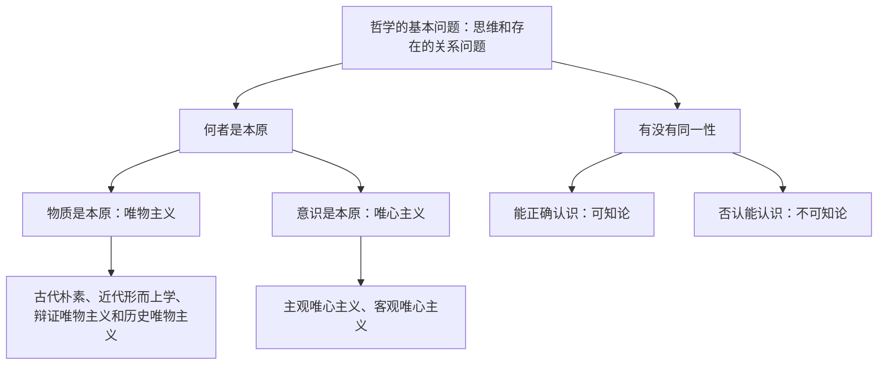

# 哲学的基本问题

## 核心概念

- **哲学的基本问题**：思维和存在的关系问题，也就是意识和物质的关系问题。
- **第一方面**：思维和存在**何者是本原**的问题——划分唯物主义和唯心主义的唯一标准。
- **第二方面**：思维和存在**有没有同一性**的问题，即思维能否正确认识存在的问题——划分可知论和不可知论。
- **唯物主义**：物质是本原，先有物质后有意识，物质决定意识。三种基本形态：古代朴素唯物主义、近代形而上学唯物主义、辩证唯物主义和历史唯物主义。
- **唯心主义**：意识是本原，物质依赖于意识。两种基本形态：主观唯心主义、客观唯心主义。

## 知识梳理

| 派别 | 基本观点 | 典型表现 |
| --- | --- | --- |
| 古代朴素唯物主义 | 把物质归结为具体物质形态 | "水是万物的始基"、五行说 |
| 近代形而上学唯物主义 | 把物质归结为原子 | 机械性、形而上学性、不彻底性 |
| 主观唯心主义 | 把人的主观精神当作本原 | "心外无物"、"存在就是被感知" |
| 客观唯心主义 | 把客观精神当作本原 | "理生万物"、上帝创世说 |

## 原理与方法论

| 原理 | 方法论要求 |
| --- | --- |
| 思维和存在的关系问题是哲学的基本问题 | 处理好主观与客观的关系，一切从实际出发 |
| 唯物主义与唯心主义的分歧在于何者为本原 | 坚持唯物主义，反对唯心主义 |
| 思维和存在具有同一性 | 坚持可知论，相信世界可以被认识 |

## 典型题例

**例1（选择题）** 王守仁说"心外无物"，贝克莱说"存在就是被感知"。二者共同点是（　）
A. 属于客观唯心主义　B. 把人的主观精神当作世界的本原　C. 坚持可知论　D. 否认思维与存在的同一性
**答案要点**：二者都把人的主观精神夸大为世界本原，属于主观唯心主义。选 **B**。

**例2（主观题）** 为什么思维和存在的关系问题是哲学的基本问题？
**答案要点**：①它是人们在生活和实践活动中首先遇到和无法回避的基本问题；②它是一切哲学都不能回避、必须回答的问题；③对这一问题的不同回答决定着各种哲学的基本性质和方向，决定着对其他哲学问题的回答。

## 易错点

- 划分唯物主义与唯心主义的**唯一标准**是对本原问题的回答，不涉及第二方面。
- 古代朴素唯物主义把物质等同于**具体物质形态**；近代形而上学唯物主义把物质等同于**原子**。
- "理生万物""上帝创世"属**客观**唯心主义，"心外无物"属**主观**唯心主义，不可混淆。
- 唯物主义并非都正确（前两种形态有局限），唯心主义在其发展中也有借鉴意义。

## 背记要点

1. 哲学基本问题：思维和存在的关系问题（= 意识和物质的关系问题）。
2. 两方面内容：何者是本原（唯物/唯心）；有没有同一性（可知论/不可知论）。
3. 唯物主义三种基本形态、唯心主义两种基本形态及典型观点须能对号入座。
4. 对基本问题的不同回答决定各种哲学的基本性质和方向。
5. 北京等级考视角：常给出古今名言判断哲学派别，注意关键词定位。

## 自测题

1. 哲学的基本问题是什么？包括哪两方面内容？
2. 划分唯物主义和唯心主义的唯一标准是什么？
3. 唯物主义的三种基本形态各有何特点与局限？
4. 主观唯心主义和客观唯心主义的区别是什么？各举一例。

## 相关知识点

哲学的起源与含义见 [[追求智慧的学问]]；科学回答基本问题的哲学见 [[科学的世界观和方法论]]。
