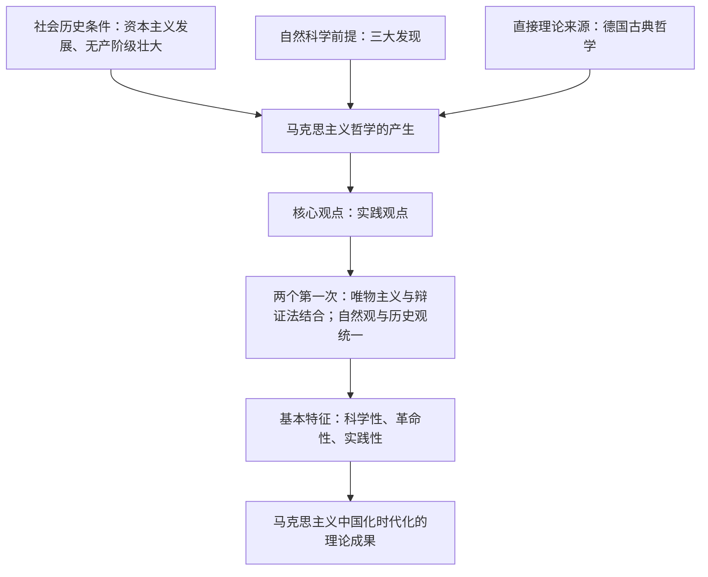

# 科学的世界观和方法论

## 核心概念

- **马克思主义哲学的产生**：有其深厚的社会历史条件——阶级基础是无产阶级的产生和发展；自然科学前提是细胞学说、能量守恒和转化定律、生物进化论三大发现；直接理论来源是德国古典哲学（黑格尔辩证法的合理内核、费尔巴哈唯物主义的基本内核）。
- **马克思主义哲学的核心观点**：实践观点。它第一次实现了唯物主义与辩证法的有机结合，第一次实现了唯物辩证的自然观与唯物辩证的历史观的有机统一。
- **基本特征**：科学性、革命性、实践性的统一；是科学的世界观和方法论。
- **马克思主义中国化时代化**：毛泽东思想、中国特色社会主义理论体系、习近平新时代中国特色社会主义思想是马克思主义中国化时代化的重大理论成果。

## 知识梳理

| 特征 | 内涵 |
| --- | --- |
| 科学性 | 正确反映了物质世界的本质和规律 |
| 革命性 | 是"改变世界"的科学、指导人类解放的科学，是无产阶级的科学的世界观和方法论 |
| 实践性 | 实践的观点是马克思主义哲学的核心观点 |

## 原理与方法论

| 原理 | 方法论要求 |
| --- | --- |
| 马克思主义哲学是科学的世界观和方法论 | 坚持以马克思主义为指导，学哲学、用哲学 |
| 实践的观点是马克思主义哲学的核心观点 | 坚持实践第一，理论联系实际 |
| 马克思主义是不断发展的开放的理论 | 坚持马克思主义中国化时代化，用发展着的理论指导实践 |

## 典型题例

**例1（选择题）** 马克思主义哲学实现了哲学史上的伟大变革，其重要表现是（　）
A. 第一次提出了唯物主义　B. 第一次实现了唯物主义与辩证法的有机结合、唯物辩证的自然观与历史观的有机统一　C. 结束了一切哲学争论　D. 使哲学成为科学之科学
**答案要点**："两个第一次"是马克思主义哲学变革性的集中体现。选 **B**。

**例2（主观题）** 结合材料（如脱贫攻坚、中国式现代化实践），说明为什么要坚持马克思主义中国化时代化。
**答案要点**：①马克思主义是科学的理论，但必须同中国具体实际相结合、同中华优秀传统文化相结合；②实践没有止境，理论创新也没有止境；③毛泽东思想、中国特色社会主义理论体系、习近平新时代中国特色社会主义思想指导中国革命、建设和改革不断取得胜利。

## 易错点

- 三大发现是**自然科学前提**，德国古典哲学是**直接理论来源**，二者不可混淆。
- 马克思主义哲学的核心观点是**实践观点**，不是矛盾观点或阶级斗争观点。
- 马克思主义哲学不是"科学之科学"，它与具体科学仍是一般与个别的关系。
- 马克思主义是**开放的、发展的**理论体系，不是僵化的教条。

## 背记要点

1. 产生条件三要素：阶级基础、自然科学前提（三大发现）、直接理论来源（德国古典哲学）。
2. 核心观点：实践观点；"两个第一次"实现哲学史上的伟大变革。
3. 基本特征：科学性、革命性、实践性的统一。
4. 中国化时代化成果：毛泽东思想—中国特色社会主义理论体系—习近平新时代中国特色社会主义思想。
5. 北京等级考视角：常结合党的创新理论考查马克思主义的实践品格与发展性。

## 自测题

1. 马克思主义哲学产生的自然科学前提和直接理论来源分别是什么？
2. 马克思主义哲学实现的"两个第一次"指什么？
3. 马克思主义哲学的核心观点和基本特征是什么？
4. 马克思主义中国化时代化的重大理论成果有哪些？

## 相关知识点

哲学基本问题的科学回答见 [[哲学的基本问题]]；实践观点的展开见 [[人的认识从何而来]]；以马克思主义指导文化建设见 [[综合探究三 坚持以马克思主义为指导 发展中国特色社会主义文化]]。
