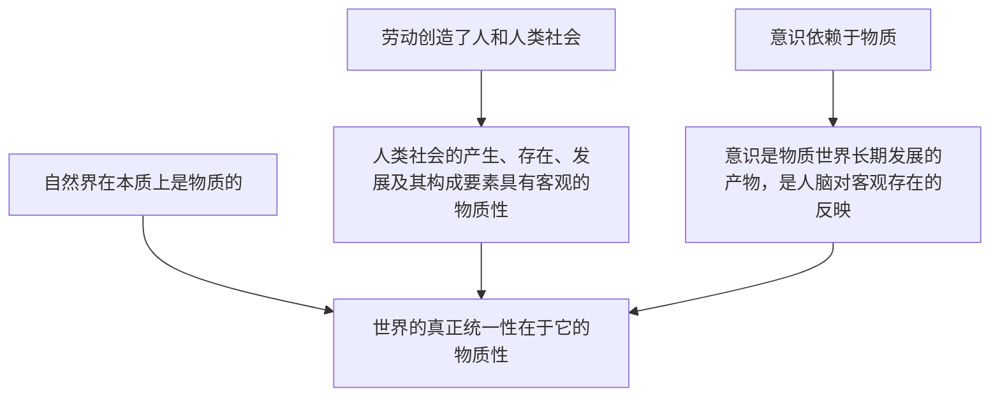

# 世界的物质性

## 核心概念

- **物质**：不依赖于人的意识，并能为人的意识所反映的客观实在。物质的唯一特性是**客观实在性**。
- **自然界的物质性**：自然界在本质上是物质的，自然界中的事物是按照自身所固有的规律形成和发展的。
- **人类社会的物质性**：人类社会是物质世界长期发展的产物；劳动创造了人和人类社会；构成社会物质生活条件的基本要素（地理环境、人口因素、生产方式）都是客观的物质的要素。
- **意识**：意识是自然界长期发展的产物，是社会发展的产物；人脑是意识活动的物质器官；意识是人脑对客观存在的反映。
- **结论**：世界的真正统一性在于它的物质性。世界是物质的世界。

## 知识梳理

| 层面 | 要点 |
| --- | --- |
| 自然界 | 事物按自身固有规律形成和发展，都是统一物质世界的组成部分 |
| 人类社会 | 是物质世界长期发展的产物；三个基本要素客观物质 |
| 人的意识 | 一开始就是社会的产物，在劳动中伴随人和人类社会一起产生 |

## 原理与方法论

| 原理 | 方法论要求 |
| --- | --- |
| 世界的真正统一性在于它的物质性（世界统一于物质） | 想问题、办事情要一切从实际出发，实事求是 |
| 自然界具有物质性 | 尊重自然、顺应自然、保护自然，与自然和谐相处 |
| 物质决定意识，意识是人脑对客观存在的反映 | 坚持一切从实际出发，使主观符合客观 |

## 典型题例

**例1（选择题）** 哲学上的物质概念与具体的物质形态的关系是（　）
A. 整体与部分的关系　B. 共性与个性、一般与个别的关系　C. 主观与客观的关系　D. 原因与结果的关系
**答案要点**：物质概念概括了万事万物的共同本质——客观实在性，与具体形态是共性与个性的关系。选 **B**。

**例2（主观题）** 结合"生态文明建设"材料，运用世界的物质性原理说明为什么要尊重自然。
**答案要点**：①自然界在本质上是物质的，自然界中的事物按自身固有的规律形成和发展；②世界的真正统一性在于它的物质性；③人类改造自然必须以承认自然界的客观性为前提，尊重自然、顺应自然、保护自然，否则会受到自然的惩罚。

## 易错点

- 物质的**唯一特性**是客观实在性；运动是物质的**固有的根本属性**，二者不能混淆。
- "客观实在"是对万事万物共性的概括，"客观存在"包括物质现象与精神现象，范围更大。
- 意识是**人脑**的机能，不是"大脑"的机能；有了人脑不等于就有意识，意识内容源于客观存在。
- 人类社会的物质性不等于社会发展与人的意识无关，而是说其产生、存在、发展具有客观性。

## 背记要点

1. 物质定义：不依赖于人的意识、能为人的意识所反映的客观实在；唯一特性是客观实在性。
2. 世界的真正统一性在于它的物质性（教材原文口径，答题标准表述）。
3. 劳动创造了人和人类社会；社会物质生活条件三要素客观。
4. 意识起源：自然界长期发展的产物 + 社会发展的产物；本质：人脑对客观存在的反映。
5. 北京等级考视角：常以生态治理、科学发现为背景考查物质性原理与从实际出发。

## 自测题

1. 哲学上的物质概念是什么？其唯一特性是什么？
2. 为什么说自然界和人类社会都具有物质性？
3. 从起源、生理基础、内容三方面说明意识的本质。
4. "世界的真正统一性在于它的物质性"对我们提出了什么方法论要求？

## 相关知识点

物质的存在方式见 [[运动的规律性]]；意识能动作用与规律客观性的结合见 [[运动的规律性]]；社会存在的决定作用见 [[社会历史的本质]]。
