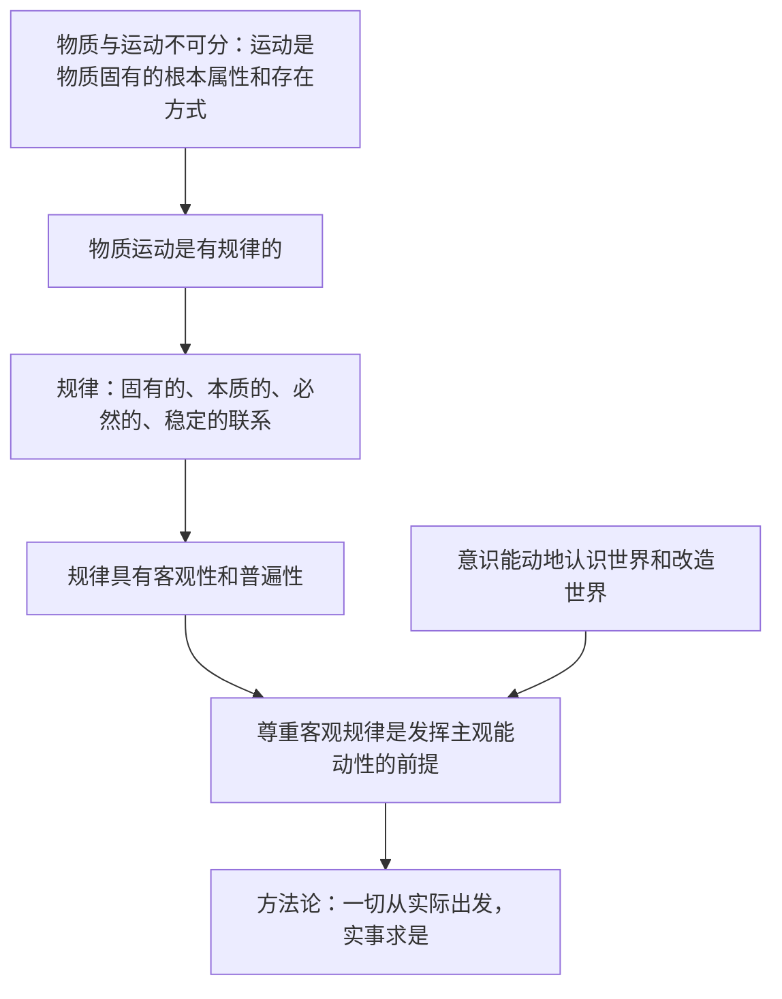

# 运动的规律性

## 核心概念

- **运动**：宇宙间一切事物、现象的变化和过程。物质是运动的物质，运动是物质**固有的根本属性和存在方式**；运动是物质的运动，物质是运动的载体。
- **规律**：事物运动过程中固有的、本质的、必然的、稳定的联系。规律是客观的、普遍的，不以人的意志为转移，既不能被创造，也不能被消灭。
- **意识的能动作用**：人能够能动地认识世界（意识活动具有目的性、自觉选择性和能动创造性）；人能够能动地改造世界（意识对改造客观世界具有指导作用）。
- **尊重客观规律与发挥主观能动性**：尊重客观规律是正确发挥主观能动性的前提；人可以在认识和把握规律的基础上，根据规律发生作用的条件和形式利用规律，改造客观世界，造福人类。
- **一切从实际出发，实事求是**：做事情要尊重物质运动的客观规律，从客观存在的事物出发，找出事物固有的规律性，以此作为行动的依据。

## 知识梳理

| 项目 | 要点 |
| --- | --- |
| 规律的特点 | 客观性、普遍性；不能被创造、改变、消灭，但可以被认识和利用 |
| 能动认识世界 | 目的性、自觉选择性、能动创造性 |
| 能动改造世界 | 正确意识促进事物发展，错误意识阻碍事物发展 |

## 原理与方法论

| 原理 | 方法论要求 |
| --- | --- |
| 规律是客观的、普遍的 | 必须尊重规律，按客观规律办事，不能违背规律 |
| 人可以认识和利用规律 | 在把握规律的基础上，改造客观世界，造福人类 |
| 物质决定意识，意识具有能动作用 | 一切从实际出发，实事求是；重视精神的力量，树立正确意识 |
| 规律客观性与主观能动性的辩证关系 | 把发挥主观能动性和尊重客观规律结合起来，把高度的革命热情同严谨踏实的科学态度结合起来 |

## 典型题例

**例1（选择题）** "揠苗助长"事与愿违，"庖丁解牛"游刃有余。这两则典故共同说明（　）
A. 规律是可以被改变的　B. 发挥主观能动性就能成功　C. 要按客观规律办事，违背规律必受惩罚　D. 人在规律面前无能为力
**答案要点**：揠苗助长违背规律受惩罚，庖丁解牛顺应规律获成功。选 **C**。

**例2（主观题）** 结合我国依据节气规律指导农业生产、利用天文规律实施探月工程等事例，说明如何处理尊重客观规律与发挥主观能动性的关系。
**答案要点**：①规律是客观的，尊重客观规律是正确发挥主观能动性的前提；②人可以在认识和把握规律的基础上，根据规律发生作用的条件和形式利用规律；③把发挥主观能动性和尊重客观规律结合起来，做到一切从实际出发，实事求是。

## 易错点

- 规律**不能被创造、改变、消灭**，但人可以**认识和利用**规律；"改变规律发生作用的条件"不等于改变规律。
- 运动是物质**固有的根本属性**；客观实在性才是物质的**唯一特性**。
- 意识的能动作用有二重性：**正确**意识促进、**错误**意识阻碍，不能笼统说"意识促进事物发展"。
- 规律本身无好坏之分；规律不等于规则、守则（后者是主观的）。

## 背记要点

1. 运动是物质固有的根本属性和存在方式；物质与运动不可分割。
2. 规律定义四关键词：固有的、本质的、必然的、稳定的联系。
3. 规律客观性、普遍性原理 + 按规律办事的方法论是主观题高频考点。
4. 意识能动作用：能动地认识世界（目的性、自觉选择性、能动创造性）+ 能动地改造世界。
5. 北京等级考视角：常以重大工程、生态治理为背景，要求"结合材料"运用规律与能动性关系原理。

## 自测题

1. 如何理解物质和运动的关系？
2. 什么是规律？规律有哪些特点？
3. 意识的能动作用表现在哪些方面？
4. 怎样做到一切从实际出发、实事求是？

## 相关知识点

世界的物质统一性见 [[世界的物质性]]；规律与联系、发展的关系见 [[世界是普遍联系的]] 与 [[世界是永恒发展的]]。
