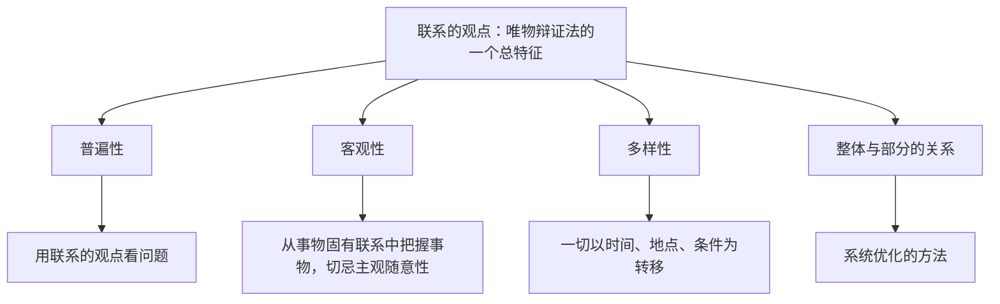

# 世界是普遍联系的

## 核心概念

- **联系**：事物之间以及事物内部诸要素之间相互依赖、相互影响、相互制约、相互作用。
- **联系的普遍性**：任何事物都处在联系之中，世界是一个普遍联系的有机整体。
- **联系的客观性**：联系是事物本身固有的，不以人的意志为转移。自在事物的联系和人为事物的联系都是客观的。
- **联系的多样性**：直接联系与间接联系、内部联系与外部联系、本质联系与非本质联系、必然联系与偶然联系等。要善于分析和把握事物存在和发展的各种条件，一切以时间、地点、条件为转移。
- **整体与部分**：整体居于主导地位，统率着部分；部分影响整体，关键部分的功能及其变化甚至对整体的功能起决定作用。
- **系统优化的方法**：系统的基本特征是整体性、有序性和内部结构的优化趋向。

## 知识梳理

| 关系 | 整体 | 部分 |
| --- | --- | --- |
| 地位作用 | 居于主导地位，统率部分 | 服从和服务于整体；关键部分甚至起决定作用 |
| 方法论 | 树立全局观念，立足整体，实现整体最优目标 | 重视部分作用，用局部的发展推动整体的发展 |

## 原理与方法论

| 原理 | 方法论要求 |
| --- | --- |
| 联系具有普遍性 | 用联系的观点看问题，反对孤立地看问题 |
| 联系具有客观性 | 从事物固有的联系中把握事物，切忌主观随意性；人可以根据事物固有联系建立新的联系 |
| 联系具有多样性 | 善于分析和把握事物存在和发展的各种条件，一切以时间、地点、条件为转移 |
| 整体与部分辩证统一 | 树立全局观念，同时重视部分的作用 |
| 系统与要素的关系 | 掌握系统优化的方法，用综合的思维方式认识事物 |

## 典型题例

**例1（选择题）** "城门失火，殃及池鱼"体现的哲学道理是（　）
A. 任何两个事物之间都有联系　B. 事物是普遍联系的　C. 联系是主观臆造的　D. 联系是无条件的
**答案要点**：火—水—鱼之间的间接联系体现联系的普遍性。注意联系是有条件的，并非任意两物直接相联。选 **B**。

**例2（主观题）** 结合京津冀协同发展的材料，运用整体与部分的知识说明为什么要"一盘棋"谋划。
**答案要点**：①整体居于主导地位、统率部分，应树立全局观念，立足整体，寻求最优目标；②部分的功能及其变化会影响整体，关键部分甚至对整体功能起决定作用，要搞好局部；③三地立足协同发展整体布局，各扬所长，实现整体功能大于部分功能之和。

## 易错点

- 联系是普遍的，但**并非任何两个事物之间都存在联系**，联系是有条件的。
- 人为事物的联系也是**客观的**，因为它以自在事物的联系为基础，形成后便独立于人的意识之外。
- 人不能创造或消灭联系本身，但可以**根据事物固有的联系，改变事物的状态，建立新的联系**。
- 关键部分"甚至对整体功能起决定作用"是**有条件的**，不能说部分决定整体。

## 背记要点

1. 联系的观点是唯物辩证法的一个总特征。
2. 联系三性：普遍性、客观性、多样性，各配一条方法论。
3. 整体与部分：主导与服从 + 全局观念与重视局部（主观题高频）。
4. 系统基本特征：整体性、有序性、内部结构的优化趋向。
5. 北京等级考视角：区域协同、产业链供应链、生态系统治理是常考素材。

## 自测题

1. 联系的含义是什么？联系有哪些特点？
2. 如何理解联系的客观性与人的活动的关系？
3. 整体与部分的辩证关系及其方法论要求是什么？
4. 掌握系统优化的方法要注意哪些方面？

## 相关知识点

发展的观点见 [[世界是永恒发展的]]；联系的根本内容是矛盾，见 [[唯物辩证法的实质与核心]]。
