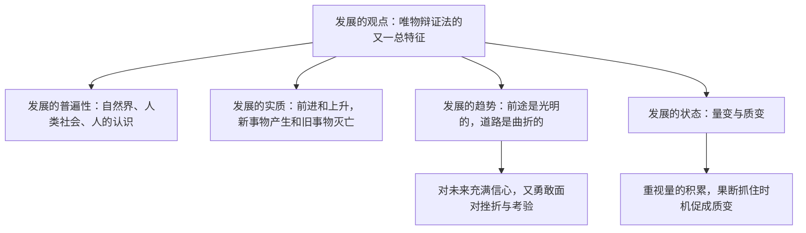

# 世界是永恒发展的

## 核心概念

- **发展的普遍性**：自然界、人类社会、人的认识都是不断发展的，世界是永恒发展的。
- **发展的实质**：事物的前进和上升，是新事物的产生和旧事物的灭亡。
- **新事物与旧事物**：新事物是符合客观规律、具有强大生命力和远大发展前途的事物；判断新旧事物的标准是**是否符合客观规律、有没有强大生命力和远大发展前途**，而不是出现时间的先后、形式的新旧、力量的强弱。
- **前途光明与道路曲折**：事物发展的前途是光明的，道路是曲折的；事物发展的方向是前进的、上升的，事物前进的道路是曲折的、迂回的。
- **量变与质变**：量变是质变的必要准备，质变是量变的必然结果；质变又为新的量变开辟道路。

## 知识梳理

| 比较项 | 量变 | 质变 |
| --- | --- | --- |
| 含义 | 事物数量的增减或场所的变更 | 事物根本性质的变化 |
| 状态 | 渐进的、不显著的变化 | 根本的、显著的变化 |
| 关系 | 量变是质变的必要准备 | 质变是量变的必然结果，又为新的量变开辟道路 |

## 原理与方法论

| 原理 | 方法论要求 |
| --- | --- |
| 世界是永恒发展的，发展具有普遍性 | 用发展的观点看问题，反对静止地看问题 |
| 事物发展前途是光明的，道路是曲折的 | 对未来充满信心，热情支持新事物成长；做好走曲折道路的准备，勇敢面对挫折 |
| 量变与质变的辩证关系 | 重视量的积累，为质变创造条件；抓住时机促成质变，实现事物的飞跃 |

## 典型题例

**例1（选择题）** "青出于蓝而胜于蓝""长江后浪推前浪"共同蕴含的哲理是（　）
A. 新事物必然战胜旧事物　B. 量变必然引起质变　C. 事物发展道路是笔直的　D. 联系是普遍的
**答案要点**：新事物符合客观规律、具有强大生命力，必然代替旧事物。选 **A**。

**例2（主观题）** 我国新能源汽车产业从起步艰难到领跑全球，经历了技术瓶颈、市场质疑等考验。运用"事物发展的趋势"知识加以分析。
**答案要点**：①事物发展的前途是光明的，新能源汽车符合客观规律和绿色发展方向，具有强大生命力和远大前途；②事物发展的道路是曲折的，新事物成长要经历不完善到完善的过程，会遇到旧势力、旧观念的阻碍；③既要对新产业充满信心，又要勇敢面对困难，在曲折中不断前进。

## 易错点

- 发展的实质是**前进和上升**；运动变化不一定是发展，发展一定是运动变化。
- 判断新事物的标准不是**时间先后、形式新旧、力量强弱**，而是是否符合客观规律。
- 量变**达到一定程度**才引起质变，不能说"量变必然引起质变"（须加条件）。
- 质变不等于发展，质变有前进的也有倒退的；只有前进上升的质变才是发展。

## 背记要点

1. 发展的观点是唯物辩证法的又一总特征；发展的实质：新事物的产生和旧事物的灭亡。
2. 判断新旧事物的根本标准：是否符合客观规律、有没有强大生命力和远大发展前途。
3. 趋势原理：前途光明 + 道路曲折，两个方面缺一不可。
4. 状态原理：量变是必要准备，质变是必然结果；方法论"重视积累 + 抓住时机"。
5. 北京等级考视角：科技创新、产业升级、个人成长类材料常考发展观综合运用。

## 自测题

1. 发展的普遍性表现在哪些方面？发展的实质是什么？
2. 为什么说事物发展的前途是光明的、道路是曲折的？
3. 量变和质变的辩证关系及方法论要求是什么？
4. 如何区分"运动、变化"与"发展"？

## 相关知识点

联系的观点见 [[世界是普遍联系的]]；发展的源泉和动力是矛盾，见 [[唯物辩证法的实质与核心]]。
