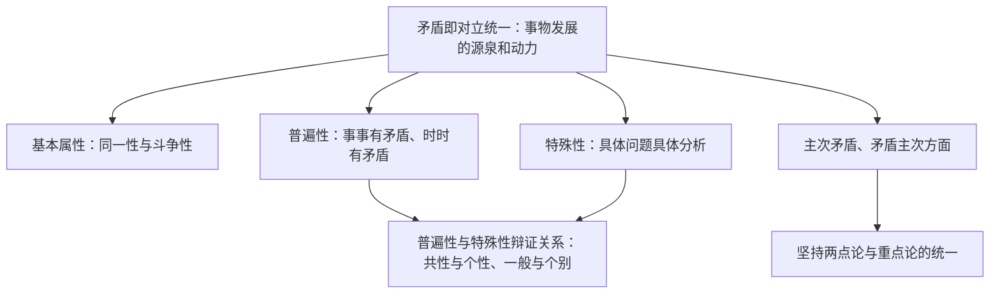

# 唯物辩证法的实质与核心

## 核心概念

- **矛盾**：反映事物内部对立和统一关系的哲学范畴，即对立统一。矛盾是事物发展的源泉和动力，矛盾的观点是唯物辩证法的根本观点，对立统一规律是唯物辩证法的实质与核心。
- **矛盾的基本属性**：斗争性与同一性。同一性是矛盾双方相互吸引、相互联结的属性和趋势；斗争性是矛盾双方相互排斥、相互对立的属性。同一以差别和对立为前提，斗争性寓于同一性之中。
- **矛盾的普遍性**：事事有矛盾，时时有矛盾。
- **矛盾的特殊性**：矛盾着的事物及其每一个侧面各有其特点。三种情形：不同事物有不同的矛盾；同一事物在发展的不同过程和阶段上有不同的矛盾；同一事物中的不同矛盾、同一矛盾的两个不同方面各有其特殊性。
- **主要矛盾与次要矛盾、矛盾的主要方面与次要方面**：要求坚持两点论与重点论的统一。

## 知识梳理

| 比较项 | 主要矛盾 | 矛盾的主要方面 |
| --- | --- | --- |
| 外延 | 复杂事物中的诸多矛盾 | 同一矛盾的双方 |
| 作用 | 对事物发展起决定作用 | 决定事物的性质 |
| 关键词 | 重点、中心、关键、突破口 | 主流、性质、总体上、辨方向 |

## 原理与方法论

| 原理 | 方法论要求 |
| --- | --- |
| 矛盾即对立统一 | 用一分为二的观点、全面的观点看问题 |
| 矛盾具有普遍性 | 承认矛盾、分析矛盾，勇于直面矛盾，善于解决矛盾 |
| 矛盾具有特殊性 | 具体问题具体分析（马克思主义活的灵魂） |
| 矛盾普遍性与特殊性辩证关系 | 坚持共性与个性的具体的历史的统一；马克思主义基本原理同中国具体实际相结合的哲学依据 |
| 主次矛盾、矛盾主次方面辩证关系 | 坚持两点论与重点论相统一，反对一点论和均衡论 |

## 典型题例

**例1（选择题）** "射人先射马，擒贼先擒王"体现的方法论是（　）
A. 抓主流　B. 集中力量解决主要矛盾　C. 具体问题具体分析　D. 一分为二看问题
**答案要点**："先""王"指向解决问题的重点和关键，属于抓主要矛盾。选 **B**。

**例2（主观题）** 运用矛盾普遍性和特殊性辩证关系的原理，说明"马克思主义基本原理必须同中国具体实际相结合"。
**答案要点**：①矛盾的普遍性与特殊性相互联结，普遍性寓于特殊性之中，并通过特殊性表现出来；②马克思主义基本原理是对普遍规律的科学概括（共性），中国国情是特殊性（个性）；③坚持共性与个性的具体的历史的统一，把普遍原理与具体实际相结合，才能不断开辟马克思主义中国化时代化新境界。

## 易错点

- 矛盾双方的转化是**有条件的**，不能说"必然转化"。
- 普遍性**寓于**特殊性之中，通过特殊性表现出来；不能说"特殊性寓于普遍性之中"。
- 抓重点针对**主要矛盾**（办事情），抓主流针对**矛盾的主要方面**（看问题、评性质），审题须区分。
- 和谐不是无矛盾，和谐是矛盾双方相互依存、协调发展的状态。

## 背记要点

1. 矛盾是事物发展的源泉和动力；对立统一规律是唯物辩证法的实质与核心（教材原文口径）。
2. 同一性与斗争性：同一以差别和对立为前提，斗争性寓于同一性之中。
3. 具体问题具体分析是马克思主义的活的灵魂，是正确认识事物的基础、正确解决矛盾的关键。
4. 矛盾普遍性与特殊性的关系是关于事物矛盾问题的精髓。
5. 北京等级考视角：主次矛盾与主次方面的辨析、共性个性原理结合中国式现代化是高频主观题。

## 自测题

1. 矛盾的两种基本属性是什么？二者关系如何？
2. 矛盾特殊性的三种情形是什么？为什么要具体问题具体分析？
3. 主要矛盾与矛盾主要方面有何区别？如何在题目中识别？
4. 矛盾普遍性与特殊性的辩证关系原理有何现实意义？

## 相关知识点

联系与发展的总特征见 [[世界是普遍联系的]]、[[世界是永恒发展的]]；辩证法与形而上学的对立见 [[综合探究一 坚持唯物辩证法 反对形而上学]]。
