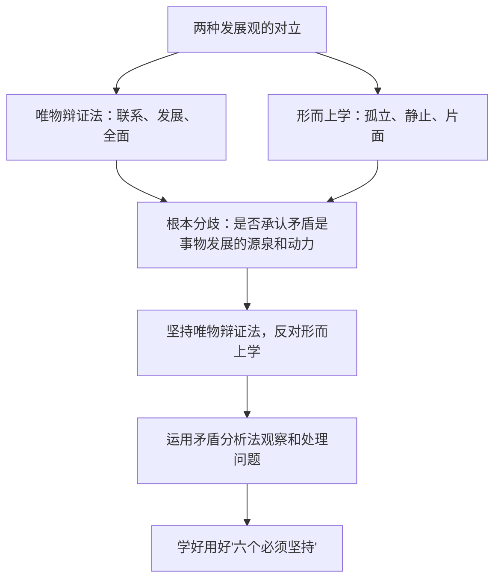

# 综合探究一 坚持唯物辩证法 反对形而上学

## 核心概念

- **唯物辩证法**：主张用联系的、发展的、全面的观点看问题，其根本观点是矛盾的观点，实质与核心是对立统一规律。
- **形而上学**：用孤立的、静止的、片面的观点看问题，其根本分歧在于**是否承认矛盾，是否承认矛盾是事物发展的源泉和动力**。
- **矛盾分析法**：认识世界和改造世界的根本方法。
- **习近平新时代中国特色社会主义思想的世界观和方法论**：坚持人民至上、坚持自信自立、坚持守正创新、坚持问题导向、坚持系统观念、坚持胸怀天下（"六个必须坚持"）。

## 知识梳理

| 比较项 | 唯物辩证法 | 形而上学 |
| --- | --- | --- |
| 基本观点 | 联系、发展、全面 | 孤立、静止、片面 |
| 对矛盾的态度 | 承认矛盾，主张矛盾是发展的源泉和动力 | 否认矛盾，用外力解释变化 |
| 典型表现 | 一分为二、统筹兼顾、具体分析 | "只见树木不见森林"、刻舟求剑、一点论 |

## 探究主题与线索

1. **线索一：比较两种发展观**——梳理教材中"守株待兔""刻舟求剑"等寓言与联系发展全面观点的对照，明确二者的根本分歧。
2. **线索二：矛盾分析法的运用**——结合社会热点（如"双碳"目标下发展与保护的关系），练习"两点论与重点论统一""具体问题具体分析"的答题路径。
3. **线索三：学习"六个必须坚持"**——理解其中蕴含的辩证唯物主义和历史唯物主义的世界观和方法论，如系统观念体现普遍联系的观点，问题导向体现矛盾的观点。
4. **成果要求**：能用辩证法观点辨析生活中的形而上学表现，写出短评或辨析提纲。

## 典型题例

**例1（选择题）** 唯物辩证法与形而上学的根本分歧在于（　）
A. 是否承认联系　B. 是否承认发展　C. 是否承认矛盾，是否承认矛盾是事物发展的源泉和动力　D. 是否承认物质决定意识
**答案要点**：联系、发展的分歧根源于对矛盾的态度。选 **C**。

**例2（主观题）** 有同学复习时"眉毛胡子一把抓"，有同学只盯短板忽视优势。请用唯物辩证法的知识为他们提出建议。
**答案要点**：①坚持两点论与重点论的统一，集中精力抓主要矛盾（薄弱学科、关键环节），反对均衡论；②坚持全面的观点，既看到不足也看到优势，反对一点论；③具体问题具体分析，针对各科特点制定不同策略；④反对孤立、静止、片面的形而上学做法。

## 易错点

- 根本分歧不是"是否承认联系或发展"，而是**是否承认矛盾**——这是最深层的分歧。
- 形而上学不完全等于唯心主义；唯物主义者也可能犯形而上学错误（如近代形而上学唯物主义）。
- 矛盾分析法是**根本方法**，不是唯一方法。
- "六个必须坚持"是世界观和方法论层面的要求，答题时要与具体哲学原理对应，不可空喊口号。

## 背记要点

1. 唯物辩证法两个总特征：联系的观点、发展的观点；实质与核心：对立统一规律。
2. 形而上学三个特征：孤立、静止、片面。
3. 根本分歧：是否承认矛盾，是否承认矛盾是事物发展的源泉和动力。
4. 矛盾分析法是认识世界和改造世界的根本方法。
5. 北京等级考视角：常以辨析题形式考查对形而上学表现的识别与纠正。

## 自测题

1. 唯物辩证法与形而上学的对立表现在哪些方面？根本分歧是什么？
2. 为什么说矛盾分析法是认识和改造世界的根本方法？
3. 举出两个生活中形而上学的表现并加以纠正。
4. "六个必须坚持"分别体现了哪些哲学道理？

## 相关知识点

联系的观点见 [[世界是普遍联系的]]；发展的观点见 [[世界是永恒发展的]]；矛盾的观点见 [[唯物辩证法的实质与核心]]。
