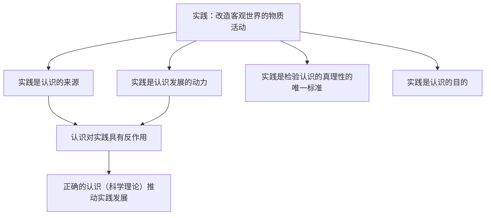

# 人的认识从何而来

## 核心概念

- **认识**：主体对客体的能动反映。感性认识是认识的初级阶段（感觉、知觉、表象）；理性认识是认识的高级阶段（概念、判断、推理）。感性认识有待于发展、深化为理性认识，理性认识依赖于感性认识。
- **实践**：人们改造客观世界的物质活动。两层含义：以人为主体、以客观事物为对象的物质性活动；把观念的存在变为现实的存在的直接现实性活动。
- **实践的特点**：客观物质性、主观能动性、社会历史性。
- **实践的基本形式**：改造自然的生产实践、变革社会的实践、探索世界规律的科学实验活动。
- **实践是认识的基础**：实践是认识的来源、认识发展的动力、检验认识的真理性的唯一标准、认识的目的。

## 知识梳理

| 特点 | 内涵 |
| --- | --- |
| 客观物质性 | 实践的主体、对象、手段都是客观的；实践过程和结果受客观规律制约 |
| 主观能动性 | 实践是人有目的、有意识的活动 |
| 社会历史性 | 实践是处在一定社会关系中的人的活动，受一定历史条件的制约 |

## 原理与方法论

| 原理 | 方法论要求 |
| --- | --- |
| 实践是认识的基础（实践决定认识） | 坚持实践第一的观点，积极投身社会实践 |
| 认识对实践具有反作用 | 重视科学理论的指导作用，做到理论与实践相结合 |
| 感性认识与理性认识辩证统一 | 既要占有丰富感性材料，又要透过现象把握本质 |

## 典型题例

**例1（选择题）** "纸上得来终觉浅，绝知此事要躬行"强调（　）
A. 间接经验不重要　B. 实践是认识的来源　C. 认识的目的是获得真理　D. 读书无用
**答案要点**："躬行"强调亲身实践对获得真知的意义，体现实践是认识的来源。注意：认识的来源唯一（实践），获得认识的途径有直接经验和间接经验两条。选 **B**。

**例2（主观题）** 我国科学家通过"嫦娥"系列任务不断获取月球样本，修正和深化了对月球演化的认识。运用"实践是认识的基础"加以说明。
**答案要点**：①实践是认识的来源，月球样本的获取使新认识得以产生；②实践是认识发展的动力，探月工程提出新问题、提供新工具，推动认识深化；③实践是检验认识的真理性的唯一标准，原有假说经样本检验得以修正；④实践是认识的目的，深化认识服务于后续深空探测实践。

## 易错点

- 认识的**来源**是实践且唯一；**途径**有直接经验和间接经验，不能混淆来源与途径。
- 实践是检验认识的真理性的**唯一**标准；科学理论、多数人的意见都不能作为检验标准。
- 实践是**改造客观世界**的物质活动；改造主观世界的活动（如学习、思考）不属于实践。
- 认识的反作用具有二重性：正确认识促进实践，错误认识阻碍实践。

## 背记要点

1. 实践的含义与三个特点：客观物质性、主观能动性、社会历史性。
2. 实践是认识的基础"四句话"：来源、动力、唯一标准、目的（主观题模板）。
3. 感性认识与理性认识是认识过程的两个不同阶段，相互渗透、相互包含。
4. 坚持实践第一的观点，重视科学理论的指导作用。
5. 北京等级考视角：科技工程、社会调查类材料常要求完整运用"实践是认识的基础"作答。

## 自测题

1. 实践的含义、特点和基本形式分别是什么？
2. 为什么说实践是认识的基础？（四方面）
3. 感性认识与理性认识的关系如何？
4. 认识的来源与获得认识的途径有什么区别？

## 相关知识点

真理与认识过程见 [[在实践中追求和发展真理]]；马克思主义哲学的实践观点见 [[科学的世界观和方法论]]。
