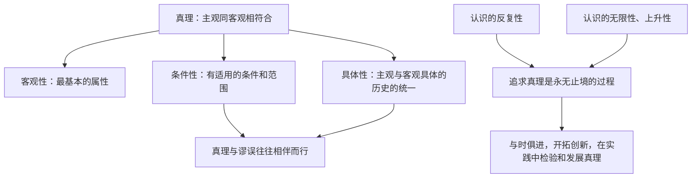

# 在实践中追求和发展真理

## 核心概念

- **真理**：标志主观同客观相符合的哲学范畴，是人们对客观事物及其规律的正确反映。
- **真理的客观性**：真理最基本的属性；对同一个确定的对象只能有一种正确的认识，真理面前人人平等。
- **真理的条件性**：任何真理都有自己适用的条件和范围。
- **真理的具体性**：任何真理都是相对于特定的过程来说的，都是主观与客观、理论与实践的具体的历史的统一。
- **认识过程**：认识具有反复性、无限性、上升性；追求真理是一个永无止境的过程。方法论：与时俱进，开拓创新，在实践中认识和发现真理，在实践中检验和发展真理。

## 知识梳理

| 特征 | 原因 |
| --- | --- |
| 反复性 | 受主体（立场、能力、方法）与客体（本质暴露有过程）条件限制，认识需多次反复 |
| 无限性 | 认识对象无限变化，认识主体世代延续，认识基础（实践）不断发展 |
| 上升性 | 认识运动是波浪式前进或螺旋式上升的过程 |

## 原理与方法论

| 原理 | 方法论要求 |
| --- | --- |
| 真理是客观的、具体的、有条件的 | 坚持真理面前人人平等；随过程的推移和条件的变化丰富、发展真理 |
| 认识具有反复性、无限性、上升性 | 与时俱进，开拓创新，在实践中认识和发现真理，在实践中检验和发展真理 |
| 真理与谬误相伴而行 | 正确对待错误，在探索中不断走向真理 |

## 典型题例

**例1（选择题）** 三角形内角和等于180度只在平面几何中成立，在凹曲面、球面上则不成立。这说明（　）
A. 真理是主观的　B. 真理是有条件的、具体的　C. 真理会被推翻　D. 不存在客观真理
**答案要点**：任何真理都有自己适用的条件和范围，超出范围真理会变成谬误。选 **B**。

**例2（主观题）** 从"两弹一星"到载人航天再到空间站建造，我国对太空的认识不断深化。运用"认识过程"的知识加以分析。
**答案要点**：①认识具有反复性，受主客观条件限制，人们对太空的认识需要多次反复才能完成；②认识具有无限性，认识对象、主体、实践基础都在发展，对太空的探索没有止境；③认识具有上升性，认识在实践基础上波浪式前进、螺旋式上升；④要与时俱进、开拓创新，在实践中检验和发展真理。

## 易错点

- 真理最基本的属性是**客观性**，但真理的形式是主观的、内容是客观的。
- 真理不会被"推翻"，而是**不断向前发展**、被超越；已经确定的真理在其适用范围内不容否认。
- 认识的反复性不等于"不可知论"；经过反复能够获得正确认识。
- "有用即真理"是实用主义错误观点，真理的标准是实践而非有用与否。

## 背记要点

1. 真理定义：标志主观同客观相符合的哲学范畴；客观性是最基本属性。
2. 真理三性：客观性、条件性、具体性；真理与谬误往往相伴而行。
3. 认识过程三性：反复性、无限性、上升性（原因各记两条）。
4. 方法论落脚句：与时俱进，开拓创新，在实践中认识和发现真理，在实践中检验和发展真理。
5. 北京等级考视角：科学史、政策调整类材料常考真理条件性与认识过程的综合运用。

## 自测题

1. 什么是真理？为什么说客观性是真理最基本的属性？
2. 如何理解真理的条件性和具体性？
3. 认识的反复性、无限性的原因分别是什么？
4. "追求真理永无止境"给我们什么方法论启示？

## 相关知识点

实践与认识的关系见 [[人的认识从何而来]]；用发展观点看认识过程见 [[世界是永恒发展的]]。
