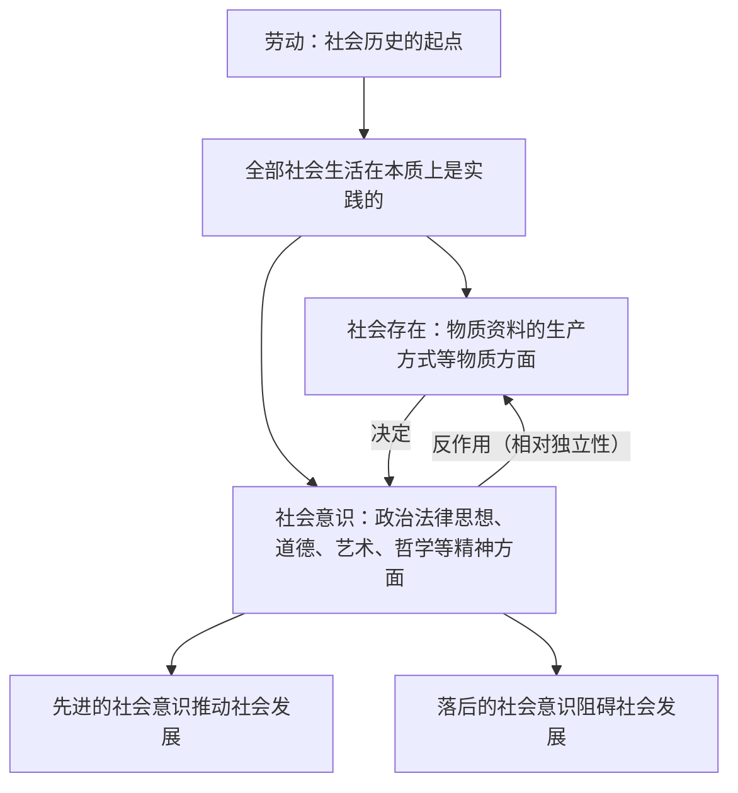

# 社会历史的本质

## 核心概念

- **社会生活在本质上是实践的**：劳动是社会历史的起点，是理解全部社会历史的钥匙；全部社会生活在本质上是实践的。
- **社会存在**：社会的物质生活过程，主要指物质资料的生产方式，还包括自然地理环境、人口等社会生活的物质方面。
- **社会意识**：社会生活的精神方面，包括政治思想、法律思想、道德、科学、艺术、宗教、哲学等各种不同的社会意识形式。
- **社会存在与社会意识的辩证关系**：社会存在决定社会意识，社会意识是对社会存在的反映；社会意识具有相对独立性，先进的社会意识可以正确预见社会发展的方向和趋势，对社会发展起积极的推动作用，落后的社会意识对社会的发展起阻碍作用。
- **两种历史观的分水岭**：对社会存在与社会意识关系问题的不同回答，是划分历史唯物主义与历史唯心主义的基本依据。

## 知识梳理

| 项目 | 内容 |
| --- | --- |
| 社会存在 | 主要指物质资料的生产方式 |
| 社会意识的相对独立性 | 有时落后于、有时先于社会存在的变化发展 |
| 历史观基本问题 | 社会存在与社会意识的关系问题 |

## 原理与方法论

| 原理 | 方法论要求 |
| --- | --- |
| 社会生活在本质上是实践的 | 立足社会实践理解社会历史现象 |
| 社会存在决定社会意识 | 坚持一切从社会实际出发，使社会意识随社会存在的变化而变化 |
| 社会意识具有相对独立性、能反作用于社会存在 | 树立先进的社会意识，重视社会主义精神文明建设，克服落后观念 |

## 典型题例

**例1（选择题）** 随着数字经济发展，"数据要素""平台治理"等新观念应运而生。这表明（　）
A. 社会意识决定社会存在　B. 社会存在决定社会意识　C. 社会意识与社会存在同步变化　D. 社会意识没有独立性
**答案要点**：新经济形态（社会存在）催生新观念（社会意识）。选 **B**。

**例2（主观题）** 结合社会主义核心价值观引领社会风尚的实例，说明社会意识的相对独立性。
**答案要点**：①社会意识具有相对独立性，其变化发展与社会存在不完全同步；②先进的社会意识可以正确预见社会发展的方向和趋势，对社会发展起积极的推动作用；③社会主义核心价值观作为先进的社会意识，引领道德风尚、凝聚社会共识，促进社会文明进步。

## 易错点

- 社会存在**主要指**物质资料的生产方式，不能缩小为地理环境或人口。
- 社会意识的反作用具有二重性：**先进推动、落后阻碍**，不能笼统说"促进"。
- 社会意识与社会存在的发展**不完全同步**：可能落后、也可能先于社会存在。
- 劳动是社会历史的**起点**；理解社会历史的钥匙是劳动（实践），不是英雄人物的意志。

## 背记要点

1. 劳动是社会历史的起点；全部社会生活在本质上是实践的。
2. 社会存在决定社会意识；社会意识是对社会存在的反映（原理句式）。
3. 社会意识的相对独立性 + 先进/落后意识的不同作用。
4. 社会存在与社会意识的关系问题是划分历史唯物主义与历史唯心主义的基本依据。
5. 北京等级考视角：新业态新观念、核心价值观建设是本框高频命题素材。

## 自测题

1. 为什么说全部社会生活在本质上是实践的？
2. 社会存在与社会意识各包括哪些内容？
3. 简述社会存在与社会意识的辩证关系。
4. 社会意识的相对独立性有哪些表现？

## 相关知识点

社会基本矛盾运动见 [[社会历史的发展]]；人民群众的历史地位见 [[社会历史的主体]]；物质与意识关系见 [[世界的物质性]]。
