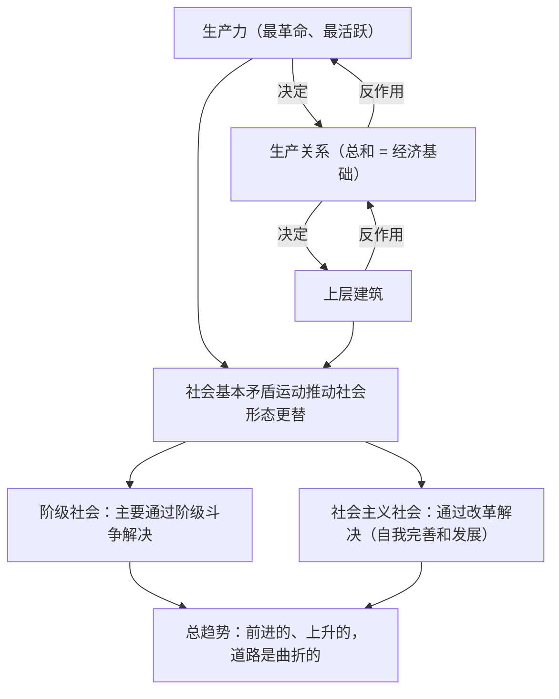

# 社会历史的发展

## 核心概念

- **物质生产方式**：生产力与生产关系的统一，是社会存在和发展的基础，决定着社会的性质和面貌，其变革决定着社会形态的更替。
- **生产力与生产关系**：生产力是最革命、最活跃的因素；生产力决定生产关系，生产关系对生产力具有反作用。生产关系一定要适合生产力状况的规律。
- **经济基础与上层建筑**：经济基础指生产关系的总和；上层建筑指建立在一定经济基础之上的意识形态以及相应的制度、组织和设施。经济基础决定上层建筑，上层建筑对经济基础具有反作用。上层建筑一定要适合经济基础状况的规律。
- **社会基本矛盾**：生产力和生产关系的矛盾、经济基础和上层建筑的矛盾，是贯穿人类社会始终的基本矛盾。
- **社会发展的实现方式**：在阶级社会里，社会基本矛盾的解决主要通过阶级斗争实现；在社会主义社会，主要通过**改革**实现。改革是社会主义制度的自我完善和发展，是发展中国特色社会主义的强大动力。
- **社会历史发展的总趋势**：前进的、上升的，发展的过程是曲折的。

## 知识梳理

## 原理与方法论

| 原理 | 方法论要求 |
| --- | --- |
| 生产关系一定要适合生产力状况的规律 | 调整生产关系中不适合生产力的环节，深化经济体制改革 |
| 上层建筑一定要适合经济基础状况的规律 | 完善上层建筑，深化政治体制、行政体制等改革 |
| 社会基本矛盾运动推动社会发展 | 尊重社会发展规律，通过改革解决社会主义社会的基本矛盾 |
| 社会历史发展总趋势是前进的、上升的 | 坚定信心，在曲折中推动社会进步 |

## 典型题例

**例1（选择题）** 我国深化国资国企改革、优化营商环境，激发了各类经营主体活力。从历史唯物主义看，这是因为（　）
A. 上层建筑决定经济基础　B. 生产关系对生产力具有反作用，改革调整了不适合生产力的环节　C. 社会意识决定社会存在　D. 阶级斗争是社会发展的直接动力
**答案要点**：调整生产关系以适合生产力状况，解放和发展生产力。选 **B**。

**例2（主观题）** 运用社会基本矛盾的知识，说明为什么"改革开放只有进行时，没有完成时"。
**答案要点**：①生产力和生产关系、经济基础和上层建筑的矛盾贯穿人类社会始终，社会主义社会的基本矛盾仍是它们；②这一矛盾是非对抗性的，只能通过社会主义的自我完善和发展加以解决；③改革是社会主义制度的自我完善和发展，是发展中国特色社会主义的强大动力；④社会在基本矛盾的不断解决中前进，故改革永无止境。

## 易错点

- 经济基础是**生产关系的总和**，不是生产力；不能把"经济基础决定上层建筑"写成"生产力决定上层建筑"。
- 社会主义社会的基本矛盾是**非对抗性**的，通过改革而非阶级斗争解决。
- 改革是社会主义制度的**自我完善和发展**，不是根本制度的改变。
- 生产关系的反作用有二重性：适合则促进，不适合则阻碍。

## 背记要点

1. 物质生产方式是社会存在和发展的基础。
2. 两大基本规律：生产关系一定要适合生产力状况、上层建筑一定要适合经济基础状况。
3. 社会基本矛盾贯穿人类社会始终；社会主义社会通过改革解决。
4. 改革定位：社会主义制度的自我完善和发展；强大动力。
5. 北京等级考视角：全面深化改革、机构改革、要素市场化配置是高频材料。

## 自测题

1. 生产力与生产关系的辩证关系是什么？
2. 经济基础与上层建筑各指什么？二者关系如何？
3. 社会主义社会的基本矛盾靠什么方式解决？为什么？
4. 如何理解社会历史发展的总趋势？

## 相关知识点

社会存在与社会意识见 [[社会历史的本质]]；改革的主体力量见 [[社会历史的主体]]。
