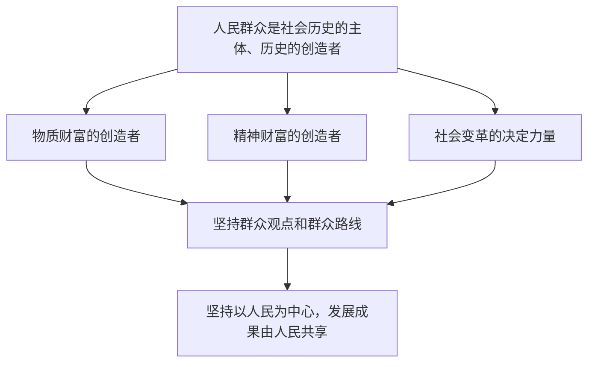

# 社会历史的主体

## 核心概念

- **人民群众**：一切对社会历史起推动作用的人们，既包括普通个人，也包括杰出人物。劳动群众是人民群众的主体部分。
- **人民群众是历史的创造者**：人民群众是社会物质财富的创造者，是社会精神财富的创造者，是社会变革的决定力量。
- **群众观点**：相信人民群众自己解放自己，全心全意为人民服务，一切向人民群众负责，虚心向人民群众学习。
- **群众路线**：一切为了群众，一切依靠群众，从群众中来，到群众中去。群众路线是无产阶级政党的根本的领导方法和工作方法。
- **以人民为中心**：发展为了人民、发展依靠人民、发展成果由人民共享；把人民对美好生活的向往作为奋斗目标。

## 知识梳理

| 表现 | 说明 |
| --- | --- |
| 创造物质财富 | 人民群众的生产活动是社会存在和发展的基础 |
| 创造精神财富 | 人民群众的生活和实践是一切精神财富形成和发展的源泉 |
| 社会变革的决定力量 | 在社会基本矛盾的解决中、在社会历史的前进中起决定作用 |

## 原理与方法论

| 原理 | 方法论要求 |
| --- | --- |
| 人民群众是历史的创造者，是社会历史的主体 | 坚持群众观点和群众路线 |
| 人民群众的实践是精神财富的源泉 | 文化创作要扎根人民、扎根生活 |
| 人民群众是社会变革的决定力量 | 尊重人民首创精神，紧紧依靠人民推进改革 |

## 典型题例

**例1（选择题）** "小岗村'大包干'的探索被总结推广，成为农村改革的起点。"这体现了（　）
A. 杰出人物创造历史　B. 人民群众是社会变革的决定力量，要尊重人民首创精神　C. 社会意识决定社会存在　D. 上层建筑决定经济基础
**答案要点**：农民的首创实践推动了改革，体现群众是变革的决定力量。选 **B**。

**例2（主观题）** 结合党的二十大报告"江山就是人民，人民就是江山"的论述，运用社会历史主体的知识说明为什么必须坚持以人民为中心。
**答案要点**：①人民群众是社会历史的主体，是历史的创造者；②人民群众是物质财富和精神财富的创造者，是社会变革的决定力量；③必须坚持群众观点和群众路线，把人民对美好生活的向往作为奋斗目标，发展为了人民、依靠人民、成果由人民共享。

## 易错点

- 人民群众是一个**历史范畴**，在不同国家、不同历史时期具有不同内涵，但劳动群众始终是主体部分。
- 人民群众**包括**杰出人物；不能把二者对立，也不能夸大英雄人物的决定作用（英雄史观是历史唯心主义）。
- 精神财富的**源泉**是人民群众的生活和实践，不是知识分子的头脑。
- 群众路线是党的根本的**领导方法和工作方法**；群众观点是基本的政治立场，二者表述不可互换。

## 背记要点

1. 人民群众是社会历史的主体、历史的创造者（三个表现须齐全）。
2. 群众观点四句、群众路线三句要能默写。
3. 坚持以人民为中心：为了人民、依靠人民、成果由人民共享。
4. 反对英雄史观等历史唯心主义观点。
5. 北京等级考视角：全过程人民民主、共同富裕、文艺为人民创作是高频命题背景。

## 自测题

1. 人民群众的含义是什么？其主体部分是谁？
2. 人民群众是历史创造者的三个表现分别是什么？
3. 群众观点和群众路线的基本内容是什么？
4. 如何理解"坚持以人民为中心"的哲学依据？

## 相关知识点

社会发展的规律见 [[社会历史的发展]]；人的价值在于奉献见 [[价值与价值观]]；反对历史虚无主义见 [[综合探究二 坚持历史唯物主义 反对历史虚无主义]]。
