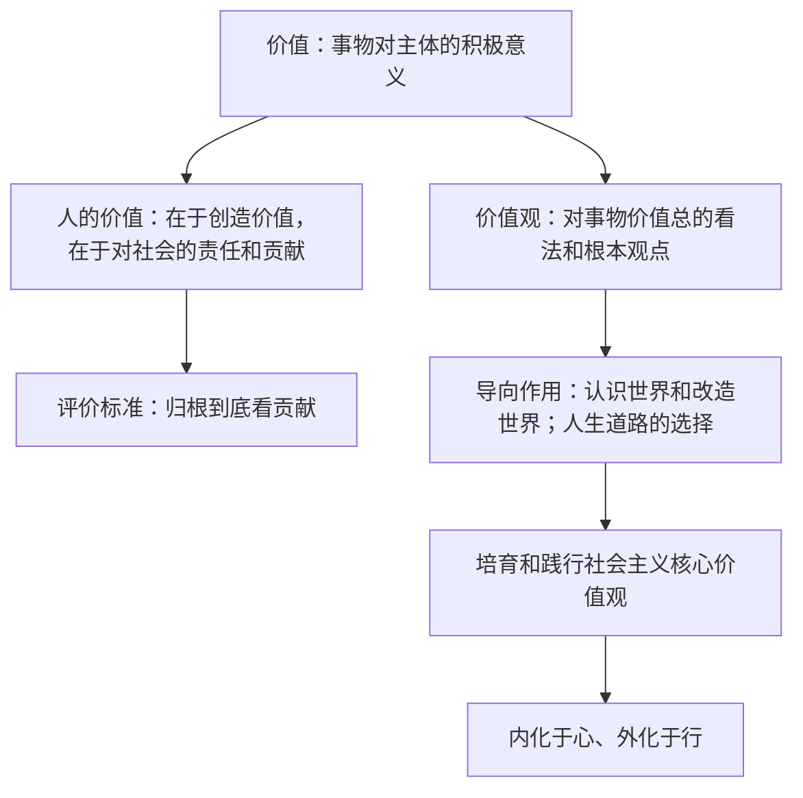

# 价值与价值观

## 核心概念

- **哲学意义上的价值**：一事物对主体的积极意义，即一事物所具有的能够满足主体需要的属性和功能。它涵盖了各个不同领域事物的价值，具有高度的概括性和普遍性。
- **人的价值**：人的价值在于创造价值，在于对社会的责任和贡献，即通过自己的活动满足社会、他人和自己的需要。对一个人的价值的评价归根到底是看他的贡献。
- **价值观**：人们在认识各种具体事物的价值的基础上，形成的对事物价值的总的看法和根本观点。
- **价值观的导向作用**：价值观对人们认识世界和改造世界的活动具有重要导向作用；对人生道路的选择具有重要的导向作用。价值观是人生的重要向导。
- **社会主义核心价值观**：国家层面（富强、民主、文明、和谐），社会层面（自由、平等、公正、法治），个人层面（爱国、敬业、诚信、友善）。培育和践行社会主义核心价值观，要使之内化于心、外化于行。

## 知识梳理

| 层面 | 社会主义核心价值观内容 |
| --- | --- |
| 国家 | 富强、民主、文明、和谐 |
| 社会 | 自由、平等、公正、法治 |
| 个人 | 爱国、敬业、诚信、友善 |

## 原理与方法论

| 原理 | 方法论要求 |
| --- | --- |
| 人的价值在于创造价值，在于对社会的责任和贡献 | 在劳动和奉献中创造价值，积极投身为人民服务的实践 |
| 价值观对人的行为具有重要导向作用 | 树立正确的价值观，发挥正确价值观的引领作用 |
| 社会主义核心价值观凝结着全体人民共同的价值追求 | 培育和践行社会主义核心价值观，内化于心、外化于行 |

## 典型题例

**例1（选择题）** "时代楷模"以平凡坚守铸就不凡业绩，赢得社会尊敬。这说明（　）
A. 人的价值在于社会对个人的满足　B. 人的价值在于对社会的责任和贡献　C. 价值观都能促进社会发展　D. 有价值的人生不需要满足个人需要
**答案要点**：评价人的价值归根到底看贡献。选 **B**。

**例2（主观题）** 运用价值观导向作用的知识，说明青少年为什么要培育和践行社会主义核心价值观。
**答案要点**：①价值观对人们认识世界和改造世界的活动具有重要导向作用，对人生道路的选择具有重要导向作用；②社会主义核心价值观是当代中国精神的集中体现，凝结着全体人民共同的价值追求；③青少年处于价值观形成的关键时期，践行核心价值观有助于扣好人生第一粒扣子，把个人理想融入国家和民族的事业。

## 易错点

- 人的价值是**社会价值与自我价值的统一**，但强调人的真正价值在于对社会的责任和贡献。
- 价值观的导向作用具有二重性：**正确的**价值观起促进作用，错误的价值观起阻碍作用。
- "价值"是哲学范畴，不等同于经济学中的商品价值。
- 价值观属于社会意识，由社会存在决定，不能说价值观决定社会发展。

## 背记要点

1. 价值：事物对主体的积极意义；人的价值在于创造价值、在于对社会的责任和贡献。
2. 评价一个人的价值，归根到底是看他的贡献。
3. 价值观的双重导向：认识和改造世界的活动 + 人生道路的选择。
4. 社会主义核心价值观24字须准确背诵，分清三个层面。
5. 北京等级考视角：常以模范人物事迹考查人的价值与价值观导向的结合。

## 自测题

1. 哲学意义上的价值是什么？人的价值是什么？
2. 如何评价一个人的价值？
3. 价值观的导向作用表现在哪些方面？
4. 社会主义核心价值观的内容是什么？如何践行？

## 相关知识点

如何作出正确选择见 [[价值判断与价值选择]]；如何实现人生价值见 [[价值的创造和实现]]。
