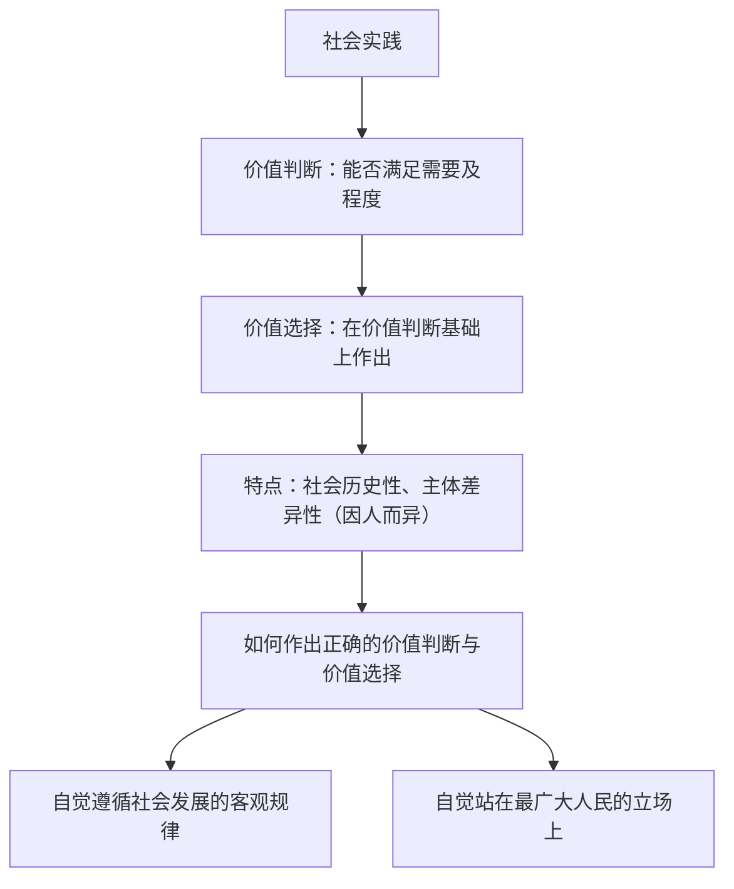

# 价值判断与价值选择

## 核心概念

- **价值判断**：人们对事物能否满足主体的需要以及满足的程度作出的判断。
- **价值选择**：在价值判断的基础上作出的选择。价值判断是价值选择的基础。
- **产生基础**：价值判断和价值选择是社会实践的产物，是在社会实践的基础上形成的。
- **社会历史性**：价值判断和价值选择会因时间、地点和条件的变化而不同。
- **主体差异性**：人们的社会地位不同、需要不同，价值判断和价值选择也就不同；价值判断和价值选择往往因人而异。
- **正确标准**：自觉遵循社会发展的客观规律；自觉站在最广大人民的立场上，把人民群众的利益作为最高的价值标准，把维护人民的利益作为最高的价值追求。

## 知识梳理

| 特点 | 内涵 | 启示 |
| --- | --- | --- |
| 社会历史性 | 因时间、地点、条件的变化而不同 | 具体地、历史地分析；正确评价历史上的价值观念 |
| 主体差异性 | 因社会地位、需要、立场不同而不同 | 明确立场，站在最广大人民的立场上 |

## 原理与方法论

| 原理 | 方法论要求 |
| --- | --- |
| 价值判断与价值选择具有社会历史性 | 把握其产生的社会历史条件，与时俱进地作出判断和选择 |
| 价值判断与价值选择因人而异 | 自觉站在最广大人民的立场上想问题、办事情 |
| 正确的价值判断与价值选择须遵循规律、符合人民利益 | 把人民群众的利益作为最高的价值标准 |

## 典型题例

**例1（选择题）** 过去"盼温饱"，现在"盼环保"；过去"求生存"，现在"求生态"。这一变化表明（　）
A. 价值判断和价值选择具有社会历史性　B. 价值观是一成不变的　C. 价值选择决定价值判断　D. 人们的需要决定社会存在
**答案要点**：随时间、条件变化，价值判断和价值选择发生变化。选 **A**。

**例2（主观题）** 面对防洪与发电、生态与开发的权衡，某地最终选择"生态优先、绿色发展"。运用价值判断与价值选择的知识加以分析。
**答案要点**：①价值判断是价值选择的基础，该地在科学评估基础上作出选择；②正确的价值判断与价值选择必须自觉遵循社会发展的客观规律，生态优先符合自然规律和可持续发展规律；③必须自觉站在最广大人民的立场上，绿色发展维护了人民长远利益和根本利益；④当个人利益、局部利益与人民根本利益冲突时，应自觉服从人民的根本利益。

## 易错点

- 价值判断是价值选择的**基础**，顺序不能颠倒。
- "因人而异"不等于"没有客观标准"；衡量标准是**是否遵循规律、是否符合人民根本利益**。
- 价值判断与价值选择的社会历史性说明对历史观念要**具体地、历史地分析**，不能以今非古或全盘否定。
- 最高价值标准是**人民群众的利益**，不是个人利益或多数人一时的意见。

## 背记要点

1. 价值判断与价值选择产生于社会实践；价值判断是价值选择的基础。
2. 两个特点：社会历史性、主体差异性（因人而异）。
3. 两条正确标准：自觉遵循社会发展的客观规律 + 自觉站在最广大人民的立场上。
4. 把人民群众的利益作为最高的价值标准（教材原文口径）。
5. 北京等级考视角：政策抉择、伦理争议类情境常要求运用"两条标准"作评析。

## 自测题

1. 什么是价值判断和价值选择？二者关系如何？
2. 价值判断与价值选择的社会历史性有何意义？
3. 为什么价值判断和价值选择往往因人而异？
4. 如何作出正确的价值判断和价值选择？

## 相关知识点

价值观的导向作用见 [[价值与价值观]]；人民立场的历史观依据见 [[社会历史的主体]]。
