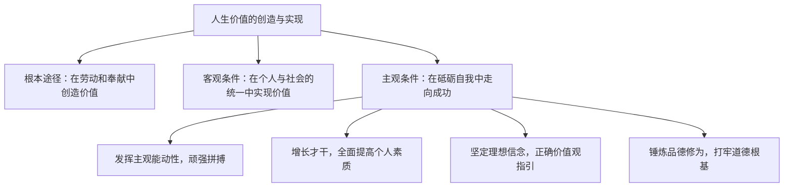

# 价值的创造和实现

## 核心概念

- **弘扬劳动精神，实现人生价值**：劳动是人的存在方式，是创造美好生活、促进人的自由全面发展的重要手段；努力奉献的人是幸福的，在劳动和奉献中创造价值、实现价值。
- **在个人与社会的统一中创造和实现价值**：社会提供的客观条件是人们实现人生价值的前提；人的价值只能在社会中实现；强调在与社会的统一中实现个人价值，并不否认追求人的个性发展。
- **在砥砺自我中创造和实现价值**：需要充分发挥主观能动性，需要顽强拼搏、自强不息的精神；需要努力增长自己的才干，全面提高个人素质；需要坚定的理想信念，需要正确价值观的指引；需要锤炼品德修为，不断打牢道德根基。

## 知识梳理

| 途径 | 关键词 | 要点 |
| --- | --- | --- |
| 劳动和奉献 | 根本途径 | 积极投身为人民服务的实践 |
| 个人与社会统一 | 客观前提 | 正确处理个人与集体、个人与社会的关系 |
| 砥砺自我 | 主观条件 | 能动性、才干、理想信念、品德修为 |

## 原理与方法论

| 原理 | 方法论要求 |
| --- | --- |
| 劳动和奉献是实现人生价值的根本途径 | 弘扬劳动精神，在劳动和奉献中创造价值 |
| 社会提供的客观条件是实现人生价值的前提 | 正确处理个人与社会的关系，在奉献社会中实现个性发展 |
| 实现人生价值需要主观努力 | 顽强拼搏、增长才干、坚定信念、锤炼品德 |

## 典型题例

**例1（选择题）** 科学家扎根边疆数十年培育良种，把论文写在大地上。这启示我们实现人生价值要（　）
A. 脱离社会独自奋斗　B. 在劳动和奉献中创造价值，把个人理想融入国家事业　C. 只重个人兴趣　D. 等待社会提供优越条件
**答案要点**：在劳动和奉献中、在个人与社会的统一中创造和实现价值。选 **B**。

**例2（主观题）** 结合北京冬奥会志愿者、大国工匠等青年榜样的事迹，说明青年应如何创造和实现人生价值。
**答案要点**：①弘扬劳动精神，在劳动和奉献中创造价值，积极投身为人民服务的实践；②在个人与社会的统一中实现价值，利用社会提供的客观条件，把个人前途与国家命运结合起来；③在砥砺自我中走向成功：发挥主观能动性、增长才干、坚定理想信念、以正确价值观为指引、锤炼品德修为。

## 易错点

- 实现人生价值的**根本途径**是劳动和奉献，不是机遇或天赋。
- 强调个人与社会的统一，**并不否认个性发展**；反对的是极端个人主义。
- 客观条件是**前提**，主观努力是**条件**，答题时两方面都要顾及，不可偏废。
- "奉献"不等于不要个人正当利益；自我价值与社会价值统一于奉献社会的实践。

## 背记要点

1. 根本途径：在劳动和奉献中创造价值；努力奉献的人是幸福的。
2. 客观前提：社会提供的客观条件；人的价值只能在社会中实现。
3. 主观条件四要点：能动性与拼搏、增长才干、理想信念与正确价值观、品德修为。
4. 三条途径构成"如何实现人生价值"的完整答题框架。
5. 北京等级考视角：榜样人物、职业选择类主观题几乎必用本框三条途径作答。

## 自测题

1. 为什么说劳动和奉献是实现人生价值的根本途径？
2. 如何理解"人的价值只能在社会中实现"？
3. 在砥砺自我中实现价值需要哪些主观条件？
4. 个人与社会的统一是否否认个性发展？为什么？

## 相关知识点

人的价值的内涵见 [[价值与价值观]]；正确的价值导向见 [[价值判断与价值选择]]；群众立场见 [[社会历史的主体]]。
