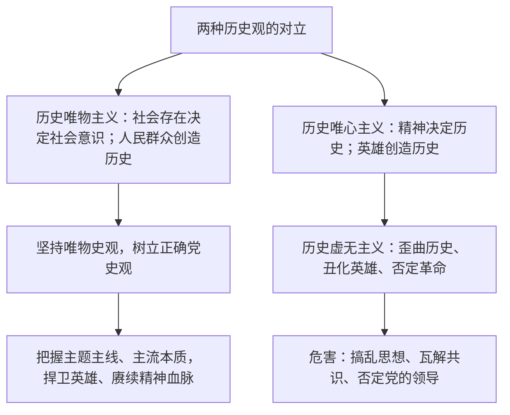

# 综合探究二 坚持历史唯物主义 反对历史虚无主义

## 核心概念

- **历史唯物主义**：关于人类社会发展一般规律的科学，认为社会存在决定社会意识，人民群众是历史的创造者，社会基本矛盾运动推动社会发展。
- **历史唯心主义**：把社会历史看成精神发展史，否认社会发展的客观规律，否认人民群众在历史发展中的决定作用。
- **历史虚无主义**：打着"反思历史""还原真相"的幌子，歪曲党史、国史、军史，丑化英雄模范，否定革命、否定党的领导和社会主义道路，实质是历史唯心主义的表现。
- **正确的历史观、党史观**：坚持用唯物史观认识和记述历史，把握历史发展的主题主线、主流本质，旗帜鲜明反对历史虚无主义。

## 知识梳理

| 比较项 | 历史唯物主义 | 历史虚无主义 |
| --- | --- | --- |
| 历史本质 | 社会存在决定社会意识 | 以主观臆断裁剪历史 |
| 历史主体 | 人民群众是历史的创造者 | 贬损人民与英雄的作用 |
| 评价方法 | 具体地、历史地、全面地分析 | 攻其一点、以偏概全 |

## 探究主题与线索

1. **线索一：辨析历史观**——收集"告别革命论""历史选择偶然论"等观点，用社会基本矛盾原理和人民主体原理予以批驳。
2. **线索二：正确评价历史人物**——坚持在特定历史条件下具体分析，既不神化也不苛求古人，反对借"细节"抹黑英雄模范。
3. **线索三：学史明理**——结合"四史"学习，说明中国共产党的领导、社会主义道路是历史的结论、人民的选择。
4. **成果要求**：撰写一篇反对历史虚无主义的短评，运用唯物史观原理，做到史论结合。

## 典型题例

**例1（选择题）** 历史虚无主义者往往用支流否定主流、用现象否定本质、用局部否定整体。从哲学上看，其错误在于（　）
A. 坚持了两点论　B. 违背了矛盾主次方面的辩证关系，以偏概全　C. 坚持了具体问题具体分析　D. 夸大了人民群众的作用
**答案要点**：抓不住主流、颠倒主次方面，是形而上学和历史唯心主义的表现。选 **B**。

**例2（主观题）** 运用历史唯物主义的知识，说明为什么必须旗帜鲜明反对历史虚无主义。
**答案要点**：①社会存在决定社会意识，历史结论根植于近代以来中国社会发展的客观进程，不容随意否定；②人民群众是历史的创造者，历史虚无主义贬低人民和英雄的历史作用，本质是历史唯心主义；③社会意识具有反作用，历史虚无主义作为错误的社会意识会搞乱思想、消解共识；④必须坚持唯物史观和正确党史观，把握历史主流本质，捍卫革命历史与英雄形象。

## 易错点

- 历史虚无主义并非"虚无一切历史"，而是**有选择地虚无**革命历史、党的领导，具有明确的政治指向。
- 反对历史虚无主义不等于拒绝正常的学术研究和历史反思，关键在于**立场和方法**。
- 评价历史人物要放在**特定历史条件**下具体分析，反对以今律古、攻其一点。
- 历史发展有偶然因素，但**总趋势由社会基本矛盾运动决定**，不能用偶然否定必然。

## 背记要点

1. 划分两种历史观的基本依据：对社会存在与社会意识关系问题的回答。
2. 历史虚无主义的实质：历史唯心主义；手法：以支流否定主流、以偏概全。
3. 批驳武器：社会存在决定社会意识 + 人民群众是历史的创造者 + 矛盾主次方面原理。
4. 树立正确党史观：把握主题主线、主流本质。
5. 北京等级考视角：常结合"四史"学习、英雄烈士保护立法等素材命制评析题。

## 自测题

1. 历史唯物主义与历史唯心主义的根本分歧是什么？
2. 历史虚无主义有哪些典型表现？其实质是什么？
3. 如何运用唯物史观批驳"英雄创造历史"的观点？
4. 评价历史人物应坚持什么方法？

## 相关知识点

社会存在与社会意识见 [[社会历史的本质]]；人民群众的历史地位见 [[社会历史的主体]]；矛盾主次方面见 [[唯物辩证法的实质与核心]]。
