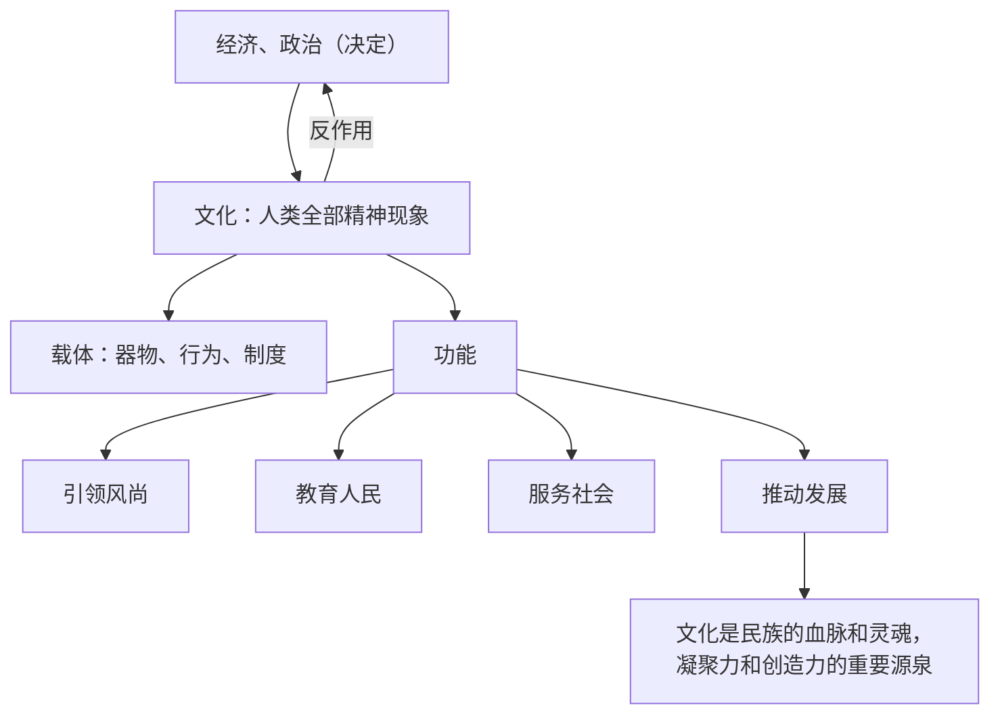

# 文化的内涵与功能

## 核心概念

- **文化的内涵**：广义的文化指人类认识和改造世界的一切活动及其创造的物质成果和精神成果；狭义的文化是相对于经济、政治而言的人类全部精神现象，既包括世界观、人生观、价值观等具有意识形态性质的部分，又包括自然科学和技术、语言和文字等非意识形态的部分。
- **文化与经济政治的关系**：文化是经济和政治的反映；一定的文化由一定的经济、政治所决定，又反作用于一定的经济、政治，给予经济、政治以重大影响。
- **文化与文明**：文明与野蛮相对立，是进步的过程和状态；文化有先进与落后之分，先进文化是人类文明的一项重要内容。
- **文化的载体**：文化要通过载体呈现出来，器物、行为、制度等是文化的载体。
- **文化的功能**：引领风尚、教育人民、服务社会、推动发展；文化是民族的血脉和灵魂。

## 知识梳理

| 项目 | 要点 |
| --- | --- |
| 核心内容 | 世界观、人生观、价值观是文化的核心 |
| 文化与文明 | 都是实践的产物；文明是进步状态，文化有先进与落后之分 |
| 文化载体 | 文化通过一定的载体呈现，载体承载、表达和展现文化内容 |

## 原理与方法论

| 原理 | 方法论要求 |
| --- | --- |
| 文化由经济政治决定，又反作用于经济政治 | 重视先进文化建设，为经济社会发展提供精神动力 |
| 文化具有引领风尚、教育人民、服务社会、推动发展的功能 | 发挥文化培根铸魂、凝心聚力的作用 |
| 文化是民族的血脉和灵魂 | 铸牢文化认同，增强民族凝聚力 |

## 典型题例

**例1（选择题）** 博物馆里的青铜器、古建筑上的雕梁画栋向人们诉说着历史。这表明（　）
A. 器物就是文化本身　B. 文化要通过载体呈现出来　C. 文化与经济无关　D. 精神产品可以脱离物质载体
**答案要点**：器物是文化的载体，承载和展现文化内容。选 **B**。

**例2（主观题）** 结合"文化赋能乡村振兴"的材料，说明文化的功能。
**答案要点**：①文化引领风尚，乡风文明建设改善村风民俗；②文化教育人民，优秀文化提升村民素养；③文化服务社会，公共文化服务丰富群众生活；④文化推动发展，文旅融合把文化资源转化为发展优势；⑤文化是民族的血脉和灵魂，为乡村振兴凝聚精神力量。

## 易错点

- 文化是**人类社会实践的产物**，纯粹自然的东西不是文化；但"自然的人化"成果属于文化。
- 文化的反作用有二重性：**先进健康的文化促进**发展，落后腐朽的文化阻碍发展。
- 文化与经济政治的发展**不完全同步**，文化有其相对独立性。
- 器物是文化的**载体**而非文化本身；不能把文化等同于文化产品。

## 背记要点

1. 狭义文化：相对于经济、政治而言的人类全部精神现象；核心是世界观、人生观、价值观。
2. 文化由经济政治决定，又反作用于经济政治（双向关系）。
3. 文化功能八字：引领风尚、教育人民、服务社会、推动发展。
4. 文化是民族的血脉和灵魂。
5. 北京等级考视角：文化产业、文博热、城市更新中的文化元素是常考情境。

## 自测题

1. 狭义的文化指什么？其核心是什么？
2. 文化与经济、政治的关系如何？
3. 文化与文明的区别与联系是什么？
4. 文化的功能有哪些？请结合实例说明。

## 相关知识点

中华传统文化的特点见 [[正确认识中华传统文化]]；文化的民族性见 [[文化的民族性与多样性]]；社会意识的相对独立性见 [[社会历史的本质]]。
