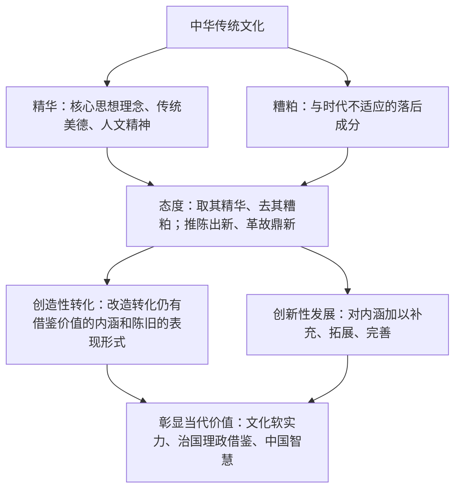

# 正确认识中华传统文化

## 核心概念

- **中华优秀传统文化的主要内容**：核心思想理念（讲仁爱、重民本、守诚信、崇正义、尚和合、求大同等）、中华传统美德、中华人文精神。
- **中华优秀传统文化的特点**：源远流长、博大精深。中华文化具有强大的凝聚力和连续性，是中华民族共同文化特质的体现。
- **中华文化的形成与发展**：各民族文化相互交融，共同熔铸了灿烂的中华文化；中华文化在与外来文化的交流互鉴中不断发展。
- **对待传统文化的正确态度**："取其精华、去其糟粕"，改造传统文化；"推陈出新、革故鼎新"，创造新文化、发展先进文化。坚持古为今用、推陈出新，实现中华优秀传统文化的**创造性转化和创新性发展**。
- **当代价值**：优秀传统文化是中华民族的突出优势，是我们最深厚的文化软实力；有助于解决当代中国和世界发展中的许多问题，为治国理政、道德建设提供有益借鉴，为解决人类问题贡献中国智慧。

## 知识梳理

| 项目 | 内容 |
| --- | --- |
| 特点 | 源远流长（历时性）、博大精深（内涵性） |
| 核心思想理念 | 讲仁爱、重民本、守诚信、崇正义、尚和合、求大同 |
| 两创 | 创造性转化、创新性发展 |

## 原理与方法论

| 原理 | 方法论要求 |
| --- | --- |
| 传统文化既有精华也有糟粕（一分为二） | 取其精华、去其糟粕，批判继承 |
| 文化随实践的发展而发展 | 推陈出新、革故鼎新，古为今用 |
| 中华优秀传统文化是最深厚的文化软实力 | 推动创造性转化、创新性发展，坚定文化自信 |

## 典型题例

**例1（选择题）** 《典籍里的中国》用戏剧加影视手法让古籍"活"起来，广受欢迎。这体现了（　）
A. 全盘继承传统文化　B. 推动中华优秀传统文化创造性转化、创新性发展　C. 传统文化都是精华　D. 形式创新可以取代内容
**答案要点**：以时代形式激活经典内涵，属于"两创"。选 **B**。

**例2（主观题）** 有人认为"传统文化是包袱，应彻底抛弃"；也有人认为"传统文化是宝库，应原封不动保存"。请评析。
**答案要点**：①传统文化既有精华又有糟粕，须一分为二分析；②优秀传统文化是中华民族的突出优势和最深厚的文化软实力，"彻底抛弃"是历史虚无主义；③文化要随实践发展而发展，"原封不动"是守旧主义、复古主义；④正确态度是取其精华、去其糟粕，推陈出新、革故鼎新，实现创造性转化和创新性发展。

## 易错点

- 中华**传统**文化不等于中华**优秀**传统文化；只有优秀部分才是突出优势和软实力。
- "创造性转化"侧重**改造转化形式与内涵**，"创新性发展"侧重**补充拓展完善内涵**，二者侧重点不同。
- 对待传统文化既反对"全盘否定"（历史虚无主义），也反对"全盘肯定"（守旧主义、复古主义）。
- 各民族共同创造中华文化，不能把中华文化等同于汉族文化。

## 背记要点

1. 主要内容三方面：核心思想理念、中华传统美德、中华人文精神。
2. 特点：源远流长、博大精深。
3. 正确态度十六字：取其精华、去其糟粕；推陈出新、革故鼎新。
4. "两创"方针：创造性转化、创新性发展（高频考点）。
5. 北京等级考视角：文博节目、非遗活化、老字号创新是典型命题素材。

## 自测题

1. 中华优秀传统文化的主要内容和特点是什么？
2. 如何理解对待传统文化的正确态度？
3. 创造性转化与创新性发展有何区别？
4. 中华优秀传统文化的当代价值体现在哪些方面？

## 相关知识点

文化的内涵与功能见 [[文化的内涵与功能]]；民族精神的弘扬见 [[弘扬中华优秀传统文化与民族精神]]；文化发展的基本路径见 [[文化发展的基本路径]]。
