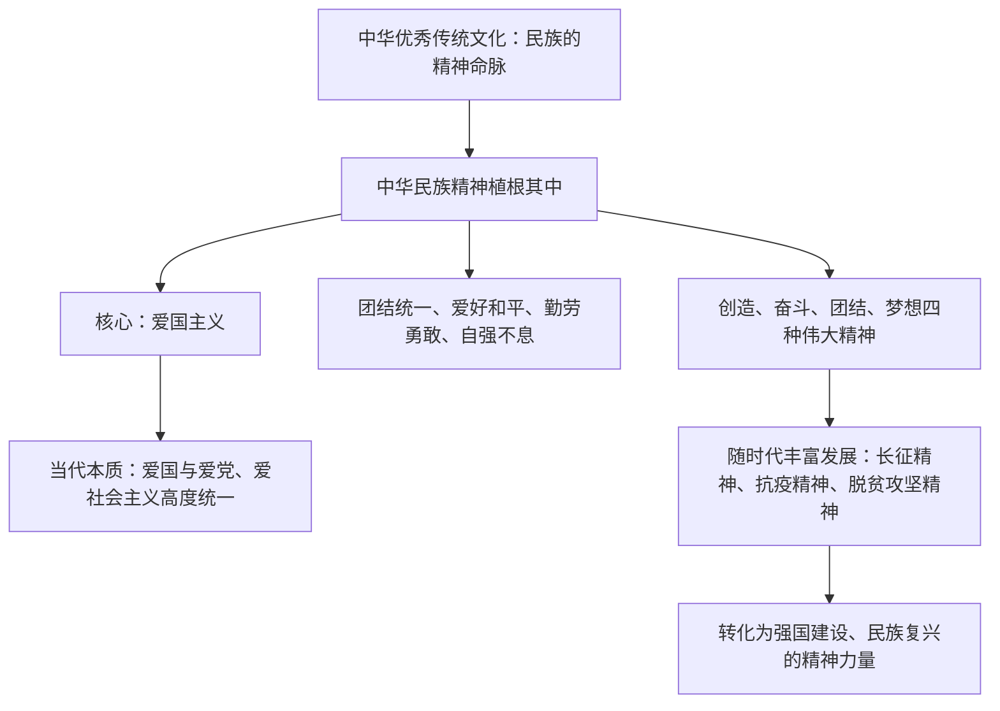

# 弘扬中华优秀传统文化与民族精神

## 核心概念

- **中华文化与民族精神的关系**：中华优秀传统文化是中华民族的精神命脉；在长期历史发展中形成和发展起来的中华民族精神，深深植根于中华优秀传统文化之中。
- **中华民族精神的基本内涵**：以爱国主义为核心的团结统一、爱好和平、勤劳勇敢、自强不息的伟大民族精神。伟大创造精神、伟大奋斗精神、伟大团结精神、伟大梦想精神是其时代表达。
- **爱国主义**：中华民族精神的核心，贯穿民族精神的各个方面。爱国主义不是抽象的，而是具体的。在当代中国，爱国主义的本质是坚持爱国和爱党、爱社会主义高度统一。
- **民族精神的时代性**：民族精神随着时代变化而不断丰富发展，在不同历史时期有不同的表现（如长征精神、抗疫精神、脱贫攻坚精神等）。
- **弘扬民族精神的意义**：为中国发展和人类文明进步提供强大精神动力，是支撑中华民族生存发展的精神支柱。

## 知识梳理

| 项目 | 内容 |
| --- | --- |
| 基本内涵 | 以爱国主义为核心，团结统一、爱好和平、勤劳勇敢、自强不息 |
| 核心 | 爱国主义（贯穿各方面） |
| 时代表达 | 伟大创造精神、伟大奋斗精神、伟大团结精神、伟大梦想精神 |

## 原理与方法论

| 原理 | 方法论要求 |
| --- | --- |
| 民族精神植根于中华优秀传统文化 | 传承优秀传统文化，涵养民族精神 |
| 爱国主义是民族精神的核心且是具体的 | 把爱国情、强国志、报国行统一起来 |
| 民族精神随时代发展而丰富 | 结合时代条件弘扬和培育民族精神，丰富精神谱系 |

## 典型题例

**例1（选择题）** 从长征精神到载人航天精神，再到脱贫攻坚精神，说明中华民族精神（　）
A. 一成不变　B. 随时代变化而不断丰富发展　C. 与传统文化无关　D. 核心不断改变
**答案要点**：民族精神具有时代性，在不同时期有不同表现，核心始终是爱国主义。选 **B**。

**例2（主观题）** 结合抗击重大自然灾害中全国人民守望相助的事例，说明弘扬中华民族精神的意义。
**答案要点**：①中华民族精神是支撑中华民族生存、发展的精神支柱；②以爱国主义为核心的伟大团结精神凝聚起同舟共济的强大合力；③为中国发展和人类文明进步提供强大精神动力；④有利于增强民族凝聚力，激励人们为实现中华民族伟大复兴而奋斗。

## 易错点

- 民族精神的核心是**爱国主义**，不能写成集体主义或改革创新。
- 当代爱国主义的本质：坚持**爱国和爱党、爱社会主义高度统一**（教材口径）。
- 民族精神的**内涵随时代丰富**，但核心不变；不能说民族精神"过时"或"被取代"。
- 民族精神源于中华优秀传统文化和人民的伟大实践，不是凭空产生的口号。

## 背记要点

1. 基本内涵：以爱国主义为核心的团结统一、爱好和平、勤劳勇敢、自强不息。
2. 四种伟大精神：创造、奋斗、团结、梦想。
3. 当代爱国主义本质：爱国、爱党、爱社会主义高度统一。
4. 民族精神是精神支柱、精神动力，随时代不断丰富发展。
5. 北京等级考视角：中国共产党人精神谱系（抗疫、脱贫攻坚、科学家精神）是热点素材。

## 自测题

1. 中华民族精神的基本内涵是什么？其核心是什么？
2. 如何理解爱国主义是具体的？
3. 民族精神与中华优秀传统文化是什么关系？
4. 新时代为什么要弘扬和培育中华民族精神？

## 相关知识点

传统文化的当代价值见 [[正确认识中华传统文化]]；文化自信的底气见 [[文化强国与文化自信]]。
