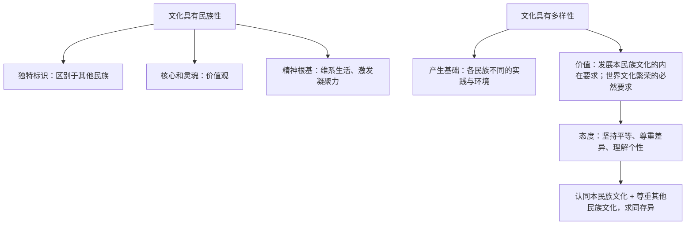

# 文化的民族性与多样性

## 核心概念

- **文化的民族性**：每个民族的文化都有自己的特色，民族文化是一个民族区别于其他民族的独特标识。民族文化起着维系社会生活、维持社会稳定、激发民族创造力和凝聚力的重要作用，是一个民族生存与发展的精神根基。
- **民族文化的核心和灵魂**：价值观是民族文化的核心和灵魂。
- **民族文化的体现**：民族文化体现在民族的生活方式、生产方式、思维方式，以及民族节日、民族服饰等方面。
- **文化的多样性**：文化多样性表征文化存在的丰富程度。每一个民族的文化都是世界文化中不可缺少的色彩。文化多样性是发展本民族文化的内在要求，也是实现世界文化繁荣的必然要求。
- **对待文化多样性的正确态度**：要在坚持各民族平等的基础上，尊重差异，理解个性；既要认同本民族文化，又要尊重其他民族文化，相互借鉴，求同存异。

## 知识梳理

| 项目 | 要点 |
| --- | --- |
| 民族性成因 | 各民族社会实践、地理环境、历史进程不同 |
| 多样性表现 | 民族节日、语言文字、文学艺术、建筑习俗等 |
| 正确态度 | 平等基础上尊重差异、理解个性，相互借鉴、求同存异 |

## 原理与方法论

| 原理 | 方法论要求 |
| --- | --- |
| 民族文化是民族生存与发展的精神根基 | 珍视和传承本民族优秀文化，增强文化认同 |
| 文化多样性是世界文化繁荣的必然要求 | 尊重文化多样性，维护人类文明的丰富多彩 |
| 各民族文化一律平等 | 反对文化霸权主义与文化中心主义，求同存异 |

## 典型题例

**例1（选择题）** "越是民族的，越是世界的。"对此理解正确的是（　）
A. 民族文化可以取代世界文化　B. 具有鲜明民族特色的优秀文化也是世界文化的组成部分　C. 文化的世界性否定民族性　D. 各民族文化没有差异
**答案要点**：文化是民族的又是世界的，民族特色文化丰富了世界文化宝库。选 **B**。

**例2（主观题）** 结合中外文明交流互鉴（如中法文化旅游年）的材料，说明应如何正确对待文化多样性。
**答案要点**：①文化多样性是发展本民族文化的内在要求，也是实现世界文化繁荣的必然要求；②要在坚持各民族平等的基础上，尊重差异、理解个性；③既要认同本民族文化，又要尊重其他民族文化，相互借鉴、求同存异；④共同促进人类文明繁荣进步。

## 易错点

- 民族文化的核心和灵魂是**价值观**，不是语言文字或民族节日。
- 认同的是**本民族文化**，尊重的是**其他民族文化**；不能写成"认同其他民族文化"。
- 尊重多样性不等于对外来文化全盘接受，须以我为主、辨证取舍。
- 文化没有高低优劣之分（各民族文化一律平等），但**有先进与落后、腐朽之分**（就其性质而言），语境不同不可混用。

## 背记要点

1. 民族文化是民族的独特标识，是民族生存与发展的精神根基。
2. 价值观是民族文化的核心和灵魂。
3. 文化多样性：发展本民族文化的内在要求 + 实现世界文化繁荣的必然要求。
4. 态度十二字：坚持平等、尊重差异、理解个性；认同本民族、尊重他民族。
5. 北京等级考视角：文明交流互鉴、全球文明倡议是高频命题背景。

## 自测题

1. 为什么说民族文化是一个民族生存与发展的精神根基？
2. 民族文化的核心和灵魂是什么？体现在哪些方面？
3. 为什么要尊重文化多样性？
4. 对待文化多样性的正确态度是什么？

## 相关知识点

文化交流的意义见 [[文化交流与文化交融]]；对待外来文化的原则见 [[正确对待外来文化]]。
