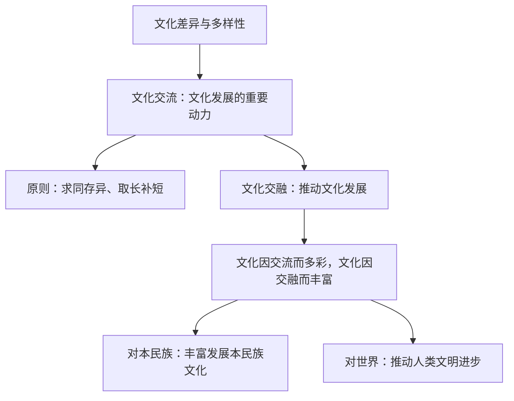

# 文化交流与文化交融

## 核心概念

- **文化交流**：文化交流构成了文化发展的重要动力。各民族文化之间的差异和交流不仅不会成为文化发展和创新的障碍，反而会对不同民族文化的发展和创新产生重要的推动作用。
- **坚持求同存异、取长补短的原则**：积极推进不同民族文化的交流，推动人类文化的发展。既要吸收借鉴，又要保持自身特色，维护各国各民族文明多样性。
- **文化交融**：文化交融推动文化的发展。文化因交流而多彩，文化因交融而丰富。一个民族的文化成就，不仅是本民族人民劳动智慧的结晶，而且包含着其他民族文化的有益成果。
- **文化交融的意义**：对本民族——通过交融积淀本民族文化精华，丰富发展本民族文化；对世界——为世界文化发展繁荣作出贡献，推动人类文明进步。
- **交流与交融的关系**：交流侧重不同文化的相互沟通、传播（"你来我往"）；交融侧重相互借鉴、渗透，形成新的文化成果（"你中有我、我中有你"）。

## 知识梳理

| 比较项 | 文化交流 | 文化交融 |
| --- | --- | --- |
| 侧重 | 沟通、传播，互通有无 | 借鉴、融合，产生新成果 |
| 形象表述 | "你来我往" | "你中有我、我中有你" |
| 作用 | 文化发展的重要动力 | 推动文化的发展与创新 |

## 原理与方法论

| 原理 | 方法论要求 |
| --- | --- |
| 文化交流构成文化发展的重要动力 | 积极推进不同民族文化的交流，坚持求同存异、取长补短 |
| 文化交融推动文化的发展 | 积极借鉴别国别民族思想文化的长处和精华 |
| 文化既是民族的又是世界的 | 推进人类文明交流互鉴，维护文明多样性 |

## 典型题例

**例1（选择题）** 汉代张骞通西域带回葡萄、苜蓿，中国丝绸、造纸术西传，佛教传入中国后与本土文化结合形成禅宗。这些史实表明（　）
A. 文化交流必然导致文化趋同　B. 文化交流与交融促进文化发展　C. 外来文化决定民族文化发展方向　D. 文化交融消灭了文化差异
**答案要点**：交流互通有无，交融产生新成果，共同推动文化发展。选 **B**。

**例2（主观题）** 结合共建"一带一路"促进文明互鉴的材料，说明文化交流与文化交融的意义。
**答案要点**：①文化交流构成文化发展的重要动力，沿线各国交流促进各民族文化发展创新；②文化因交流而多彩，文化因交融而丰富；③文化交融使本民族文化吸收其他民族文化的有益成果而丰富发展；④为世界文化发展繁荣、人类文明进步作出贡献；⑤应坚持求同存异、取长补短，维护文明多样性。

## 易错点

- 文化交流的作用是"重要动力"，不能夸大为**唯一或根本**动力（文化发展的根本途径是立足社会实践）。
- 文化交融不是文化**趋同**或同化，交融后各民族文化仍保持自身特色。
- 差异不是交流的障碍，恰恰是交流的**前提和动力**。
- 借鉴外来文化要吸收**有益成果**，不是照搬一切。

## 背记要点

1. 文化交流构成了文化发展的重要动力。
2. 原则：求同存异、取长补短。
3. 文化因交流而多彩，文化因交融而丰富（原文金句，主观题常用）。
4. 交融双重意义：丰富本民族文化 + 推动人类文明进步。
5. 北京等级考视角：一带一路人文交流、中外联合考古、影视出海是常考素材。

## 自测题

1. 为什么说文化交流构成了文化发展的重要动力？
2. 推进文化交流应坚持什么原则？
3. 文化交流与文化交融有何区别与联系？
4. 文化交融对本民族和世界分别有什么意义？

## 相关知识点

文化多样性的价值见 [[文化的民族性与多样性]]；对外来文化的正确态度见 [[正确对待外来文化]]。
