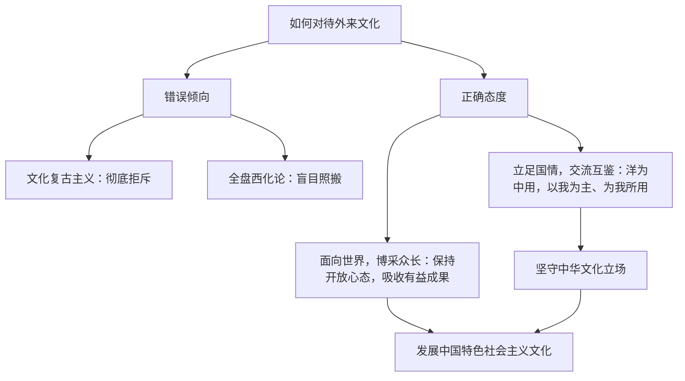

# 正确对待外来文化

## 核心概念

- **两种错误观点**：彻底拒斥外来文化的**文化复古主义**；盲目照搬西方文化的**全盘西化论**。历史证明，这两种观点都是错误的。
- **正确态度一：面向世界，博采众长**：文化发展必须保持开放的心态。要学习借鉴一切有利于我国社会主义文化建设的有益经验、一切有利于丰富我国人民文化生活的积极成果、一切有利于发展我国文化事业和文化产业的经营管理理念和运行机制，发展中国特色社会主义文化。
- **正确态度二：立足国情，交流互鉴**：外来文化的有益成果只有与中国具体国情相结合，才能发挥积极作用。要坚持"洋为中用"，坚持以我为主、为我所用，坚守中华文化立场，吸收外来有益文化，推动当代中国文化发展。
- **典型例证**：马克思主义传入中国后，与中国具体实际相结合、与中华优秀传统文化相结合，指引中国革命、建设和改革不断胜利，深刻改变了中国。

## 知识梳理

| 态度 | 内涵 | 反对的倾向 |
| --- | --- | --- |
| 面向世界，博采众长 | 开放心态，学习借鉴有益经验与积极成果 | 封闭主义、文化复古主义 |
| 立足国情，交流互鉴 | 与中国国情结合，以我为主、为我所用 | 全盘西化、照搬照抄 |

## 原理与方法论

| 原理 | 方法论要求 |
| --- | --- |
| 文化发展需要博采众长 | 保持开放心态，吸收外来文化的有益成果 |
| 外来文化只有与本国国情结合才能起积极作用 | 立足国情、洋为中用，坚守中华文化立场 |
| 矛盾普遍性与特殊性相结合（哲学依据） | 把外来文化的有益成果同中国具体实际相结合 |

## 典型题例

**例1（选择题）** 对待外来文化，有人主张"全盘照搬"，有人主张"一概排斥"。二者的共同错误在于（　）
A. 坚持了辩证否定观　B. 都没有坚持一分为二地对待外来文化　C. 维护了文化多样性　D. 坚守了中华文化立场
**答案要点**：全盘西化与文化复古主义都是片面的、形而上学的态度。选 **B**。

**例2（主观题）** 马克思主义是外来文化，却成为我们立党立国的根本指导思想。运用"正确对待外来文化"的知识加以说明。
**答案要点**：①外来文化的有益成果只有与中国具体国情相结合，才能发挥积极作用；②中国共产党坚持把马克思主义基本原理同中国具体实际相结合、同中华优秀传统文化相结合，使之中国化时代化；③这体现了立足国情、交流互鉴，以我为主、为我所用；④启示我们既要面向世界、博采众长，又要坚守中华文化立场。

## 易错点

- "面向世界、博采众长"吸收的是**有益成果**，不是外来文化的一切内容。
- "以我为主"强调坚守**中华文化立场**，不是文化排外。
- 学习外来文化的落脚点是**发展中国特色社会主义文化**，不是替代民族文化。
- 文化复古主义与守旧主义相近但针对对象不同：本框语境针对**对待外来文化**的两种极端。

## 背记要点

1. 两种错误：文化复古主义（彻底拒斥）、全盘西化论（盲目照搬）。
2. 正确态度八字对仗：面向世界，博采众长；立足国情，交流互鉴。
3. 十二字方针：洋为中用，以我为主、为我所用；坚守中华文化立场。
4. 典型论据：马克思主义中国化时代化（"两个结合"）。
5. 北京等级考视角：常与文化交融、文化自信联合命题，要求综合作答。

## 自测题

1. 对待外来文化的两种错误观点是什么？错在何处？
2. 如何理解"面向世界，博采众长"？
3. 为什么外来文化的有益成果必须与中国国情相结合？
4. 马克思主义在中国的成功传播给我们什么启示？

## 相关知识点

文化交流与交融见 [[文化交流与文化交融]]；文化多样性见 [[文化的民族性与多样性]]；坚持马克思主义指导见 [[综合探究三 坚持以马克思主义为指导 发展中国特色社会主义文化]]。
