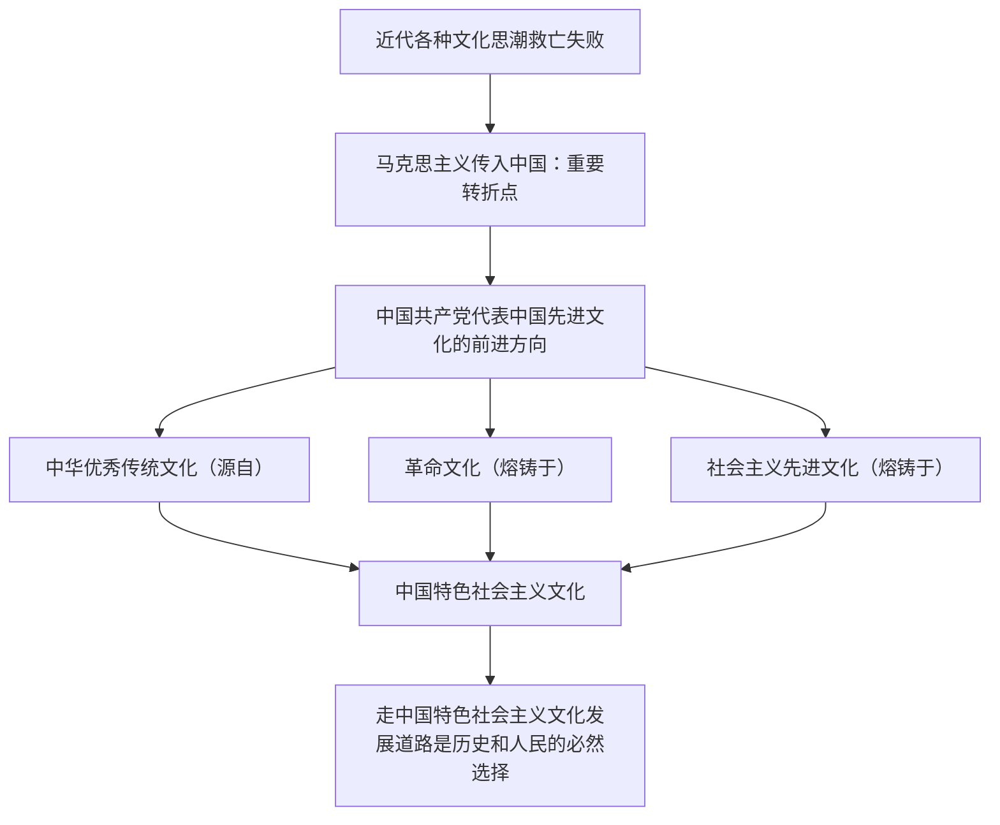

# 文化发展的必然选择

## 核心概念

- **近代文化探索的失败**：鸦片战争后，各种文化救亡思潮（旧民主主义的文化探索）没能解决中国文化走向何处、中国走向何处的问题。
- **马克思主义与先进文化**：马克思主义传入中国，是中华民族由衰微走向重振的重要转折点。中国共产党代表中国先进文化的前进方向；以马克思主义为指导的先进文化，在中国革命、建设和改革中发挥了强大的引领作用。
- **革命文化与社会主义先进文化**：革命文化承载着党和人民对国家独立、民族解放、人民幸福的顽强追求，是中国革命的精神标识；社会主义先进文化是以马克思主义为指导，坚持为人民服务、为社会主义服务，面向现代化、面向世界、面向未来的，民族的科学的大众的文化。
- **中国特色社会主义文化**：源自于中华民族五千多年文明历史所孕育的中华优秀传统文化，熔铸于党领导人民在革命、建设、改革中创造的革命文化和社会主义先进文化，植根于中国特色社会主义伟大实践。
- **必然选择**：走中国特色社会主义文化发展道路，是由人民群众根本利益决定的，是由中国共产党的性质宗旨决定的，是由我国社会制度、发展道路决定的，是由继承和创新中华优秀传统文化、弘扬革命文化、发展社会主义先进文化的要求决定的，是由我国文化自身发展规律决定的。

## 知识梳理

## 原理与方法论

| 原理 | 方法论要求 |
| --- | --- |
| 文化发展道路由多重因素决定（利益、党的性质、制度、规律） | 坚定不移走中国特色社会主义文化发展道路 |
| 先进文化引领社会前进方向 | 坚持以马克思主义为指导，发展先进文化 |
| 三种文化一脉相承 | 传承优秀传统文化、弘扬革命文化、发展社会主义先进文化 |

## 典型题例

**例1（选择题）** 中国特色社会主义文化的"源"与"根"表述正确的是（　）
A. 源自中华优秀传统文化，植根于中国特色社会主义伟大实践　B. 源自西方文化　C. 植根于革命战争年代　D. 与革命文化无关
**答案要点**：源自优秀传统文化，熔铸于革命文化和先进文化，植根于伟大实践。选 **A**。

**例2（主观题）** 运用所学，说明为什么走中国特色社会主义文化发展道路是历史的必然、人民的选择。
**答案要点**：①近代各种文化思潮都未能解决中国文化和中国的前途问题；②马克思主义传入是民族由衰微走向重振的重要转折点，党始终代表中国先进文化的前进方向；③这一道路由人民群众根本利益、党的性质宗旨、我国社会制度和发展道路、文化自身发展规律等共同决定；④只有这条道路能与中国国情相适应，建设社会主义文化强国。

## 易错点

- 转折点是**马克思主义传入中国**，不是新文化运动本身或西学东渐。
- 三种文化的定位词须准确：优秀传统文化是"源自"，革命文化与先进文化是"熔铸于"，伟大实践是"植根于"。
- 社会主义先进文化的表述："民族的科学的大众的"顺序固定，不可写错。
- 革命文化不是"过时文化"，它是中国革命的精神标识，今天仍须传承弘扬。

## 背记要点

1. 马克思主义传入中国：中华民族由衰微走向重振的重要转折点。
2. 中国共产党始终代表中国先进文化的前进方向。
3. 中国特色社会主义文化"三源流"：优秀传统文化、革命文化、社会主义先进文化。
4. 走这条道路的必然性：人民利益 + 党的性质宗旨 + 社会制度发展道路 + 文化发展规律。
5. 北京等级考视角：建党纪念、红色资源保护利用是本框高频命题情境。

## 自测题

1. 为什么说马克思主义传入中国是重要转折点？
2. 中国特色社会主义文化的内涵是什么？
3. 革命文化与社会主义先进文化各自的定位是什么？
4. 走中国特色社会主义文化发展道路的必然性有哪些？

## 相关知识点

文化发展怎么做见 [[文化发展的基本路径]]；文化自信见 [[文化强国与文化自信]]；指导思想见 [[综合探究三 坚持以马克思主义为指导 发展中国特色社会主义文化]]。
