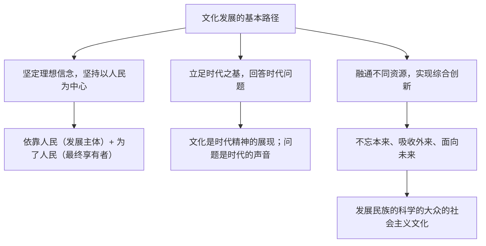

# 文化发展的基本路径

## 核心概念

- **坚定理想信念，坚持以人民为中心**：发展中国特色社会主义文化，要坚持以马克思主义为指导，坚定理想信念，坚持以人民为中心。人民是文化发展的主体，文化发展要依靠人民；人民是文化成果的最终享有者和受益者，文化发展要为了人民。
- **立足时代之基，回答时代问题**：文化作品只有符合时代发展的要求，符合社会发展的趋势，才能成为精品；问题是时代的声音，只有立足时代、解决特定的时代问题，才能推动社会进步；只有倾听特定的时代声音，才能吹响促进社会发展的时代号角。
- **融通不同资源，实现综合创新**：要坚持不忘本来、吸收外来、面向未来。融通中华优秀传统文化资源、国外优秀文化资源等不同资源；坚持以马克思主义为指导，坚守中华文化立场，立足当代中国现实，发展面向现代化、面向世界、面向未来的，民族的科学的大众的社会主义文化。

## 知识梳理

| 路径 | 核心要求 |
| --- | --- |
| 以人民为中心 | 文化发展依靠人民、为了人民，扎根人民生活 |
| 立足时代 | 反映时代风貌，回答时代课题 |
| 综合创新 | 融通古今中外资源，不忘本来、吸收外来、面向未来 |

## 原理与方法论

| 原理 | 方法论要求 |
| --- | --- |
| 人民是文化发展的主体，是文化成果的享有者 | 文艺创作坚持以人民为中心的导向，从人民生活中汲取养分 |
| 文化是对时代的反映（社会存在决定社会意识） | 立足时代之基，回答时代问题 |
| 文化创新需要融通多种资源 | 不忘本来、吸收外来、面向未来，实现综合创新 |

## 典型题例

**例1（选择题）** 电视剧《山海情》的创作者深入乡村体验生活，作品真实反映脱贫攻坚历程，感动无数观众。这表明文化创作要（　）
A. 迎合市场即可　B. 坚持以人民为中心，立足时代实践　C. 只依靠艺术家灵感　D. 脱离生活进行虚构
**答案要点**：扎根人民、反映时代是精品创作之源。选 **B**。

**例2（主观题）** 结合国产动画电影融合传统神话与现代技术、借鉴国际叙事经验而广受欢迎的案例，说明如何推动文化发展。
**答案要点**：①坚持以人民为中心，创作满足人民文化需求的作品；②立足时代之基，回答时代问题，用当代视角激活传统题材；③融通不同资源，实现综合创新：不忘本来（中华优秀传统文化）、吸收外来（国外优秀文化成果）、面向未来；④坚守中华文化立场，发展民族的科学的大众的社会主义文化。

## 易错点

- 文化发展的**主体是人民**，不是文艺工作者个人；灵感的最终源泉是人民的生活实践。
- "回答时代问题"强调文化的时代性，其哲学依据是**社会存在决定社会意识**。
- "融通资源"不是简单拼凑，而是**综合创新**，须以马克思主义为指导、坚守中华文化立场。
- 三条路径是有机整体，主观题一般需**三条齐答**再结合材料。

## 背记要点

1. 路径一：坚定理想信念，坚持以人民为中心（依靠人民 + 为了人民）。
2. 路径二：立足时代之基，回答时代问题（问题是时代的声音）。
3. 路径三：融通不同资源，实现综合创新（不忘本来、吸收外来、面向未来）。
4. 目标表述：面向现代化、面向世界、面向未来的，民族的科学的大众的社会主义文化。
5. 北京等级考视角：现象级文艺作品、文化科技融合是"怎么办"类主观题高频载体。

## 自测题

1. 为什么文化发展必须坚持以人民为中心？
2. 如何理解"立足时代之基，回答时代问题"？
3. "不忘本来、吸收外来、面向未来"分别指什么？
4. 结合一部你熟悉的文艺作品，说明文化发展的基本路径。

## 相关知识点

道路选择的必然性见 [[文化发展的必然选择]]；文化强国目标见 [[文化强国与文化自信]]；借鉴外来文化见 [[正确对待外来文化]]。
