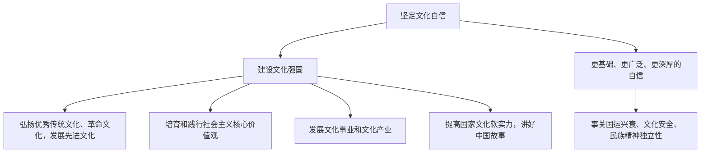

# 文化强国与文化自信

## 核心概念

- **建设文化强国**：要弘扬中华优秀传统文化、革命文化，发展社会主义先进文化；要培育和践行社会主义核心价值观，发挥其对国民教育、精神文明创建、精神文化产品创作生产传播的引领作用；要推动文化事业和文化产业发展，健全现代公共文化服务体系，健全现代文化产业体系和市场体系；要提高国家文化软实力，增强中华文明传播力影响力，讲好中国故事、传播好中国声音。
- **文化自信**：对自身文化价值的充分肯定，对自身文化生命力的坚定信念。文化自信是更基础、更广泛、更深厚的自信，是一个国家、一个民族发展中更基本、更深沉、更持久的力量。
- **文化自信的来源**：来自对时代发展潮流、中国特色社会主义伟大实践的深刻把握，来自对自身文化价值的充分肯定、对自身文化生命力的坚定信念。
- **坚定文化自信的意义**：事关国运兴衰、事关文化安全、事关民族精神独立性。没有高度的文化自信，没有文化的繁荣兴盛，就没有中华民族伟大复兴。

## 知识梳理

| 项目 | 要点 |
| --- | --- |
| 文化事业 | 公益性，健全现代公共文化服务体系，保障人民基本文化权益 |
| 文化产业 | 经营性，健全现代文化产业体系和市场体系，满足多样化需求 |
| 文化自信定位 | 更基本、更深沉、更持久的力量 |

## 原理与方法论

| 原理 | 方法论要求 |
| --- | --- |
| 文化自信是更持久、更深沉的力量 | 坚定对中国特色社会主义文化的自信 |
| 核心价值观是当代中国精神的集中体现 | 以社会主义核心价值观引领文化建设 |
| 文化软实力是综合国力的重要组成部分 | 增强中华文明传播力影响力，讲好中国故事 |

## 典型题例

**例1（选择题）** 我国推进城乡公共图书馆、文化馆免费开放，同时培育骨干文化企业打造精品IP出海。这体现了（　）
A. 只发展文化事业　B. 文化事业和文化产业协同推进，建设文化强国　C. 文化建设以营利为目的　D. 文化输出取代文化交流
**答案要点**：公共文化服务（事业）与文化产业两手抓。选 **B**。

**例2（主观题）** 运用文化自信的知识，说明为什么"没有高度的文化自信就没有中华民族伟大复兴"。
**答案要点**：①文化是民族的血脉和灵魂，文化自信是更基础、更广泛、更深厚的自信，是更基本、更深沉、更持久的力量；②文化自信事关国运兴衰、事关文化安全、事关民族精神独立性；③坚定文化自信才能坚守中华文化立场，凝聚民族复兴的精神力量；④我们的文化自信来自中华优秀传统文化、革命文化和社会主义先进文化，来自中国特色社会主义伟大实践。

## 易错点

- 文化自信"三个更"定位：**更基础、更广泛、更深厚**的自信，**更基本、更深沉、更持久**的力量，两组表述要分清。
- 文化事业与文化产业不能混同：前者重**公益性与基本权益**，后者重**市场与多样化需求**。
- 我们自信的对象是**中国特色社会主义文化**（含三种文化），不是全部传统文化。
- 提高文化软实力不等于文化扩张；讲好中国故事重在**传播力影响力**与文明互鉴。

## 背记要点

1. 文化强国四大着力点：弘扬三种文化、培育践行核心价值观、发展文化事业和产业、提高文化软实力。
2. 文化自信的定位："三个更"的自信与力量（原文口径必背）。
3. 文化自信的底气：优秀传统文化、革命文化、社会主义先进文化 + 伟大实践。
4. 意义三事关：国运兴衰、文化安全、民族精神独立性。
5. 北京等级考视角：中华文明探源、国家文化数字化战略、文化出海是热点情境。

## 自测题

1. 建设文化强国的主要措施有哪些？
2. 什么是文化自信？我们的文化自信从何而来？
3. 文化事业与文化产业有何区别？
4. 为什么必须坚定文化自信？

## 相关知识点

文化发展道路见 [[文化发展的必然选择]]；发展路径见 [[文化发展的基本路径]]；核心价值观见 [[价值与价值观]]。
