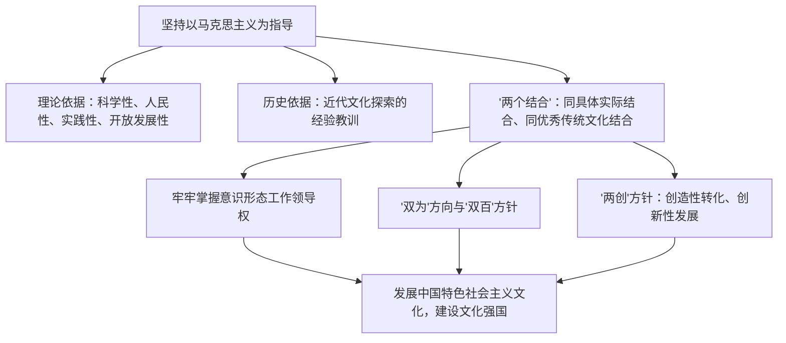

# 综合探究三 坚持以马克思主义为指导 发展中国特色社会主义文化

## 核心概念

- **指导思想**：发展中国特色社会主义文化，必须坚持以马克思主义为指导，这是由马克思主义的科学性、人民性、实践性和开放发展性决定的，也是近代以来中国文化发展的历史结论。
- **"两个结合"**：把马克思主义基本原理同中国具体实际相结合、同中华优秀传统文化相结合，是开辟和发展中国特色社会主义、建设社会主义文化强国的必由之路。
- **意识形态领导权**：意识形态决定文化前进方向和发展道路，必须牢牢掌握意识形态工作领导权，建设具有强大凝聚力和引领力的社会主义意识形态。
- **文化建设的总体要求**：坚持以人民为中心的工作导向，坚持为人民服务、为社会主义服务的方向，坚持百花齐放、百家争鸣的方针，坚持创造性转化、创新性发展。

## 知识梳理

| 方针原则 | 内容 |
| --- | --- |
| "双为"方向 | 为人民服务、为社会主义服务 |
| "双百"方针 | 百花齐放、百家争鸣 |
| "两创"方针 | 创造性转化、创新性发展 |

## 探究主题与线索

1. **线索一：为什么必须坚持马克思主义指导**——从马克思主义的理论品格与近代文化探索的历史结论两个维度收集论据，形成论证提纲。
2. **线索二：理解"两个结合"**——以"中华优秀传统文化中的民本思想与以人民为中心的发展思想"等案例，说明马克思主义与中华优秀传统文化彼此契合、相互成就。
3. **线索三：辨析错误思潮**——针对"指导思想多元化""文化虚无主义"等观点，运用意识形态领导权知识予以批驳。
4. **成果要求**：围绕"新时代青年如何做中国特色社会主义文化的建设者"举办小组展示，做到观点、论据、结论完整。

## 典型题例

**例1（选择题）** 有人主张"文化领域应指导思想多元化"。这一观点的错误在于（　）
A. 承认了文化多样性　B. 否认了马克思主义在意识形态领域的指导地位　C. 坚持了"双百"方针　D. 尊重了创作自由
**答案要点**：文化多样与指导思想一元并不矛盾；放弃马克思主义指导会使文化建设迷失方向。选 **B**。

**例2（主观题）** 结合"第二个结合"（同中华优秀传统文化相结合）的相关论述，说明其对发展中国特色社会主义文化的意义。
**答案要点**：①马克思主义与中华优秀传统文化相互契合、相互成就，结合造就了新的文化生命体；②巩固了文化主体性，筑牢了道路根基，让中国特色社会主义道路有了更宏阔深远的历史纵深；③推动中华优秀传统文化创造性转化、创新性发展，使马克思主义成为中国的、中华优秀传统文化成为现代的；④为建设社会主义文化强国、坚定文化自信提供根本遵循。

## 易错点

- 坚持马克思主义指导与文化多样性、"双百"方针**不矛盾**：指导思想一元化，文化形态多样化。
- "两个结合"中两个对象不同：**具体实际**（实践维度）与**优秀传统文化**（文化维度），不能只答其一。
- "双为""双百""两创"三组方针内容不可张冠李戴。
- 掌握意识形态工作领导权不是压制学术争鸣，学术问题与政治问题要区分。

## 背记要点

1. 必须坚持以马克思主义为指导：理论品格 + 历史结论双重依据。
2. "两个结合"是必由之路（高频考点，须能展开）。
3. 牢牢掌握意识形态工作领导权。
4. 三组方针："双为"方向、"双百"方针、"两创"方针。
5. 北京等级考视角：探究类大题常要求综合本册哲学与文化知识，论证文化发展的方向与路径。

## 自测题

1. 为什么发展中国特色社会主义文化必须坚持以马克思主义为指导？
2. "两个结合"的内容和意义是什么？
3. 如何理解指导思想一元化与文化多样化的关系？
4. "双为"方向、"双百"方针、"两创"方针分别指什么？

## 相关知识点

马克思主义的科学性见 [[科学的世界观和方法论]]；文化发展道路见 [[文化发展的必然选择]]；发展路径见 [[文化发展的基本路径]]；文化自信见 [[文化强国与文化自信]]。
