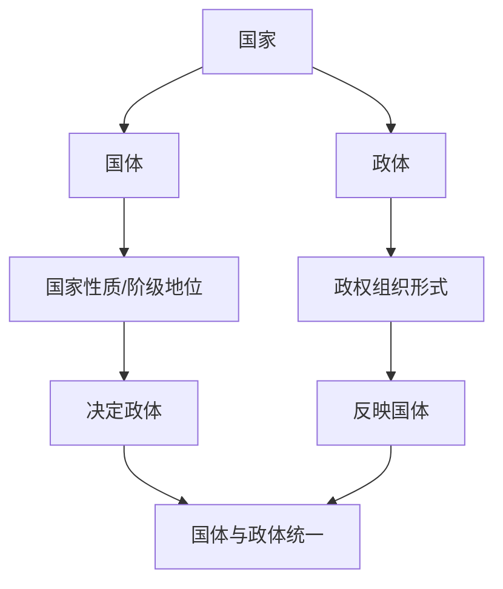

# 第一课 国体与政体：国家是什么

## 核心概念

**国家**：国家是阶级矛盾不可调和的产物，是阶级统治的工具，本质上是**阶级统治**的工具。

**国家的属性**：国家具有**主权**（最高权力）、**阶级性**（本质属性）、**社会管理职能**等。

**国体**：即国家性质，指社会各阶级在国家中的地位，由**统治阶级的性质**决定。

**政体**：即国家政权的组织形式，指国家政权的组织形式和管理形式。

## 知识梳理

| 概念 | 含义 | 关系 |
| --- | --- | --- |
| 国体 | 国家性质，各阶级在国家中的地位 | 决定政体 |
| 政体 | 政权组织形式 | 反映国体 |
| 主权 | 国家最高权力 | 国家根本属性之一 |

## 原理与方法论

**原理**：国体决定政体，政体反映国体，二者是内容与形式的关系。

**方法论**：分析国家制度时，要透过政体看国体，把握国家的阶级本质；同时认识到政体具有相对独立性，同一国体可有不同政体。

## 典型题例

**例**：为什么说国家是阶级统治的工具？

**解**：国家是阶级矛盾不可调和的产物，掌握政权的统治阶级通过国家机器维护本阶级利益、镇压被统治阶级的反抗，因此国家本质上是阶级统治的工具。

## 易错点

- 国家的**本质属性是阶级性**，不是主权或社会管理职能。
- 国体决定政体，但政体具有**相对独立性**。
- 国家是阶级矛盾**不可调和**的产物。
- 国体与政体是内容与形式的关系。

## 背记要点

1. 国家本质：阶级统治的工具。
2. 国体决定政体，政体反映国体。
3. 国家属性：主权、阶级性、社会管理职能。
4. 国体与政体是内容与形式的关系。

## 自测题

1. 国家的本质属性是____。
2. 国体是指____。
3. 政体是指____。
4. 国体与政体的关系是____。

## 相关知识点

政权组织形式见 [[第一课 国体与政体：国家的政权组织形式]]；国家结构形式见 [[第二课 国家的结构形式：主权统一与政权分层]]。
